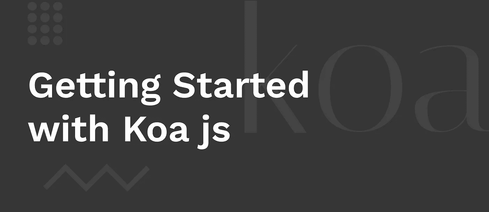
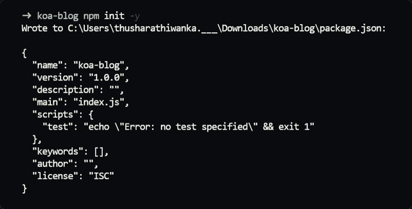
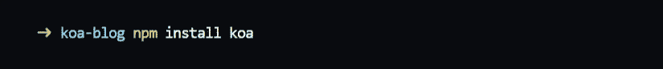
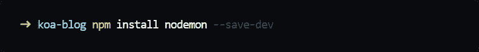
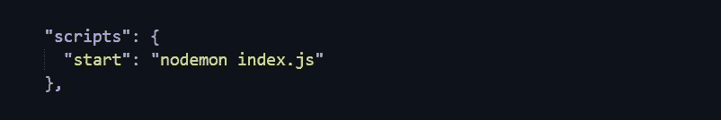
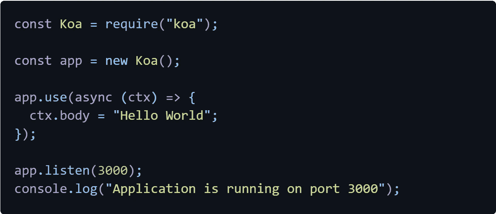
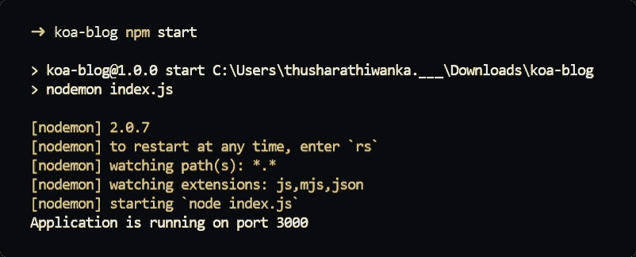

# Koa.js 入门

> 原文：<https://medium.com/codex/getting-started-with-koa-js-c6ae6465fdd9?source=collection_archive---------5----------------------->

基本上，Express js 是几年前将其作为后端框架的框架。此外，Koa js 是一个现代和极简的 Node.js 框架，由 Express js 的创建者创建。Koa 有点现代，因为它使用 ES6 语法等等。如果你了解 Express js，你会发现它的语法和 koa 非常相似，你会很快掌握它。在这里，我们将讨论安装 koa 和创建监听某个端口的服务器。

## 什么是 Koa？

express js 的创建者为 node.js 提供了一个新的服务器端框架。与其他的相比，Koa 是非常轻量级的，我们可以选择通过添加模块来扩展这个框架。此外，一个非常现代的框架，使用 ES6 和上述语法，允许您在应用程序中提供更好的错误处理。这有助于开发人员创建经久耐用的应用程序。

## 安装 Koa

在安装 koa 之前，你必须安装 node.js，然后初始化一个节点项目，打开终端，输入 npm init 命令。此外，通过将-y 作为参数传递，您可以跳过所有问题，并使用默认值填充项目细节。

当所有的先决条件完成后，我们可以使用 npm install koa/npm i koa 将 koa 框架安装到我们的项目中。这将创建 node_modules 文件夹和包锁 JSON 文件来跟踪包的版本，koa 将保存在 node_modules 文件夹中。

然后，我们将安装 nodemon，它有助于在发生更改时刷新服务器。我们可以安装 nodemon global 或作为开发服务器依赖项。我将使用 npm install nodemon/npm i nodemon 将它安装为一个 dev 依赖项，然后将-D 或- -save-dev 作为参数传递。

在明星和 koa js 合作之前，我们还要做一件事。我们将创建一个脚本来通过 nodemon 运行这个应用程序，这样我们就不必键入 nodemon 然后键入 filename 来运行这个应用程序。我将把它分配给 package.json 文件中的 npm 脚本。请看下面的附件，以便更好地理解。

现在，我们可以使用 npm start 命令来启动我们的应用程序。因为我们没有 index.js 文件，所以让我们在根文件夹中创建它。

## 使用 Koa 创建服务器

首先，让我们看看如何创建一个服务器并监听一个特定的端口号。参考下面的代码。

然后使用我们之前创建的脚本运行应用程序。打开浏览器并转到 localhost:3000，以 Hello World 的形式查看输出。现在，我们已经创建了一个服务器，它向所有请求返回“Hello World”。

我们也可以返回 JSON 数据或 HTML 文件。我们不会在这里谈论这个。如果你想更多地了解 koa js [点击这里](https://koajs.com/)进入 koa 文档页面。