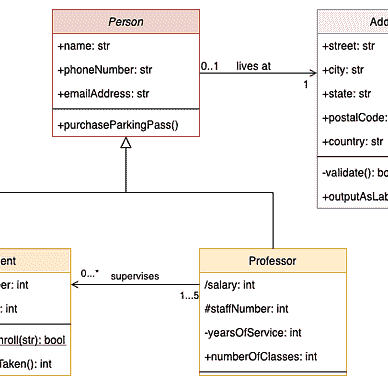

# Kotlin 入门

> 原文：<https://medium.com/codex/getting-started-with-kotlin-964ed8e2fca8?source=collection_archive---------11----------------------->

## 注释、变量和标准输出


[来源](https://www.google.com/url?sa=i&url=https%3A%2F%2Fwww.sngular.com%2Fkotlin-programming-good-idea%2F&psig=AOvVaw0qECcsYNQNpAk2Z2yosCeG&ust=1668215501544000&source=images&cd=vfe&ved=0CBEQ3YkBahcKEwjI_v-V-aT7AhUAAAAAHQAAAAAQAw)

本文是 Kotlin 编程课程系列的第 2 部分


[尼尚特·安贾尼路](/@cybercoder.naj?source=post_page-----964ed8e2fca8--------------------------------)

## 科特林编程课程

[View list](/@cybercoder.naj/list/kotlin-programming-course-86768cb5ed32?source=post_page-----964ed8e2fca8--------------------------------)3 stories

Kotlin 是当今世界快速发展的语言。Kotlin 处理复杂编程范例的简单性令人惊叹。这种语言赢得了包括谷歌在内的全球许多开发者的心，使 Kotlin 成为 2019 年 Android
开发的官方语言。

# 创建 Kotlin 项目

用 Kotlin 编码需要一个 IDE，或者我应该说是 IDEA。强烈推荐你下载 JetBrains 的 IntelliJ IDEA 并在那里运行你的 Kotlin 代码。

通过 4 个简单的步骤创建 Kotlin 项目:

1.  IntelliJ IDEA 启动后，点击“创建新项目”。
2.  在左侧，选择 Java 和对话框窗口右侧的复选框*only*“kot Lin/JVM”。
3.  选择 JDK 版本。如果你还没有安装新的 JDK 版本，你可能需要安装一个。
4.  右键点击`src/`文件夹，选择**新建> Kotlin 类/文件**，创建一个新的 Kotlin 文件。所有 Kotlin 文件都以扩展名`.kt`结尾。

**注意:**由于版本差异，设置可能会有所不同。

# 编写你的第一个 Kotlin 程序

最近，我学会了用一种叫做 Haskell 的新语言编写代码,“Hello World”程序是我们在课程中做的最后一个程序。(Pst，我不太喜欢 Haskell)。幸运的是，在 Kotin，我们从 Hello world 节目开始。

```
/*
 * public class HelloKt {
 *     public static void main(String[] args) {
 *         System.out.println("Hello World!");
 *     }
 * }
 */

fun main() {
  println("Hello World!")
}
```

如果你以前用 Java 编程过，你应该知道如何用 Java 打印 Hello World。首先，您需要创建一个具有名称和主函数长签名的类。此后，您需要引用系统的 OutputStream 对象将一些内容打印到终端。

> 科特林就像:拿着我的啤酒。

您所需要的只是简洁的主函数定义，用一个词将消息打印到控制台。

# 评论

注释是程序中最简单的事情。程序员使用文本来描述程序或帮助其他程序员理解代码。它们不是由编译器编译的。注释在代码中没有任何作用。它们只是方便程序员理解代码的作用。

```
// This is a single line comment.

/*
* This is
* a multiline
* comment
*/
```

# 变量

> 你们很多人会念 data 而不是 data。:P

我来打个比方。想象你自己是 UPS 快递员，你需要
从彼得那里收集一个包裹并把它交给格温(可能是浪漫的事情
😉).所以你需要知道一些事情来做这个工作。你能告诉我最重要的事吗？不是摩托车或者包夹什么的；是地址！你需要知道彼得的地址来取包裹。所以你找到地址，然后去他家，拿包裹，然后送到运输办公室。这个地址就是你要找的。

现在来谈谈计算机术语，当你在某处存储了某些数据为 0 和 1 时，你需要通过知道这些数据的地址来访问它们。换句话说，你需要知道数据存储在哪里，这样你就可以检索它——操作它——改变它。你怎么知道地址是什么？你打算怎么访问这些数据？

你不必知道！编译器跟踪数据的地址。你不必为此担心。编程语言引入了一个被称为变量的概念，变量为您存储值并在内部处理地址。

## 定义变量

在 Kotlin 中，有两种类型的变量定义`var`和`val`。两者的区别在于，`var`是可变变量，`val`是不可变变量。举个例子，

```
fun main() {
  // Mutable variable - changeable in the future.
  // Int stands for Integer, the datatype we are specifying.
  var age: Int = 5

  // Immutable value - once declared, cannot change.
  // String is a collection of characters in double-inverted commas (")
  val name: String = "Nishant"

  age = 21 // <- this is legal
  name = "Joe" // <- ERR: cannot reassign to val.

  /* $ sign before the variable inside double-inverted
   * commas substitutes the value of the variable.
   */
  println("My name is $name, and I am $age years old.");
}
```

**注:**在我的代码中，我已经写了“Int”和“String”。这些是我们将涉及的数据类型

# 结论

正如您已经看到的，Kotlin 显示了现代语言的迹象，是 Java 的一个更好的子集。简单的语法，简单的打印，很快，你会在 Kotlin 中看到更多你会喜欢的特性。

我在 Medium 上有两个阅读清单:“Kotlin 编程课程”和“Kotlin 的一切”。后者更接近于 Kotlin 的高级编程特性，而前者则构成了基础。


[尼尚·安贾尼·贾兰](/@cybercoder.naj?source=post_page-----964ed8e2fca8--------------------------------)

## 科特林编程课程

[View list](/@cybercoder.naj/list/kotlin-programming-course-86768cb5ed32?source=post_page-----964ed8e2fca8--------------------------------)3 stories

[尼尚·安贾尼·贾兰](/@cybercoder.naj?source=post_page-----964ed8e2fca8--------------------------------)

## 一切科特林

[View list](/@cybercoder.naj/list/everything-kotlin-fc4d61a1a661?source=post_page-----964ed8e2fca8--------------------------------)19 stories

我希望你喜欢读我的文章，并学到了一些东西。谢谢大家！✌️

```
**Want to connect?**

My [GitHub](https://github.com/cybercoder-naj) profile.
My [Portfolio](https://cybercoder-naj.github.io) website.
```