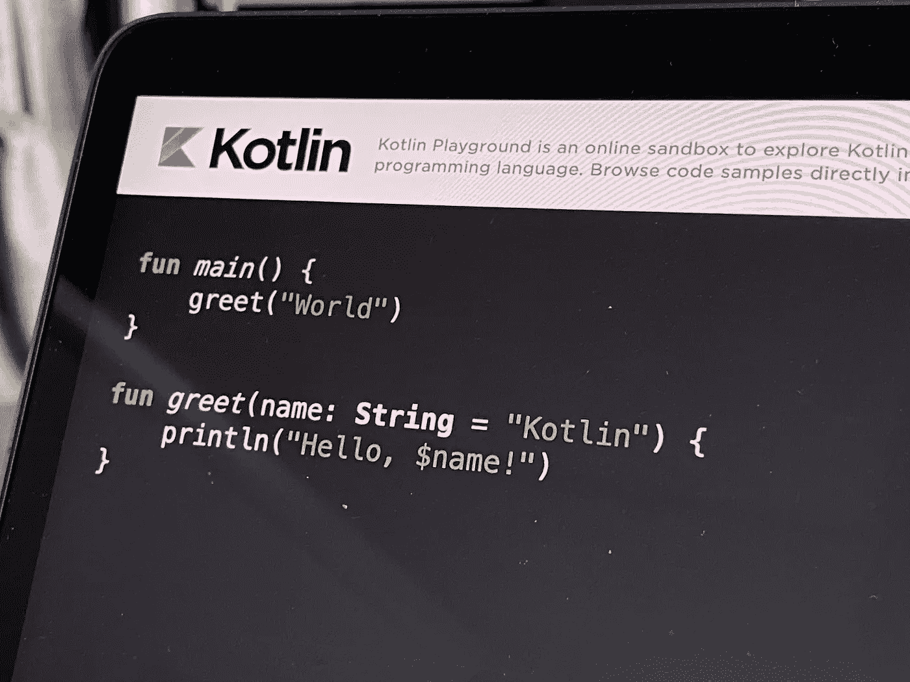

# Kotlin 和 Maven 入门

> 原文：<https://medium.com/codex/getting-started-with-kotlin-and-maven-9482a65158a1?source=collection_archive---------5----------------------->

## 建立一个基于 Maven 的 Kotlin 项目，并通过 3 个简单的步骤运行它

路易斯·蔡在 [Unsplash](https://unsplash.com/s/photos/kotlin?utm_source=unsplash&utm_medium=referral&utm_content=creditCopyText) 上的照片

事实上，在选择构建工具时， [Gradle](https://gradle.org/) 是 [***Kotlin***](https://kotlinlang.org/) 开发的默认选择。然而，有很多开发人员仍然喜欢使用其他构建解决方案(如 maven)来管理和构建他们基于 JVM 的项目…