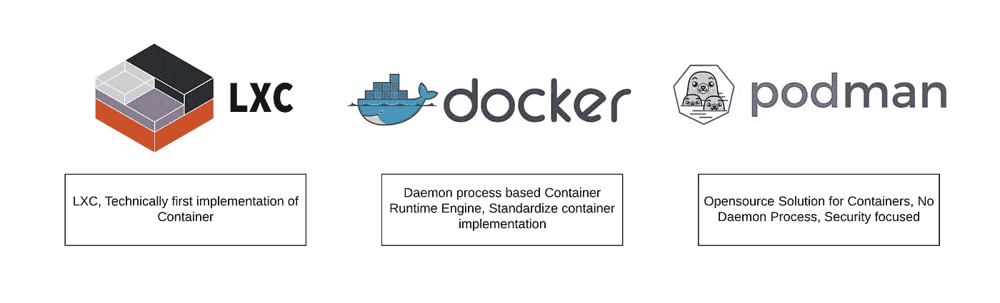

# 波德曼入门

> 原文：<https://medium.com/codex/getting-started-with-podman-6b94ad670980?source=collection_archive---------2----------------------->

## 技术基础，[法典](http://medium.com/codex)

LXC ->码头工人->波德曼

在当今世界，集装箱是 IT 行业的新常态。我们每个人都想利用它的强大功能。这一切都始于 LXC，但 Docker 给出了它的当前价值。Docker 是一个容器引擎，它提供了管理容器完整生命周期的平台。Docker 使构建、部署和管理容器变得更加容易、简单和安全。