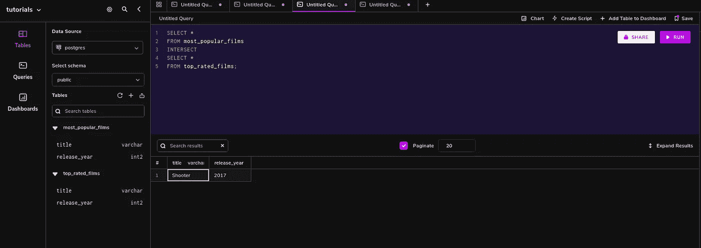

# PostgreSQL 集合运算符入门

> 原文：<https://medium.com/codex/getting-started-with-postgresql-set-operators-a4474de17523?source=collection_archive---------8----------------------->


Postgres 提供了集合操作符，使得从数据库中查询和过滤搜索结果变得容易。集合运算符用于连接两个或多个 SELECT 语句的结果。这些运算符是 UNION、UNION ALL、INTERSECT 和 EXCEPT——每个运算符都可以用于跨多个表构建查询，并筛选您需要的特定数据。

为了返回两个 SELECT 语句的组合结果，我们使用并集运算符。该操作符从查询的结果中删除所有重复的结果——每个重复的结果只列出一行。为了检查这种行为，可以使用 UNION ALL 集合操作符，因为它在最终结果中保留了重复项。INTERSECT 集合运算符只列出两个 SELECT 查询共享的记录，相反，EXCEPT 集合运算符从第二个 SELECT 查询中删除结果。因此，INTERSECT 和 EXCEPT 集合运算符用于产生不重复的结果。

所有集合操作符最初共享相同的优先级(除了 INTERSECT，我们将在后面讨论它)。因为括号的优先级高于悬空运算符，所以它们会导致顺序不同。

> **注意—**
> 所有使用集合运算符的 SELECT 语句必须选择相同数量的列。显示中使用的列是从第一个查询中获得的。

列列表数据类型必须可以被 Postgres 隐式转换。如果查询中的相应列属于不同的数据类型，Postgres 不会执行隐式类型转换。如果第一个查询中的列是 INT 类型的，而第二个查询中的对应列是 CHAR 类型的，Postgres 将**而不是**执行隐式转换——相反，它将引发类型错误。

为了对结果集进行排序，使用了位置排序。集合运算符不允许对单个结果集进行排序。在查询结束时，ORDER BY 只能出现一次。

UNION 和 INTERSECT 运算符中查询的顺序并不重要，也不会改变最终结果——UNION 和 INTERSECT 运算符是可交换的。

与 UNION 运算符相比，UNION ALL 具有更好的性能，因为在筛选重复项和对结果进行排序时不使用资源。

*   可以使用集合运算符作为子查询的一部分。
*   不能在包含表集合表达式的 SELECT 语句中使用集合运算符。

## 创建表格

在我们继续研究集合运算符之前，我们需要创建将在整个教程中使用的表:

```
DROP TABLE IF EXISTS top_rated_films;

CREATE TABLE top_rated_films(
title VARCHAR NOT NULL,
release_year SMALLINT);

DROP TABLE IF EXISTS most_popular_films;
CREATE TABLE most_popular_films(
title VARCHAR NOT NULL,
release_year SMALLINT);

INSERT INTO top_rated_films(title, release_year)
VALUES
('Fast and furious 7', 2011),
('The redemption', 2015),
('Shooter', 2017);

INSERT INTO most_popular_films(title, release_year)
VALUES
('American snipper', 2015),
('Doulou continent',2018),
('Outpost',2019),
('Shooter', 2017);
```


## 联盟

Postgres 显示删除重复值后所有复合选择查询的组合结果，当 UNION 运算符连接多个选择查询时，结果按升序排序:

```
SELECT * FROM top_rated_films

UNION

SELECT * FROM most_popular_films
```


> **注意—**
> 选择的列必须是兼容的数据类型，否则 Postgres 会抛出类型错误:

```
SELECT title FROM top_rated_films

UNION

SELECT release_year FROM most_popular_films

//error
UNION types character varying and smallint cannot be matched
```

## 联合所有

UNION 和 UNION ALL 运算符类似，不同之处在于 UNION ALL 返回的结果集不删除重复项，也不对数据进行排序。

检查下面联合部分中的查询。请务必注意在没有排序和删除重复项的情况下生成的输出中的差异:

```
SELECT * FROM top_rated_films

UNION ALL

SELECT * FROM most_popular_films
```


## 横断

显示两个 select 语句中没有重复的公共行，并且数据按排序顺序排列；使用 INTERSECT 运算符。射手电影被返回，因为它在最高评级和最受欢迎的电影表中都可用。

```
SELECT *
FROM most_popular_films 
INTERSECT
SELECT *
FROM top_rated_films;
```



## 除...之外

为了显示在第一个查询中存在但在第二个查询中不存在的行，使用了 EXCEPT 运算符。它不返回重复项，默认情况下，数据按升序排列。

```
SELECT * FROM most_popular_films
EXCEPT
SELECT * FROM top_rated_films
```


## 在集合运算中使用 ORDER BY 子句

在包含复合 SELECT 语句的查询中，ORDER BY 子句只能在末尾出现一次。这表明单个 SELECT 语句**不能**包含 ORDER BY 子句。排序仅基于出现在第一个选择查询中的列。建议使用列位置对复合查询进行排序。

下面的查询对两个部门的结果进行排序，并将它们统一起来:

```
SELECT * FROM most_popular_films
UNION ALL
SELECT * FROM top_rated_films
ORDER BY title;
```


## 结论

现在您已经学会了如何使用 Postgres 集合运算符，您可以使用它们来优化数据库查询，以检索和比较不同列中的数据，从而简化数据检索过程。