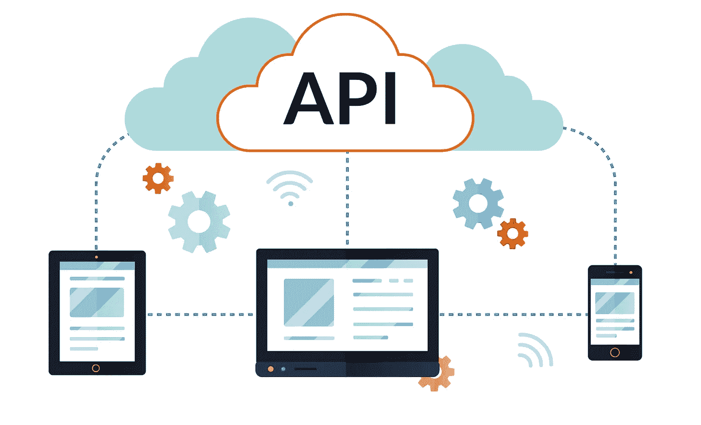
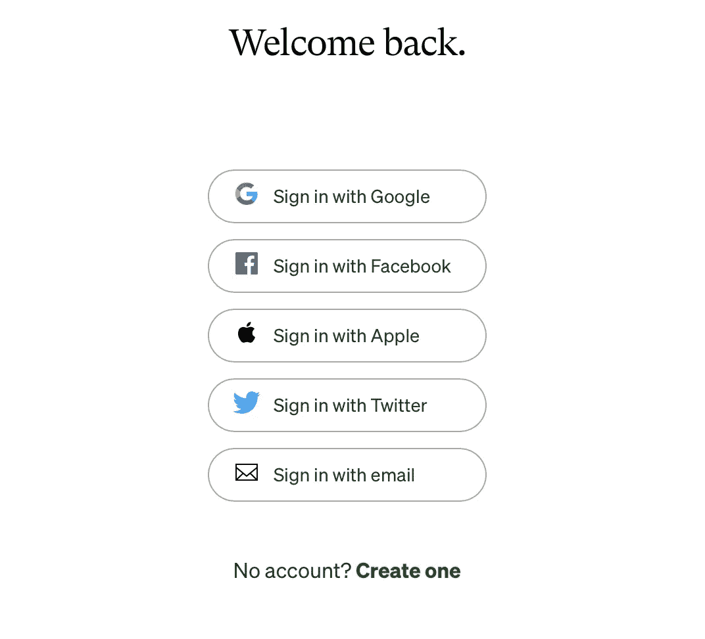

# Python 数据验证库 Pydantic 入门。

> 原文：<https://medium.com/codex/getting-started-with-pydantic-as-a-data-validation-tool-in-api-development-2155deef37c4?source=collection_archive---------3----------------------->



作为一名 web/移动开发者，你在开发全栈应用程序时会遇到 API，因为它们无处不在。每次你在 rideshare 应用程序上检查你的位置时，发生的事情是 rideshare 服务(客户端)从第三方应用程序(如谷歌地图 API)请求你的当前位置。因此，我们的位置是实时的，因为谷歌地图有一些 rideshare 应用程序可能没有的位置数据，因为它会占用大量资源，所以他们以 API 的形式外包。



当你想通过你的社交媒体(Twitter、脸书、谷歌、Github)登录不同的应用时，你也可以与 API 交互。此选项比手动使用您的凭据登录更安全，也更方便。API 在电子商务应用中也很突出，在处理服务支付时，它们经常使用 stripe、Paypal、Paystack 等支付解决方案

# 什么是 API？

API 充当两台机器(通常是一台客户机和一台服务器)之间的中间人，允许它们相互通信。正如你所看到的，API 在任何地方都被使用，作为一名开发人员，掌握它是一项非常重要的技能。

在本文中，我们将介绍如何使用 python 数据验证库 pydantic 处理客户端请求的数据。

当创建 API 时，您需要控制发送的信息，以避免错误的数据输入(例如，客户端可以发送一个空字段作为名称字段，或者一个字符串格式作为数字字段)，方法是将它强制放入一个模式中。模式设计数据应该是什么样子，这样客户端就可以给它需要的信息，除非它抛出一个错误。Python 有一个名为 pydantic 的数据验证库来解决这个问题。

“Pydantic 是一个使用 python 类型注释的数据验证和设置管理”——[Pydantic 官方文档](https://pydantic-docs.helpmanual.io)。Pydantic 确保发送或接收的数据是预期的，除非它返回一个非常友好的错误消息(我们都很感激😂❤️).

**Pydantic vs Python 数据类**

Python 数据类是将 python 类编写为数据容器的一种方式。它们以一种更高效、更优雅的方式保存数据，而不必编写如此多的模板代码，也不必初始化 python 类中的每个参数。让我们通过为电子商务应用程序创建一个产品类，来看看如何根据 python 数据类构造一个常规 python 类:

一个常规的 Python 类:

python 数据类:

从这个例子中，你可以看到有更少的样板文件和更严格的 DRY(不要重复自己)概念的应用。然而，与 Pydantic 不同，Python 数据类不支持类型或数据验证。换句话说，要开始使用 pydantic，您需要将它安装到您的虚拟机中。

```
pip install pydantic 
```

要使用 pydantic，您必须导入 BaseModel，然后在您的类中将其作为参数传递。

Pydantic 检查给定的数据是否与描述的模式匹配，如果匹配。它返回数据，否则会引发一个错误。如果字典中的 price 字段被注释掉，就会出现这种错误。

```
raise validation_error
pydantic.error_wrappers.ValidationError: 1 validation error for Product
price
  field required (type=value_error.missing)
```

Pydantic 是一个非常强大的数据解析和验证库。这只是一个如何开始使用 Pydantic 的演练，要更深入地了解 pydnatic 如何工作，您可以查看他们的官方文档。如果你喜欢这篇文章，请给它一堆掌声，并分享它谢谢:)❤️.