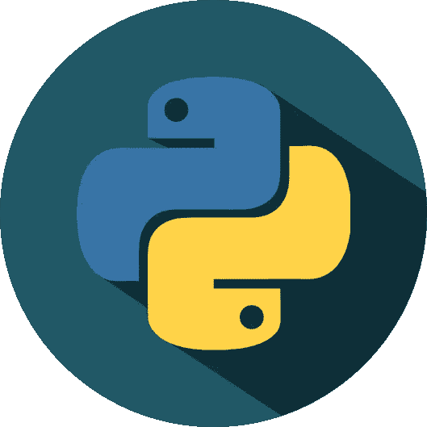

# Python 库入门

> 原文：<https://medium.com/codex/getting-started-with-python-libraries-e53176778ee4?source=collection_archive---------22----------------------->

[支线](https://www.subpng.com/)

在本教程中，我将从总体上讨论 python 库和一些常用的库。

# **什么是图书馆？**

在编程领域，我们使用术语库来表示类似于我们日常生活中所谈论的图书馆。

在编程中，库意味着可以在我们编写的程序中使用的预编译代码的集合。库还可以包含文档、配置数据、消息模板、类和值等。

# **什么是 Python 库？**

Python 库是相关模块的集合。

## **模块？**

模块是为特定目的编写的一组代码行。

它包含可以在各种程序中重用的代码包。它简化并方便了开发人员的 Python 编程。因为我们不必为不同的程序写相同的代码。机器学习、数据科学、数据可视化和其他行业都非常依赖 Python 库。库和模块本质上是共享资源。

让我们来看一个简单的场景。假设我们需要在 Python 中求一个整数的平方。在 Python 中，我们如何处理这种情况？

我们有三种不同的方法。

1.  将数字相乘两次。

2.通过使用指数运算符(**)。

3.使用 python 中内置的“数学”模块。

*在这种情况下，您应该首先使用保留关键字‘import’来导入模块‘math’然后，作为数学模块的一部分，您可以使用“pow”函数。你不必像这样写计算整数平方的算法。*

这只是一个简单的说明。数学模块中还有许多其他函数，可以使计算变得更加容易。然后有大量不同的 Python 库和模块可供选择。

# **Python 标准库**

Python 标准库的内置模块支持对基本系统功能的访问，如输入和输出、网络访问等。标准库包含 200 多个核心模块，可以快速访问 Python 环境中最重要的特性。

标准库提供的所有功能都有助于使 Python 成为一种高级语言。使用高级语言，我们不需要深入了解每个动作发生了什么。高级语言为程序员提供了一个方便易用的接口来完成所需的活动。

# **常见 Python 库**

现在让我们看看一些图形用户界面开发常用的 python 库。这些库也使 python 成为一个如此强大的工具。

1.  Tkinter

它在开发桌面应用程序方面很受欢迎。

2.PyQT5

[清洁](https://www.cleanpng.com/)

它是一个可视化框架，允许您拖放 GUI 元素，如按钮、标签和文本框。

3.Numpy

[PNGitem](https://www.pngitem.com/)

“Numpy”这个名字代表“数值 Python”。这是一个著名的机器学习库，可以处理大矩阵和多维数据。

4.SciPy

[pngset](https://pngset.com/)

“SciPy”这个名字代表“科学 Python”。这是一个开源的高级科学计算包。它是在 Numpy 扩展的基础上开发的。它使用 Numpy 来执行复杂的计算。

5.Matplotlib

[简·梅普](https://www.janmeppe.com/)

绘制数字数据图表是本库的职责。正是因为这个原因，它被用于数据分析。它也是一个开源库。

6.熊猫

[点燃](https://www.kindpng.com/)

对于数据科学家来说，熊猫是一个至关重要的图书馆。它是一个开源的机器学习包，具有各种分析工具和可配置的高级数据结构。它简化了数据分析、处理和清理。

另外， *Sci-kit Learn* 和 *Tensorflow* 是仅有的两个支持机器学习和深度学习的常用库。

这都是关于 python 库的。我希望你获得了一些新知识。

## 谢谢您们。编码快乐！