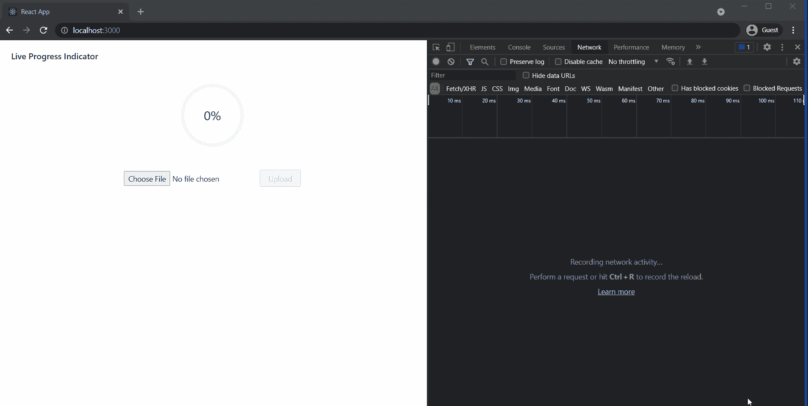

# 开始使用服务器发送的事件并了解何时使用轮询、WebSockets 和 SSE

> 原文：<https://medium.com/codex/getting-started-with-server-sent-events-and-understanding-when-to-use-polling-websockets-and-sse-87465f3bcf63?source=collection_archive---------2----------------------->

## 互联网上的数据共享如何随着 HTTP 轮询、WebSockets 和 SSE 的实时用例而发展的简史。

帕万·特里库塔姆在 [Unsplash](https://unsplash.com?utm_source=medium&utm_medium=referral) 上的照片

在这篇文章中，我将描述互联网上的数据共享是如何随着新兴需求的发展而发展的背景故事。我将向您介绍 SSE，并解释您应该在哪些用例中使用 SSE 并避免 web 套接字的开销。

在下一篇文章中，我将向您解释我的项目中需要使用 SSE 的一个用例，我将带您完成一个使用 **Spring Boot** 和**反应**开发的 POC 来演示这个想法。

**这就是我所说的用例:“在文件上传时，显示一个实时进度条，显示服务器到目前为止已经处理了多少，而不会在进度条中重复点击端点。”**

# 互联网数据共享简史

这一切都始于请求和响应的 HTTP 协议。一个实体打开一个连接并请求一个资源或服务，然后另一个实体做出响应，要么是请求的资源，要么是错误响应(如果它不可用)。在每个请求-响应周期之后，连接被关闭。

HTTP 请求-响应周期

*HTTP 是一种无状态协议，如果相同的两个实体需要再次通信，则通过新的连接进行。*

> 这是这种交流的弊端之一。对于事件驱动的应用程序来说，HTTP——以其自然的形式——并不能完全满足它。

以股票定价为例。该应用程序将向数据提供商请求当前的股票价格，并在 HTTP 场景中将其显示在网页上。*但是，HTTP land 中不存在“更新”的概念。*如果应用程序需要更新的数据，合乎逻辑的步骤是刷新页面并发出新的 HTTP 请求。虽然它模糊地完成了工作，但是频繁地发送请求对于实现这一点来说并不理想，并且也是能量密集型的。

**为了实现这些实时通信，让我们看看有哪些选择。**

## HTTP 轮询/短轮询

*短轮询*是一个基于 AJAX 的定时器，以固定的延迟调用。这里使用 REST 端点不断向服务器发出请求，以查看是否有新信息到达。因此，基本上，客户端以固定的频率发出请求，这会导致大量的请求，而服务器通常会返回相同的“陈旧”响应。所以，它不是那么有益。

HTTP 轮询

*这里是你在 JavaScript 中如何做这件事。*

HTTP 轮询

## HTTP 长轮询

HTTP 轮询的一个改进是 HTTP 长轮询。这里，只有当新数据出现时，才会返回对请求的响应，这是通过保持连接实现的。

就客户端而言，与基本轮询的唯一区别是，执行基本轮询的客户端可能会故意在每个请求之间留出一个小的时间窗口，以减少其在服务器上的负载，并且它可能会以与不支持长轮询的服务器不同的假设来响应超时。对于长轮询，客户端可以配置为在侦听响应时允许更长的超时时间(通过`Keep-Alive`头)——这通常是可以避免的，因为超时时间通常用于指示与服务器的通信问题。

所以这几乎是一回事，我们每次都必须打开新的 HTTP 请求来获取新数据，这根本不是双向的。

有关其局限性的更多详细信息，请访问-[https://stack overflow . com/questions/21676324/hard-down sides-of-long-polling](https://stackoverflow.com/questions/21676324/hard-downsides-of-long-polling)

HTTP 长轮询

## HTTP 流

HTTP 流是一种推式数据传输技术，它允许 web 服务器通过一个保持无限开放的 HTTP 连接向客户端连续发送数据。从技术上来说，这违背了 HTTP 约定，但是 HTTP 流是在服务器和客户机之间传输各种动态或可流数据的有效方法，而无需重新发明 HTTP。

SSE 建立在 HTTP 流之上，HTTP 流是以前“松散定义”的 HTTP 流的标准化。它还引入了更简单的浏览器 API 来处理这个问题。它使用 JavaScript[event source API](https://developer.mozilla.org/en-US/docs/Web/API/EventSource)来订阅任何流行浏览器中的数据流。

HTTP 流

## Web 套接字

WebSocket 连接在传输层使用 TCP/IP 来提供全双工连接。通信双方现在可以同时双向发送消息。该连接是持久的，这意味着只要应用程序运行，它就保持打开。连接也是有状态的——服务器可以发起消息，反之亦然。

**用例-**

*   消息应用程序
*   多人游戏
*   协作编辑/编码
*   基于位置的应用

我鼓励你通读一下 [MDN](https://developer.mozilla.org/en-US/docs/Web/API/WebSockets_API) doc，它详细解释了 WebSocket。

WebSockets

# 服务器发送事件简介

虽然 WebSockets 解决了大部分实时用例，但有时它可能有些过头了。就像在我们不需要双向通信的场景中一样，SSE 可能是一个不错的选择。

> SSE 是 HHTP 流之上的一个轻量级协议，它允许客户端拥有超轻量级的仅订阅功能。与 WebSockets 不同，SSE 不提供双向通信的能力，但是可以被服务器用来实时地将数据推送到客户端。

服务器发送事件(SSE)是一种服务器推送技术，使客户端能够通过 HTTP 连接从服务器接收自动更新。W3C 将服务器发送的事件 EventSource API 标准化为 HTML5 的一部分。

它提供了 XHR 流的内存高效实现。与原始 XHR 连接不同，它会缓冲收到的全部响应，直到连接断开，SSE 连接可以丢弃已处理的消息，而不会将它们全部累积到内存中。

SSE 被设计为使用 JavaScript EventSource API，以便在任何流行的浏览器中订阅数据流。通过这个接口，客户端请求一个特定的 URL 来接收事件流。SSE 通常用于向浏览器客户端发送消息更新或连续数据流。

简而言之，服务器发送事件是指从服务器向浏览器推送(而不是拉取或请求)更新。

## **用例:**

当客户端只对订阅数据流感兴趣，而不需要在同一个连接中与服务器通信时，可以特别使用 SSE。

*   订阅加密货币或股票价格的订阅源
*   订阅 Twitter feed
*   接收实况体育比分
*   新闻更新或提醒

欲了解更多详情，请访问 SSE 上的这篇 [MDN 文章](https://developer.mozilla.org/en-US/docs/Web/API/Server-sent_events/Using_server-sent_events)。

服务器发送的事件

这个博客到此为止。感谢阅读！

这是我前面提到的 POC 的演示。

> [使用 React 和 Spring Boot](/codex/implementation-of-server-sent-events-and-eventsource-live-progress-indicator-using-react-and-723596f35225) 实现服务器发送的事件和 event source——实时进度指示器，通过代码演练详细解释了 POC。

如果你喜欢这个博客，请在 [Medium](https://arpan-banerjee7.medium.com/) 、 [Linkedin](https://www.linkedin.com/in/banerjee-arpan7/) 和 [GitHub](https://github.com/arpan-banerjee7) 上关注我，了解更多类似的博客。