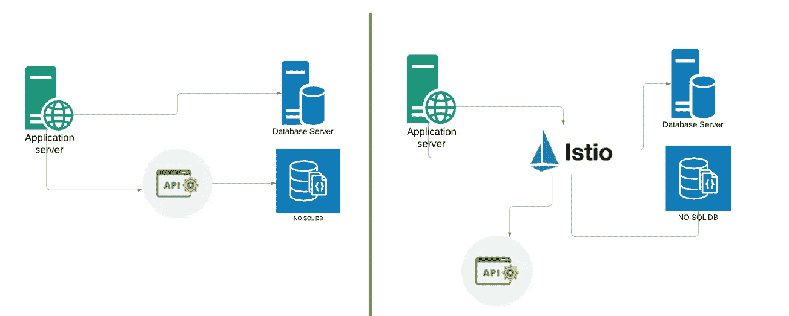

# 服务网格和 Istio 入门

> 原文：<https://medium.com/codex/getting-started-with-service-mesh-and-istio-3c8af1836454?source=collection_archive---------1----------------------->

## 技术基础，[法典](http://medium.com/codex)

服务网格和 Istio

# 第 1 部分:沟通

如果您在现代软件设计领域，您可能听说过主要在微服务环境中的服务网格架构。在这篇文章中，我的目标是让你对服务网格和一个流行的服务网格解决方案 Istio 有一个基本的了解。