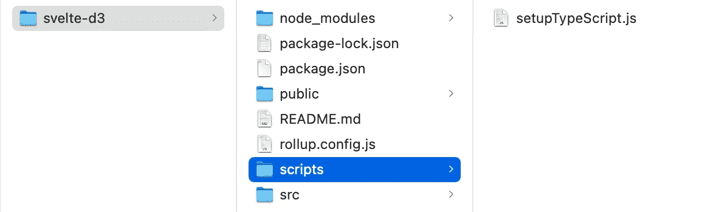
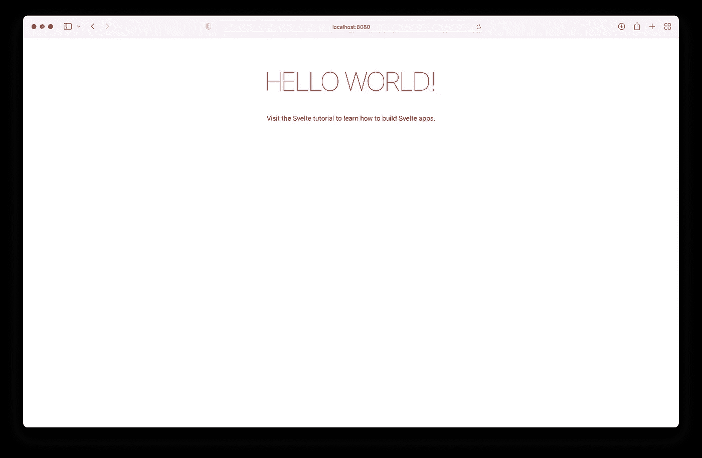
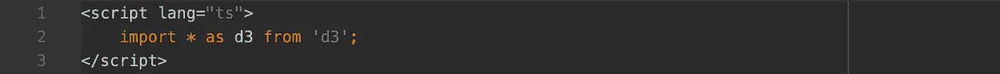
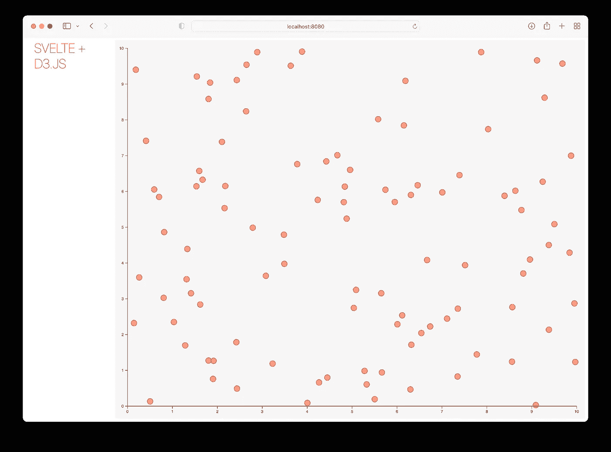

# Svelte 和 d3.js 入门

> 原文：<https://medium.com/codex/getting-started-with-svelte-and-d3-js-ea915d2c2c2c?source=collection_archive---------1----------------------->


由[费伦茨·阿尔马西](https://unsplash.com/@flowforfrank?utm_source=medium&utm_medium=referral)在 [Unsplash](https://unsplash.com?utm_source=medium&utm_medium=referral) 上拍摄的照片

自 2013 年以来，我一直使用 [d3.js 作为我的标准可视化库，大约是在 Mike Bostock 在](http://idl.cs.washington.edu/files/2011-D3-InfoVis.pdf) [InfoVis 2011](http://ieeevis.org/year/2011/info/infovis-welcome/infovis-welcome) 大会上介绍它的 2 年之后。首先，我使用 d3 创建了自己的普通 JS web 应用程序。最终，我开始使用 Angular 和 React，我的程序引入了额外的复杂性，不知何故，我花了更多的时间思考如何整合某些视觉元素，而不是简单地使用它并从中获得乐趣。然而，这只是我的主观观点——我确信许多开发人员可能会反对我😜。

去年我遇到了 Svelte，我喜欢它的轻量级概念，也喜欢开发者抛弃了虚拟 DOM。希望这篇文章是以后许多文章中的第一篇，在这里我将一步一步从头开始创建一个成熟的可视化 web 应用程序。

话说够了，开始吧！🚀

在本文中，我将介绍 vis 应用程序的以下步骤:

*   使用 TypeScript 实例化一个简单的应用程序
*   将 d3.js 集成到苗条应用中
*   第一可调整大小的 d3.js 散点图

# 创建一个简单的应用程序

首先，我们必须在我们的系统上安装[节点](https://nodejs.org/en/)。然后，打开我们的终端并执行以下命令:

```
$ npx degit sveltejs/template svelte-d3
$ cd svelte-d3
$ npm install
```

第一行将创建一个名为 **/svelte-d3** 的基于模板的新项目。然后，我们将目录切换到项目文件夹并执行 **npm install** ，这将把所有依赖项安装到文件夹 **/node_modules** (依赖项在 package.json 中定义)。项目文件夹应该如下所示:



安装完所有依赖项后的项目文件夹。

最后，为了将模板项目用作 TypeScript 项目，我们运行以下命令:

```
$ node scripts/setupTypeScript.js
$ npm install. # run a second time to 
```

如果我们将属性`lang="ts"`添加到`<script></script>`标签中，我们现在可以使用 TypeScript。在此处找到附加文档[。](https://svelte.dev/blog/svelte-and-typescript)

然后我们在终端中运行`npm run dev`，在浏览器中打开 [http://localhost:8080](http://localhost:8080) 。我们开始了，我们第一个苗条的网站！



# 安装 d3.js 依赖项

首先，我们在项目文件夹中运行以下两个命令:

```
$ npm install d3
$ npm install @types/d3
```

我们将能够在`<script></script>`标签内的苗条应用程序中以如下方式开始使用 d3:



# 可调整大小的散点图

为了简单起见，我们将使用主要的苗条组件**app . svelete**。在本例中，我们将创建一个包含 100 个点的随机数据数组，随机 x 和 y 值在[0，10]范围内:

```
let data = [];
for (let i = 0; i < 100; ++i) {
 data.push({x: Math.random() * 10, y: Math.random() * 10})
}
```

此外，我们必须创建一组初始变量:

```
let xScale = d3.scaleLinear().domain([0, 10]);
let yScale: = d3.scaleLinear().domain([0, 10]);
let width: number;
let height: number;
const margin = {
  top: 20,
  right: 20,
  bottom: 30,
  left: 30
 };
```

然后，为了支持调整大小，我们将添加一个 redraw()函数。如果您熟悉任何 2D 或 3D api，通常会在帧中发生变化(如不同的大小)时调用 redraw/repaint/…方法。对于这个例子，我们将采用完全相同的概念。

```
onMount(() => {
 redraw();
 window.addEventListener('resize', redraw);
})
```

请注意， **onMount()** 是一个简单的特定方法，在组件被呈现到 DOM 后会被自动调用。除了最初的 **redraw()** 之外，我们还添加了一个事件监听器。每当调整窗口大小时，这个监听器调用 **redraw()** 方法。

让我们来看看 **redraw()** 方法:

```
function redraw(): void {
  // empty vis div
  d3.select(vis).html(null); // determine width & height of parent element minus the margin
  width = d3.select(vis).node().getBoundingClientRect().width - margin.left - margin.right;
  height = d3.select(vis).node().getBoundingClientRect().height - margin.top - margin.bottom; // init scales according to new width & height
  xScale.range([0, width]);
  yScale.range([height, 0]); // create svg and group that is translated by the margin
  const svg = d3.select(vis)
   .append('svg')
   .attr('width', width + margin.left + margin.right)
   .attr('height', height + margin.top + margin.bottom)
   .append('g')
   .attr('transform', `translate(${[margin.left, margin.top]})`) // draw x and y axes
  svg.append("g")
   .attr("transform", `translate(${[0, height]})`)
   .call(d3.axisBottom(xScale));
  svg.append("g")
      .call(d3.axisLeft(yScale)); // draw data points
  svg.append('g').selectAll('circle')
   .data(data)
   .enter()
   .append('circle')
   .attr('cx', function (d) { 
    return xScale(d.x); 
   })
   .attr('cy', function (d) { 
    return yScale(d.y); 
   })
   .attr('r', 7)
   .style('fill', '#ff3e00')
   .style('fill-opacity', '0.5')
   .style('stroke', '#ff3e00');
 }
```

让我们将所有这些联系在一起，用我们的可视化逻辑连接一个专用的`<div></div>`。注意，在上面的代码中，`div`是通过`d3.select(vis)`选择的。

```
<script lang=”ts”>
  let vis;
</script><main>
 <div id="vis" bind:this{vis}></div>
</main><style>
 /* some styles */
</style>
```

第`bind:this{vis}`行创建了一个只读绑定，并给出了对这个特定 div 元素的引用。访问该元素的另一种方法是通过`d3.select('#vis')`访问 id。

下面是 **App.svelte** 组件的代码:

最终结果应该类似于:



接下来，检查窗口大小调整功能，并观察由于重绘，缩放比例如何适应窗口大小。你可能想知道这对于散点图是否有意义，答案是:可能没有。然而，这里有几个用例，您可能想要扩展规模。敬请期待，更多即将到来；)

*参考文献*:

[](https://svelte.dev) [## 苗条的

### 控制论增强的网络应用

苗条的人](https://svelte.dev) [](https://d3js.org) [## D3.js -数据驱动的文档

### D3 是一个用 HTML、SVG 和 CSS 可视化数据的 JavaScript 库。

d3js.org](https://d3js.org) [](https://svelte.dev/blog/virtual-dom-is-pure-overhead) [## 虚拟 DOM 是纯粹的开销

### 如果您在过去几年中使用过 JavaScript 框架，让我们彻底抛弃“虚拟 DOM 很快”的神话吧…

苗条的人](https://svelte.dev/blog/virtual-dom-is-pure-overhead)