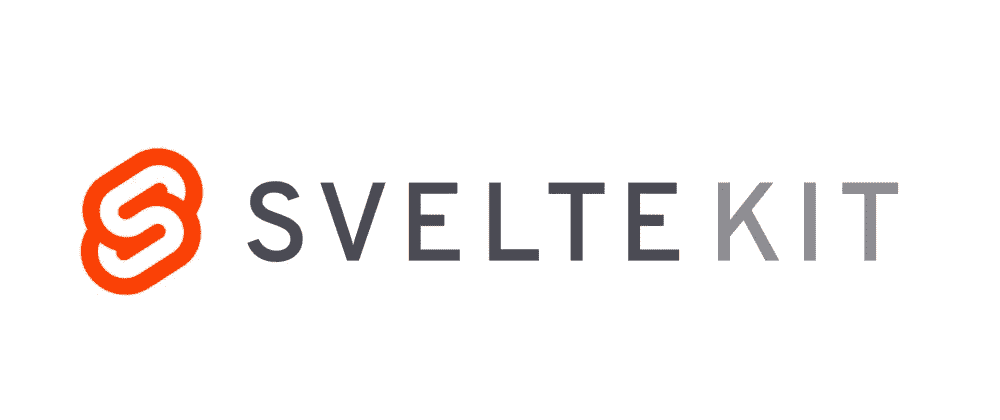
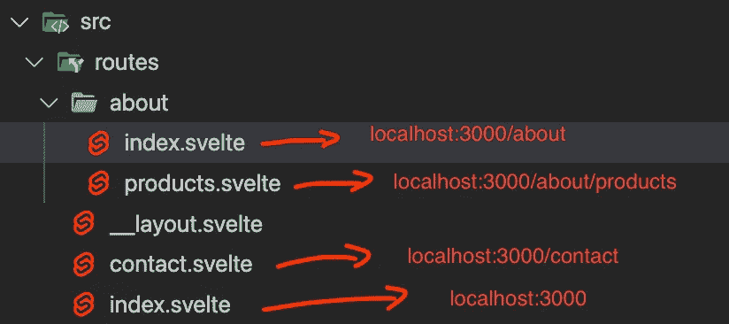
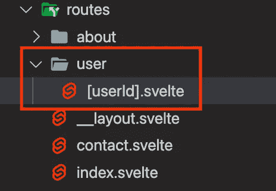

# 开始使用 SvelteKit

> 原文：<https://medium.com/codex/getting-started-with-sveltekit-369987d924bd?source=collection_archive---------0----------------------->

SvelteKit，svelte 对 Sapper 的后续产品，现在正处于公测阶段，而且相当不错。我在使用 SvelteKit 时遇到的唯一问题是文档有限。很多东西都类似于 Sapper，但作为一个最近从 React 转换过来的苗条的人，我从未真正使用过 Sapper，不得不搜索大量的堆栈溢出问题和 GitHub 项目，以弄清楚如何实现一些基本概念。随着 SvelteKit 的加入，一个简单的关于如何用 SvelteKit 完成任务的谷歌搜索通常都是关于 Sapper 的回答，很难找到与 SvelteKit 相关的信息。希望有相同情况的其他人，可以找到一些使用我在 SvelteKit 公开测试版发布后获得的知识。

# 创建项目

使用 SvelteKit 创建一个项目非常简单。Svelte 将使用以下命令生成一个模板项目:

创建一个苗条工具包项目

这将引导您完成一个设置过程，并询问您是否需要对 eslint、prettier 和 typescript 之类的东西的可选支持。它还会问你是想开始一个框架项目还是一个演示应用程序。我通常选择框架项目，但演示应用程序可以成为项目结构的一个很好的学习工具。对于本文，我将假设我们正在使用一个框架项目。

# 设置插件

SvelteKit 的一个令人惊讶的特性是，它内置了对许多常用插件的支持，如使用 svelte 的 [svelte-preprocess](https://github.com/sveltejs/svelte-preprocess) 包的 typescript、sass、less、scss、babel 等。默认情况下，svelte.config.js 文件被设置为自动预处理任何可用的插件，因此在配置中不需要额外的设置。

对于某些插件，需要一个额外的软件包才能正常工作，例如安装 npm 软件包“sass”以支持 scss/sass。

为 sass/SCSS 支持安装 SASS

安装“sass”后，您现在可以导入 scss 和 sass 文件，也可以在中使用 scss/sass。将 lang="scss "或 lang="sass "附加到 style 标签时的苗条文件。

在内部使用 SCSS。纤细的文件

## 苗条-添加

获得一些附加功能的一个简单方法是使用一个名为 [svelte-add](https://github.com/svelte-add/svelte-add) 的 npm 包。这是一个基于社区的命令行工具，用于为 SvelteKit 应用程序添加某些功能。他们有插件，比如 GraphQL(服务器端)，postcss，tailwind 等等。我个人用它来设置顺风，它让这个过程变得没有痛苦。

添加顺风

在撰写本文时，该命令有一个错误(由于 SvelteKit 最近将布局文件名从＄layout . svelte 更改为 __layout.svelte，但应该很快会得到修复，更多信息可在此处找到，并在本文的 github repo 中得到正确修复。)

插件安装完成后，你可以在项目中的任何地方使用 tailwind。

利用顺风

# 项目结构

SvelteKit 有一个特定的项目结构，比如路由和静态文件。让我们深入了解这些功能。

## 基本路由

SvelteKit 中的路由类似于 Next.js 和 Sapper 等其他 SSR 框架。在您的项目根目录中，有一个 src/routes 文件夹，其中将包含您的所有路由。路由将与文件名匹配，因此文件“src/routes/contact.svelte”将与 URL“localhost:3000/contact”匹配。您也可以拥有包含嵌套路线的文件夹。在该文件夹中有一个 index.svelte 文件将为文件夹名称创建一个路径。这个通过下图更好解释。

路由如何映射到 URL

## 高级路由

SvelteKit 支持高级路由，如动态参数。假设您想要一个包含用户 id 并显示与该用户相关的内容的用户路由。该路线看起来像这样:

localhost:3000/user/{这里的用户 id

这在 SvelteKit 中很容易做到。首先，设置一个名为 user 的文件夹，然后添加一个名为“[userId]的文件。苗条”。如果要使用动态参数，必须用[]将变量名括起来。[]中的文本将是我们稍后访问的变量的名称。

创建/user/userId 路由

在我们创建了[用户标识]之后。svelte 文件，我们可以从包' $app/stores '(包含在 SvelteKit 中一个包)中的页面变量访问动态参数。页面变量是一个存储，所以要访问它，我们必须给变量加上前缀$然后动态参数在一个名为 params 的对象下。

如何获取一个苗条组件的动态参数

在管线中可以有任意数量的动态参数，例如:

localhost:3000/user/[userId]/[receiptId]

这样做需要您创建[userId]。请用 index.svelte 和[receiptId]将文件压缩到一个文件夹中(src/user/[userId]/)。身材苗条。

## 布局

在许多应用程序中，有一些页面之间共享的公共元素，比如导航条或页脚。布局允许我们在页面上显示这些组件，而无需在路径之间切换时卸载和重新安装。

布局对于许多其他事情也很有用，例如弹出窗口可能出现在用户访问的任何页面上(例如出现在许多网站上的臭名昭著的 cookie 接受横幅)，或者导入将在每个页面中使用的样式表。

您可以有多个布局文件，它们适用于同一目录中的每个页面，或者嵌套在布局文件所在的目录中。布局文件命名为“__layout.svelte”。并且必须包含至少一个将呈现所选页面的<slot>元素。</slot>

让我们做一个导航栏和页脚，显示在每一页上。首先在 routes 文件夹中创建一个名为“__layout.svelte”的文件。确保您有一个<slot>元素，以便呈现页面。下面我有一个添加导航条的例子，该导航条样式当前活动的链接，我们从以前使用的“$app/stores”库中检索。</slot>

在 __layout.svelte 中创建导航栏

现在，如果你在不同的路线之间转换，导航条会一直在那里。

您还可以将 __layout.svelte 文件添加到仅适用于该子路径的子文件夹中。如果我们将 __layout.svelte 文件夹添加到 routes/user 文件夹，它将在我们的主布局之上添加一个附加布局，以应用于 user 文件夹中的每条路线。

如果你想从 localhost:3000/user/*中删除导航条和页脚，你可以添加一个“__layout.reset.svelte”来删除所有之前应用到该子路径的布局。

从子路线中删除基础布局

## 静态文件

您希望包含在应用程序中的文件(如照片和字体)可以包含在项目根目录下的“静态”文件夹中，然后在项目中与路径“/您的文件”一起使用。

因此，如果我们在“$project/static/photo.png”下包含一张图片，我们可以这样使用它:

如何使用图像

## 路径别名

SvelteKit 内置了对路径别名的支持，甚至包括一个内置的:$lib。路径别名将映射到项目中您想要的任何路径，并允许您删除大量的“../../../"当您需要导入文件时。默认的$lib 别名映射到“$project/src/lib”。如果我们这里有一个名为“helpers.ts”的文件，我们可以像这样在项目的任何地方导入该文件:

使用默认的$lib 别名

我们还可以通过配置“svelte.config.js”文件来添加我们自己的路径别名，如下所示:

创建$components 别名

我们向配置中的 kit 对象添加了一个 vite 属性，并在它下面设置了一个别名。

如果使用 typescript，还需要配置 tsconfig.json，以便 TypeScript 能够识别路径。

确保 typescript 知道别名

# 适配器

适配器告诉 SvelteKit 如何编译。有多种适配器，如静态适配器和节点适配器。Adapter-static 允许你编译成一个完全静态的网站，不需要服务器端渲染。Adapter-node 编译提供服务器端渲染的节点服务器。

我们将在项目中添加 adapter-node，这样我们就可以使用 SSR 运行生产服务器。

默认情况下，框架项目不包含适配器。要向我们的项目添加 adapter-node，首先让我们安装这个包。

安装适配器

请确保在末尾包含@next，否则在编写本文时，它将安装一个无法工作的旧版本适配器。

安装适配器后，将其导入到 svelte.config.js 文件中，并将其包含在“kit”属性下，如下所示:

使用适配器

完成此操作后，您可以运行以下命令来构建和运行生产服务器。

构建和运行服务器

# 结论

有了这些信息，您应该能够创建一个 SvelteKit 项目，设置您想要的插件，创建您的网站，并为生产而构建它。如果你想看更多关于 Svelte 或 SvelteKit 的教程，请在下面评论你的建议。

您可以在以下网址找到使用上述所有信息的 SvelteKit 应用示例:

[https://github . com/Cameron Stuart Smith/getting-started-with-sveltekit](https://github.com/CameronStuartSmith/getting-started-with-sveltekit)