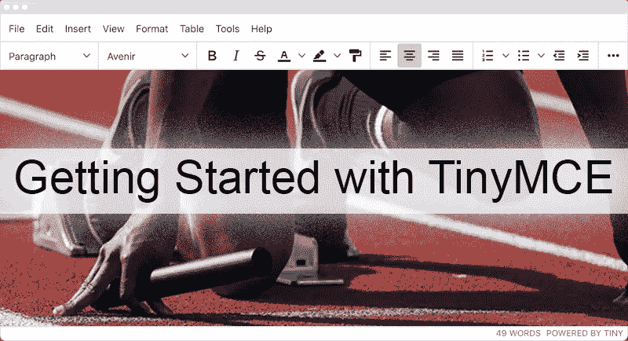
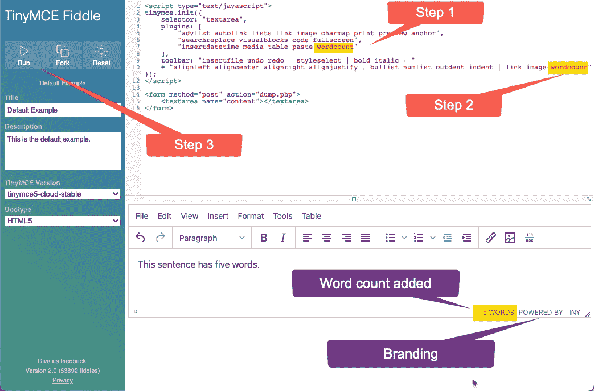
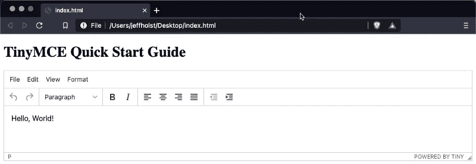
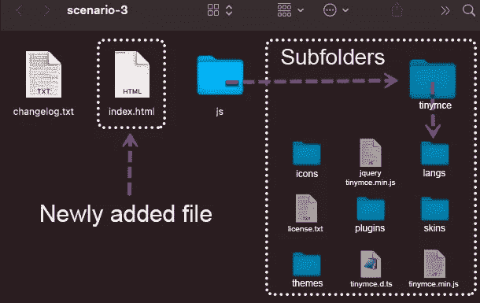
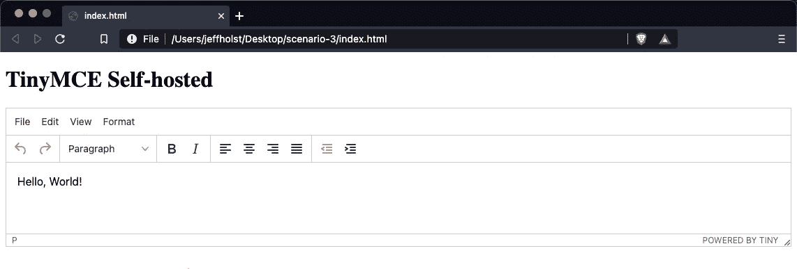

# TinyMCE 入门

> 原文：<https://medium.com/codex/getting-started-with-tinymce-2566e50c17a9?source=collection_archive---------8----------------------->

## [法典](http://medium.com/codex)

开发者广泛使用 [TinyMCE](https://www.tiny.cloud/) 来为他们的网站和解决方案添加 [WYSIWYG](https://en.wikipedia.org/wiki/WYSIWYG) 文本编辑。如果你想在网站上添加一个 HTML 编辑器，或者只是想尝试一下世界上最流行的 JavaScript 富文本编辑器，让我们开始吧！

# **快速上手 TinyMCE 的 3 种方法**

**场景 1** :在线编辑
**场景 2** :内容分发网络(CDN)
**场景 3** :自托管

少量的 JavaScript 和 HTML 在这些场景中是有帮助的，但是最有用的先决条件将是查看 [TinyMCE 文档](https://www.tiny.cloud/docs/)以了解 TinyMCE 可用的所有特性。

虽然 TinyMCE 计划中确实包括了几个付费的基于云的解决方案，但是我们将会关注在 LGPL 2.1 下授权的“永远免费”的开源版本。

# 我们开始吧

# 场景 1:在线编辑器

**优点**:易于标记和分享解决方案
**缺点**:需要在线连接

开始尝试 TinyMCE 最简单的方法之一是使用在线编辑器，如 [TinyMCE Fiddle](https://fiddle.tiny.cloud/) 或 [CodePen](https://codepen.io/tinymce/pen/NGegZK) 。

在这个场景中，我们将使用 [TinyMCE Fiddle](https://fiddle.tiny.cloud/#) 来更新 TinyMCE 以添加[字数统计](https://www.tiny.cloud/docs/plugins/opensource/wordcount/)插件。安装字数统计插件后，编辑器会在页脚显示字数统计。

首先在你的浏览器中打开网址[https://fiddle.tiny.cloud/](https://fiddle.tiny.cloud/)。

**步骤 1** :将文本**字数**添加到**插件**选项
**步骤 2** :将文本**字数**添加到**工具栏**选项
**步骤 3** :点击**运行**按钮执行修改

**图一** : 小提琴

现在你应该可以在底部页脚看到如图 1 所示的[字数统计](https://www.tiny.cloud/docs/plugins/opensource/wordcount/)插件。除了[字数](https://www.tiny.cloud/docs/plugins/opensource/wordcount/)之外，TinyMCE 还提供了强大的[高级](https://www.tiny.cloud/docs/plugins/premium/)和[开源](https://www.tiny.cloud/docs/plugins/opensource/)插件，以及用于[开发自己的插件](https://www.tiny.cloud/docs/advanced/creating-a-plugin/)的全功能 API。

**参考信息**:图 1 中的**所示的“POWERED BY TINY”品牌可以在用户界面选项中[关闭](https://www.tiny.cloud/docs/configure/editor-appearance/#branding)。付费用户不需要这种品牌，但推荐免费和开源用户使用这种品牌。**

# 场景 2:内容交付网络(CDN)

**优点**:使用 CDN 快速传递 TinyMCE 代码
**缺点**:比网络版稍难分享

与场景 1 中我们使用在线编辑器修改 TinyMCE 代码不同，在这个场景中，我们将使用自己创建的本地文件。

首先打开您最喜欢的文本编辑器或代码编辑器。

**步骤 1** :新建一个名为 index.html
**的文件步骤 2** :将下面的 HTML 复制/粘贴到新建的 index.html 文件中

**图二**:场景二 index.html

**步骤 3** :保存 index.html 文件，并在网络浏览器中打开该文件

**图 3** : 网页浏览器显示 TinyMCE

你现在可以做和**场景 1** 一样的改变来添加[字数](https://www.tiny.cloud/docs/plugins/opensource/wordcount/)插件或者做任何你喜欢的改变。不要忘记访问[开源插件](https://www.tiny.cloud/docs/plugins/opensource/)列表，查看 TinyMCE 自动包含的所有插件。

# 场景 3:自托管

**优点**:完全自托管的解决方案
**缺点**:需要更多的设置和共享

在第三个也是最后一个场景中，我们将下载 TinyMCE 代码并在本地提供服务，而不是从 CDN 链接到 tiny MCE 代码。

首先从这个链接下载一个自托管的 **TinyMCE 包**:

【https://www.tiny.cloud/get-tiny/self-hosted/ 号

在下载页面上，你可以选择下载最新的**社区**或**开发包**以及之前的版本。社区版本已经可以用于生产，而开发包对于查看完整的源代码非常有用。这两个版本都适用于这个场景，但是我们将使用 Dev 包。

**步骤 1** :新建一个名为**场景-3**
**的文件夹步骤 2** :将上面下载的 TinyMCE 包的内容解压到**场景-3** 文件夹
**步骤 3** :在**场景-3** 文件夹的顶层，新建一个名为 index.html 的空文件

**图 4** :目录结构

此时，**场景-3** 文件夹的内容应该看起来像图 4 中的图像。

**步骤 4** :将下面的 HTML 复制/粘贴到新创建的 index.html 文件中

**图六**:场景三 index.html

**第五步**:保存 index.html 文件，并在浏览器中打开

**图 7** : 网页浏览器显示 TinyMCE

在这一点上，我们还没有触及 TinyMCE 的表面，但是我们已经展示了 3 个不同的场景，如何快速开始使用 TinyMCE 进行原型开发。

祝您编码愉快，并享受您剩下的 TinyMCE 之旅！