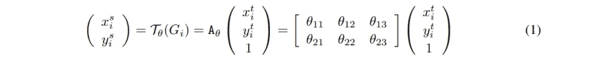
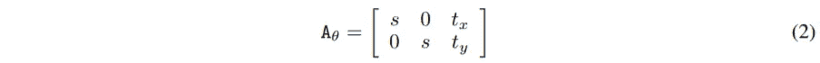
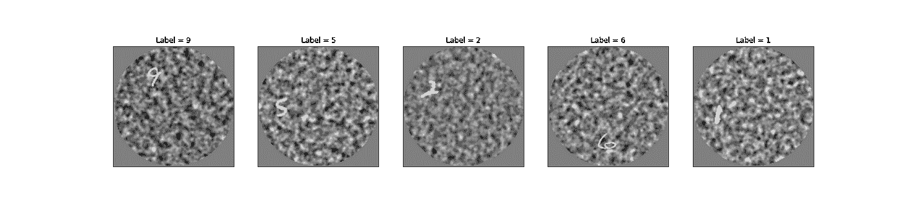
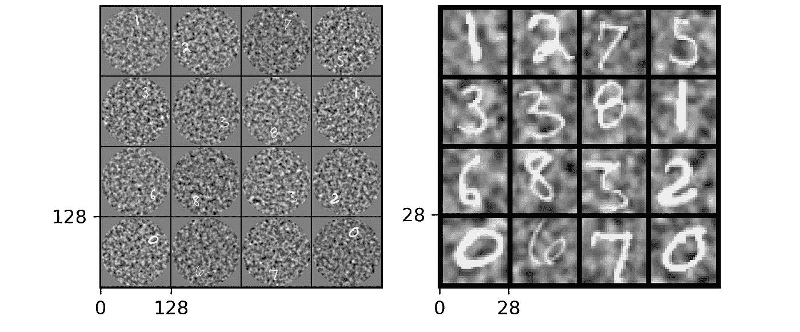

# 引起你的空间转换器的注意

> 原文：<https://medium.com/codex/getting-the-attention-of-your-spatial-transformer-5f43114df937?source=collection_archive---------10----------------------->

让我们承认，**空间变形金刚**真的很酷，自从它们在 2015 年被 Google Deep Mind 引入以来，它们的潜力还没有被充分挖掘。这些小小的**可区分注意力**砖块非常容易拖放到任何现有的 ConvNet 中，为其提供了抵抗大规模空间转换的能力，这种转换无法通过 max-pooling 层的固有空间不变性来捕捉。

在最初的工作中，空间转换器增强的 ConvNets 又名空间转换器网络(**stn**)在一个大型任务面板上进行测试。从原始的 MNIST 数据集，到街景门牌号码数据集，最后由加州理工学院-加州大学圣迭戈分校 Birds 200 完成细粒度分类任务。

所以，是的，如果没有达到**最先进的性能**，我们就不会在这里和一堆其他媒体文章中讨论它们。

# 那么，我今天在这里做什么？

让它变得非常简单，我们在这里不是为了解释和回顾 stn 的内部工作原理，我认为最初的文章和我的 medium 作者同事用每一个可能的工具和动画解释了它们。我们今天要讨论的是如何**构建**(用 Pytorch)这些空间转换器的一个变种，即**注意力受限空间转换器**。

# 等等，你想限制空间转换器？

你完全正确，当空间转换器建立时，它们被设计成捕捉所有类型的仿射变换。这可以很容易地用一个 2×3 仿射变换矩阵，或者著名的 **6 维 *θ*** 来完成，我们在这里和那里不停地谈论。

因此，当我们想要在空间上扭曲我们的照片时，我们将在我们的空间转换器中做类似的事情(或者在采样网格中，对于你们这些好奇的人来说)



为全仿射空间变换参数化的 STN

上面的 ***θ*** 矩阵是一个真正的坏蛋，它可以捕捉所有类型的**缩放**，**旋转，平移，裁剪和倾斜**在物体内部的图像，但如果我们不想要所有这些呢？如果我们只是想让网络关注图像中不在中心的小物体呢？

嗯那就简单了，我们可以召唤那个不太酷的兄弟，那个**注意力受限的** ***θ*** *。*



注意力受限的空间变换类

正如我们所见，这个矩阵只有**个三维**，我们有**个**标度变量和**个**平移变量。在注意力的情况下，我们只想捕捉缩放和平移的对象，所以我们不需要其他θ因子。

# 算够了，给我果汁

所以，如果你像我一样，是一个空间转换迷，你可能偶然发现了这个 [Pytorch 教程](https://pytorch.org/tutorials/intermediate/spatial_transformer_tutorial.html)来让你的 STN 运行起来。

但没有这么快，不幸的是，它只显示了如何建立成熟的仿射空间转换器，而不是我们正在寻找的类型，我们将不得不在这里和那里做一些调整。不会很复杂的，我保证。

如果我们更深入地看一下架构，我们可以看到*定位网络*(空间变形金刚的主要黑魔法/深度学习方案)有一个回归器，在最后一层有 6 个输出神经元。

```
*# Regressor for the 3 * 2 affine matrix*
        self**.fc_loc** **=** **nn.Sequential(**
            **nn.Linear(**10 ***** 3 ***** 3**,** 32**),**
            **nn.ReLU(True),**
            **nn.Linear(**32**,** 3 ***** 2**)**
        **)**
```

这 6 个输出神经元对应于等式(1)中的 ***θ仿射矩阵*** 内的 6 个变量，当我们要在不使用 transformer 的情况下进行正向传递时，将使用 Pytorch 的视图()简单地将输出构建为 2×3 矩阵。

```
**theta** **=** self**.fc_loc(xs)**
**theta** **=** **theta.view(-**1**,** 2**,** 3**)**
```

所以如果我们想把它限制在注意力上，我们就必须改变这两个地方的网络行为。

我们可以通过两个小步骤来实现这一点，**首先是**，简单地迫使定位网络具有 3 个输出神经元而不是 6 个，一个神经元用于缩放，两个用于转换。

```
 self**.fc_loc** **=** **nn.Sequential(**
            **nn.Linear(**10 ***** 3 ***** 3**,** 32**),**
            **nn.ReLU(True),**
            **nn.Linear(**32**,** 3**) # ONLY 3 Neurons**
        **)**
```

**其次**，也是最后，我们要建立等式(2)*中定义的 2×3 矩阵，从著名的定位网络吐出的 3 个神经元开始。

为此，从 3×1 张量开始，我们取第一个特征并将其视为缩放因子，复制它并在 2×2 矩阵内对角化它。

在这之后，我们取剩下的两个特征，把它们当作两个翻译因子，并把所有的东西串联起来，得到最终美丽的 ***注意力受限的*** ***θ矩阵。***

```
# All this action happens inside the forward pass function
theta = self.fc_loc(xs)
**scale** = theta[:, 0].unsqueeze(1)
scale_mat = torch.cat((scale, scale), 1)
**translation** = theta[:, 1:].unsqueeze(2)
theta = **torch.cat((torch.diag_embed(scale_mat), translation), 2)**
```

Tada！简单地这样做，我们用 Pytorch 魔法限制了我们的空间转换器！

*P.S:这背后的原因是，我们可以利用 Pytorch 中强大的 F.affine_grid()函数，只需对空间转换器进行最小的修改。

# 嗯，谢谢，但我只是来看一些有效的东西

我听得很清楚，你想看到一些结果，但你不确定这是否可行，让我们试试吧。

因此，我采用了本文中定义的数据集，我们将 28x28 的 MNIST 图像嵌入到一个大的 128x128 像素的灰度图像中，并添加一些噪声，然后我们从中心随机移动数字。



128x128 噪声偏移 MNIST 数据集

由于这项任务非常简单，我们只需要一个简单的分类器，LeNet ConvNet 就足够了，而且由于空间转换器的魔力，一切都将以端到端的方式学习。所以让我们写下**注意力受限的空间转换器**！

注意力受限空间转换器模块的 PyTorch 体系结构

如您所见，我做了完全相同的修改，并更改了 F.affine_grid()以返回 28x28 像素的大小，这是图像的原始大小，因此添加了一些不错的下采样，并且为了使网络更容易学习，我将本地化网络的权重设置为 0.2(大约为 28 px /128 px)而不是 1，以使收敛更快。



通过注意力受限空间转换器前后的数据集图像

这就是事情变得有趣的地方，我们可以看到空间转换器能够学习如何处理大图像中的小数字，并作为一种有效的注意机制，没有任何硬编码的规则或任何额外的监督添加到这个过程中。

这项任务实际上是一个名为 Foveated Spatial Transformers 的项目的一部分，该项目是一种生物启发的注意力机制，如果您想更深入地了解代码，请随时访问并启动[官方 github repo](https://github.com/dabane-ghassan/int-lab-book) 。

谢谢你走到这一步！

# 参考

[*【1】马克斯·贾德伯格、卡伦·西蒙扬、安德鲁·齐塞尔曼、科雷·卡武克库奥格鲁；空间变压器网络。arXiv:1506.02025*](https://arxiv.org/abs/1506.02025)

[*【2】埃马纽埃尔·多塞、皮埃尔·阿尔比格斯、洛朗·乌·佩里内；双视网膜中央凹-周边视觉处理模型实现了有效的扫视选择。2020 年远景杂志；20(8):22.*](https://jov.arvojournals.org/article.aspx?articleid=2770680)