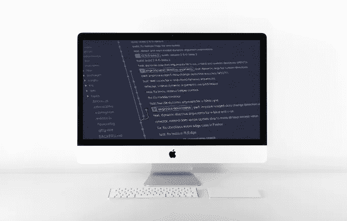

# MacOS 上的 Git 凭证——如何缓存、更新和删除您的 GitHub 帐户凭证

> 原文：<https://medium.com/codex/git-credentials-on-macos-caching-updating-and-deleting-your-git-credentials-8d22b6126533?source=collection_archive---------0----------------------->



根据 [T. Q.](https://unsplash.com/@tq_photos?utm_source=unsplash&utm_medium=referral&utm_content=creditCopyText) 在 [Unsplash](https://unsplash.com/s/photos/mac?utm_source=unsplash&utm_medium=referral&utm_content=creditCopyText) 拍摄的照片和 [Yancy Min](https://unsplash.com/@yancymin?utm_source=unsplash&utm_medium=referral&utm_content=creditCopyText) 在 [Unsplash](https://unsplash.com/s/photos/git?utm_source=unsplash&utm_medium=referral&utm_content=creditCopyText) 拍摄的照片创建

**本文针对 MacOS 用户。**

在本文中，我将带您了解如何

1.  将您的 GitHub 帐户凭证保存在您的电脑上。
2.  更改 Github 用户名和/或 PW 后，更新 Git 凭证。
3.  从您的计算机中删除 Git 凭据。

## 更新(自 2021 年 8 月起)

*Github 不再支持 HTTPS 认证，所以你需要使用 SSH 或者其他基于令牌的方法。*

你可以参考我的更新的 [**文章，关于如何设置 SSH**](/codex/git-authentication-on-macos-setting-up-ssh-to-connect-to-your-github-account-d7f5df029320) 来使用你的 Github 帐户从你的本地机器进行 git 操作:

[](/codex/git-authentication-on-macos-setting-up-ssh-to-connect-to-your-github-account-d7f5df029320) [## macOS 上的 Git 认证——设置 SSH 以连接到您的 Github 帐户

### 如何使用 SSH 进行身份验证，在与 Github 连接的本地机器上实现 Git 操作…

medium.com](/codex/git-authentication-on-macos-setting-up-ssh-to-connect-to-your-github-account-d7f5df029320) 

# Git 凭据

当您使用 HTTPS 克隆 GitHub 库时，您将需要认证您的凭证。Git 会提示你输入你的 GitHub 用户名和密码。

在成功完成将远程存储库克隆到本地环境之前，必须通过此身份验证过程。

*但是你不想每次克隆 Github 库的时候都这么做，所以让我们来看看如何让 Git 记住你电脑上的凭证*。

# 在 Git 中缓存 GitHub 凭证

**您可以使用凭证助手**告诉 Git 记住您的凭证 **，这样您就不必在每次克隆 GitHub 库时都输入您的用户名和密码。**

在 Mac 上可以用`osxkeychain helper`。

在您的终端上使用以下命令:

```
git config --global credential.helper osxkeychain
```

这告诉 Git 使用`osxkeychain` `credentials helper`。

一旦您成功认证，您的凭证将被存储在 MacOS 钥匙串中，并且将在您每次克隆 GitHub 存储库时使用。

从现在开始，除非您在 GitHub 上更改凭据(用户名、密码),否则您不必重新输入凭据。

# 在 Git 中更新您的 GitHub 凭证

如果您更改了 GitHub 帐户的用户名和/或密码，您必须更新存储在本地计算机中的 Git 凭证。

有两种方法可以更新您的 Git 凭证:

1.  通过 MacOS 的`Keychain Access`应用更新。
2.  删除当前凭据，然后保存新凭据(通过命令行)。

## 通过 MacOS 钥匙串访问更新凭证

如果你已经在 Mac 上设置了 `credentials.helper osxkeychain`，你可以使用 MacOS 的`Keychain Access`应用更新你的凭证。

要更新现有的 GitHub 钥匙串，

*   在 mac 上打开`Keychain Access`(可以使用 spotlight)
*   搜索`github.com`
*   选择`github.com`钥匙串项目
*   编辑或删除您的 GitHub 帐户凭证。

## 通过命令行删除凭据

您可以使用命令行删除现有凭据，然后在出现提示时重新输入您的新用户名和/或密码。

要删除现有凭据，请输入以下命令:

```
git credential-osxkeychain erase 
host=github.com 
protocol=https 
> [Press Return]
```

如果成功，什么都不会打印出来。

现在当你试图克隆一个 GitHub 库时，你会被提示输入你的凭证。您可以在这里输入您的新凭证。

要让 Git 记住新的凭证，可以使用

`git config --global credentials.helper osxkeychain`

再次命令。

# **资源**

GitHub 文档:

*   [docs.github.com——在 Git 中缓存您的 GitHub 凭证](https://docs.github.com/en/github/using-git/caching-your-github-credentials-in-git)
*   [docs.github.com—从 macOS 钥匙串更新凭证](https://docs.github.com/en/github/using-git/updating-credentials-from-the-macos-keychain)