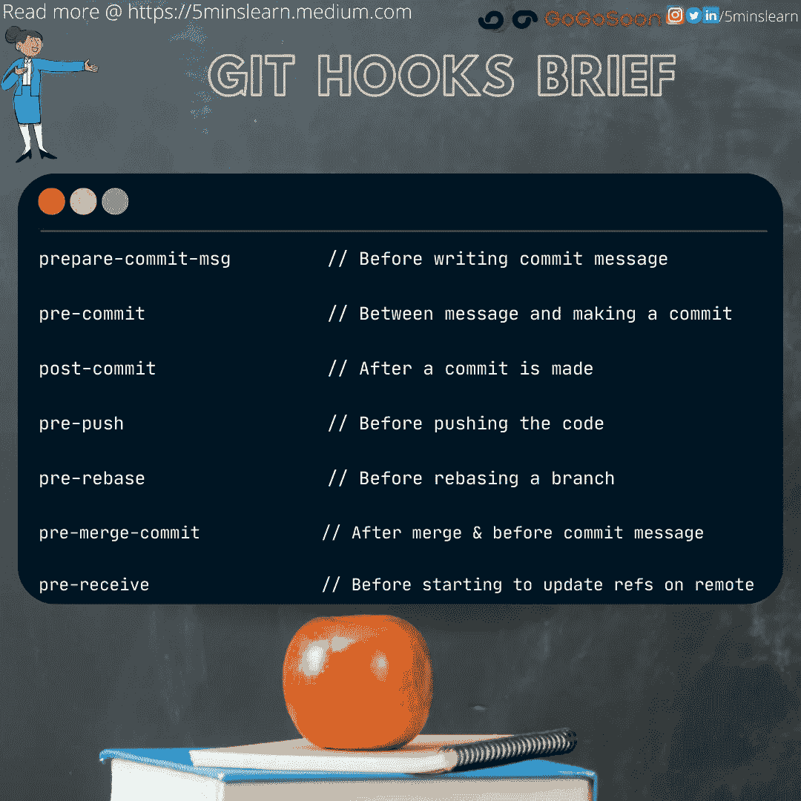
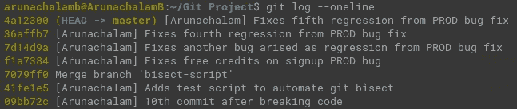
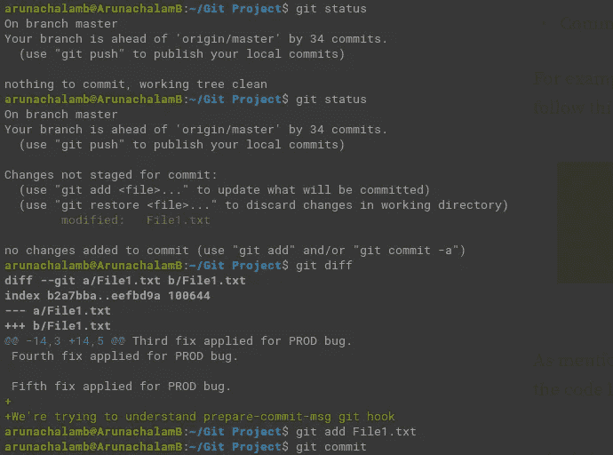
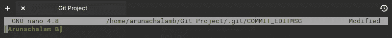
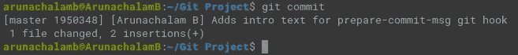
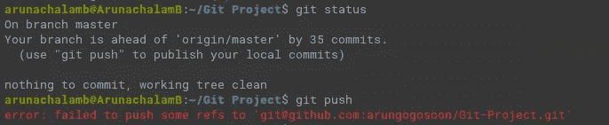
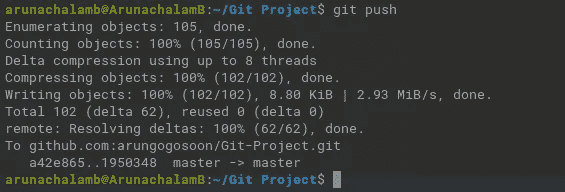

# 如何使用 Git 的附加脚本实现工作自动化？

> 原文：<https://medium.com/codex/git-hooks-dark-side-of-advanced-git-adb80ed78e71?source=collection_archive---------4----------------------->



Git 挂钩简介

你知道你可以在开发过程中自动化你每次做的部分工作吗？

这包括运行 lint、测试用例等。在提交和推送代码之前。Git 为实现这一点提供了一个很好的选择。

那叫做 **Git 钩子**

Git 钩子，作为一个高级话题，你知道我为什么称它为 Git 的黑暗部分吗？

因为，作为一个强大的特性，它没有被许多软件开发团队广泛采用(包括我，但是我遵循一个替代方案。请进一步阅读以了解它是什么&我为什么要使用它)。

让我们试着在这个博客中探索下面的项目

1.  什么是 Git 钩子？
2.  为什么大多数开发团队不在他们的开发过程中采用钩子？

## 什么是 Git 钩子？

Git 钩子是 git 的一个特性，它允许在 git 生命周期中发生某些事件时运行定制脚本。一些事件包括提交前、提交后、推送前等。

## 为什么我们需要 Git 挂钩？

Hooks 是一个让开发人员更容易遵守某些准则的工具。这些指导方针包括在提交之前运行 lint，在推送代码之前运行测试用例，等等。Git 挂钩可以被配置成在某些东西被破坏或不好(测试用例/lint 失败)时使动作失败(通过返回非零退出代码)。

## 在哪里可以找到我的回购协议上配置的挂钩？

Git Hooks 预装在 Git 存储库中。每当您初始化 git repo ( `git init`)或从任何远程服务器克隆 repo(`git clone`)时。你可以在根 repo 中找到`.git/hooks`目录下的所有钩子。

每个钩子都将被配置为一个文件。默认情况下，git 会创建下面列出的 12 个示例钩子文件。以`.sample`结尾的文件是 git 生成的示例钩子文件。

好吧。那很好。我希望你的下一个问题是，

> 有哪些我可以使用的钩子？

## 客户端挂钩

1.  准备-提交-消息
2.  预提交
3.  应用补丁消息
4.  提交消息
5.  fsmonitor-watchman
6.  应用前补丁
7.  合并前提交
8.  预推
9.  重定基数前

## 服务器端挂钩

1.  预接收
2.  更新
3.  更新后

这不是所有可用 Git 挂钩的完整列表。这些是默认情况下在所有 git 存储库中可用的样例钩子文件。前往 Git 的官方文档查看所有支持的钩子。

## 如何配置一个钩子？

让我们来看几个使用它的例子

`**prepare-commit-msg**`

在提交消息编辑器启动之前，默认消息创建之后，`prepare-commit-msg`钩子运行。它允许您在提交作者看到默认消息之前对其进行编辑。这个钩子通常用于模板化提交消息。

这个钩子的参数是，

*   保存提交消息的文件的路径
*   提交类型
*   提交 SHA-1，如果这是一个修正的提交。

例如，我曾经在我提交的所有文件前加上我的名字。我们在整个组织中遵循这一原则。



以我的名字([Arunachalam])开头的提交列表示例

如前所述，我们需要从文件名中删除`.sample`。在提交时，找到下面的代码来模板化您的姓名

我们需要使脚本可执行。所以，文件上跑着`chmod +x`


制造了`prepare-commit-msg hook file executable`

让我们尝试提交我们的更改，



更改文件以测试准备-提交-消息挂钩

在我运行`git commit`之后，Nano 文本编辑器(系统默认)立即打开。从下面的截图中，你可以看到我的名字已经被写入提交消息文件(COMMIT_EDITMSG ),我只需要添加提交消息。



尝试提交时，我的名字被预填充为模板



保存并退出提交消息(COMMIT_EDITMSG)文件后

就是这样。我们已经成功设置了`prepare-commit-msg`挂钩。

让我们快速看一下另一个简单的失败场景的例子。

如果挂钩(除了少数几个)返回非零值，操作将失败。

让我们通过返回一个非零值来使`pre-push`钩子失败

由于返回非零值，预推送挂钩将失败

我的回购中有 35 个提交(从我的博客系列开始就没有推过)。因此，我不会进行任何新的提交，也不会推送现有的提交。



由于预推送挂钩上的非零退出代码，推送失败

让我们通过返回零来使`pre-push`钩子通过

让我们再次尝试提交，并验证它是否有效。



推送到远程存储库的提交

万岁！！！！我们的提交被推送到远程 repo。

唯一担心的是，当用非零值退出时，我们收到的错误消息对用户不太友好。它没有说由于从`pre-push`钩子抛出的错误而失败。

```
error: failed to push some refs to '[git@github.com](mailto:git@github.com):arungogosoon/Git-Project.git'
```

让我们进入博客的下一部分

## 为什么大多数开发团队不在他们的开发过程中采用钩子？

回答这个问题有很多原因。然而，我概述了一些最常见的原因。

1.  钩子对于任何给定的 Git 存储库都是本地的，不与远程存储库同步。这意味着，如果你再次尝试克隆，你将看不到你的钩子。因此，在整个开发团队中管理它们将是一个挑战。但是，我们可以通过两种变通方法来解决这个问题。

    1。Git 允许我们将 hooks 文件夹移到`.git` 文件夹之外。我们可以创建一个从`.git/hooks`文件夹到我们移动钩子文件的文件夹的符号链接(快捷方式)。使用这种方法，我们可以跟踪 hooks 文件中的变化，并且它将与整个团队同步。
    2。通过使用一些类似`husky`的替代包。`[husky](https://typicode.github.io/husky/#/)`是一个`npm`包，可以添加到`node`项目中。`husky`帮助我们在项目配置文件中配置要在 git 挂钩上执行的命令。即`package.json`文件
2.  虽然我们找到了同步钩子文件的方法，但是开发人员可以通过在每个 git 命令中添加`--no-verify`来轻松跳过钩子验证。考虑到这一点，最好把 Git 挂钩看作是一个*方便的开发工具*，而不是一个*严格执行的开发策略*。除非设置了服务器端验证，否则无法对其进行验证。
3.  虽然 git 挂钩是一个有助于加强质量的引人注目的护栏，但像任何护栏一样，它们也有一些缺点，包括减慢训练有素的开发人员的速度，并阻止训练不严格的开发人员获得训练的机会。当钩子被配置为在每次提交时运行测试用例时，由于长时间运行的测试用例，它降低了开发人员的生产率。这尤其发生在编译和传输语言(例如 Java，Typescript 等)中。).与其将精力集中在护栏上以防止开发人员做“错误的事情”，不如集中在建立纪律上，这样开发人员将学会做“正确的事情”。

## 问与答(Question and Answer)

我在团队中使用`git hooks`的经验有限。

但是，我的团队中的 Kumar 提出了一个有趣的问题。

他问:“我不擅长 shell 脚本，但擅长 Python 脚本。有没有办法，我可以用 python 运行这个钩子？”

他问这个问题的时候连我都不知道。但是，我们立即进行了快速搜索，发现这是可能的。

只要用 python 解释器位置(`#!/usr/bin/env python`)替换`#!/bin/sh`就可以了。我们甚至对此进行了测试，结果很好。

## 参考

*   [https://git-scm.com/book/en/v2/Customizing-Git-Git-Hooks](https://git-scm.com/book/en/v2/Customizing-Git-Git-Hooks)
*   https://git-scm.com/docs/githooks
*   【https://www.atlassian.com/git/tutorials/git-hooks 
*   [https://www . thoughtworks . com/en-in/insights/blog/pre-commit-don-t-git-hooked](https://www.thoughtworks.com/en-in/insights/blog/pre-commit-don-t-git-hooked)

希望你喜欢阅读这篇文章。鼓掌👏如果你喜欢这篇文章。订阅我们的[时事通讯](https://5minslearn.gogosoon.com/?ref=medium_git_addon_scripts)会收到更多这类有见地的文章，这些文章会直接发送到您的收件箱。