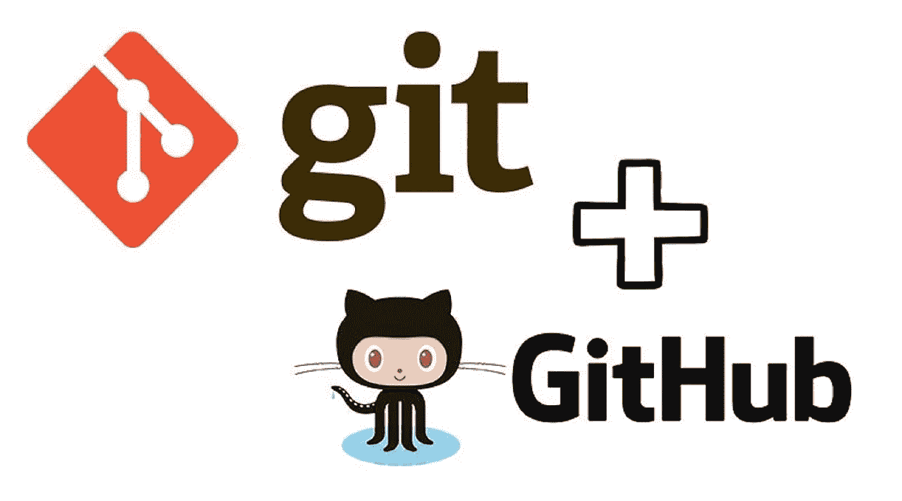
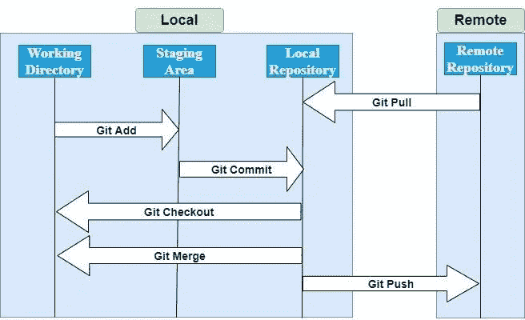

# Git 初学者入门

> 原文：<https://medium.com/codex/git-introduction-for-beginners-4286b1420f59?source=collection_archive---------27----------------------->

## (第一部分)



大家好，我是 Sathira Basnayake，我们将在本文中深入了解 Git 的基本概念。Git 基本上是世界上最流行的版本控制系统。版本控制用于跟踪和管理我们项目的变更，版本控制系统是完成这项任务的软件工具。

使用 Git，我们可以在一个名为 repository 的特殊数据库中记录代码随时间的变化，我们可以看到发生了什么变化，如果我们做了什么，我们可以轻松地恢复这些变化并进入前一阶段。没有 Git，我们必须保存项目的多个副本，并手动管理它们。如果我们作为一个团队工作，我们将不得不用电子邮件之类的东西交换代码，并手动合并它们。但是有了 Git，我们可以轻松地作为一个团队工作，并跟踪我们的代码。我想现在您对我们为什么必须在项目中使用 Git 有了一个很好的想法。

Git 是一个分布式版本控制系统，这意味着每个团队成员在机器上都有一个本地存储库，这与集中式系统不同。我们知道为什么 git 是最常用的版本控制系统吗？因为 git 是免费的、开源的、快速的、可扩展的。我们可以在命令行和 GUI 中使用 git。在本文中，我将使用命令行方法。

在我们的机器上安装 git 有几种方法，这里的是一个很好的指南。您可以参考它并成功地在您的机器上安装 Git，而不用考虑操作系统。在您的机器上安装 Git 之后，您可以将 Git 用于一个新项目或一个现有项目。

现在我们将研究如何初始化一个新的 Git 存储库。导航到您想要启动项目的地方，并输入 **git init 命令**。

```
sathira@kali:~$ git init
```

一旦输入这个命令，将会创建一个新的 git 存储库。git 文件和新的 master 分支(分支以后再说)。这个。git 子目录是隐藏的，因为它包含元数据，我们不必接触它。要将现有项目转换成 git 存储库，我们只需在包含项目的目录中运行相同的命令。我们也可以这样做。

```
sathira@kali:~$ git init <project directory>
```

现在，我们已经讨论了如何在本地将 git 存储库初始化到现有项目或新项目中。现在，我们将讨论远程存储库，以便全面了解和理解完整的工作流程。当我们谈到远程存储库时，GitHub 开始发挥作用。

GitHub 基本上是一个基于云的在线数据库，允许跟踪和共享 Git 版本控制项目。因此，我们可以将本地存储库推送到云中的 GitHub，并与我们的队友共享和管理它。这就是我们实际上如何使用版本控制系统作为一个团队工作的。因此，一旦我们将本地存储库放入 GitHub，它就包含了远程存储库，可以被我们的其他团队成员访问和管理。你可能想知道 GitHub 是唯一可以做到这一点的在线平台。不，还有其他平台，比如 Bitbucket，也在做同样的事情。但是在本文中，我们将使用 GitHub。

但是，如果一个项目已经在 GitHub 中央存储库中，而我们希望将该项目放到我们本地机器中，该怎么办呢？这就是 **git 克隆**命令发挥作用的地方。我们只能运行这个命令一次，然后用户得到一个工作副本，他可以使用 git 在本地管理版本控制。

```
git clone <repo url>
```

我认为现在是更好地了解工作流程的最佳时机。



Git 工作流

正如我们在上面的图片中看到的(Git 命令用箭头表示，我们将一个接一个地讨论它们),我们的本地目录有 3 个主要部分。

*   工作目录
*   部队从一个战场转往另一个战场的集结地
*   本地知识库

在这里，工作目录是我们创建。git 子目录。这就是我们构建项目的地方。在我们的代码中做了一些更改之后，我们必须将修改后的文件添加到暂存状态中。为此，我们使用**添加命令**。

```
sathira@kali:~$ git add 'filename'sathira@kali:~$ git add .
```

我们使用 git add。一次性添加临时区域中的所有更改。在我们将变更添加到我们的阶段之后，我们可以在提交之前再次检查工作。一旦我们添加了所有修改过的文件，我们很高兴可以将快照提交到我们的本地存储库中。这个准备区域允许我们在提交之前回顾我们的工作。为了将更改提交到本地存储库中，我们使用 **commit 命令。**

```
sathira@kali:~$ git commit - m "initial commit"
```

在这里，当我们提交时，我们必须给出一个非常有意义的消息，所以如果我们出于某种原因要检查提交历史，我们可以很容易地做到这一点。每个提交都有一个唯一的 id 和一些元信息以及完整的快照。所以如果我们想回到之前的状态，我们可以这样做。

现在我们将讨论如何配置本地存储库与远程存储库同步。为此，我们必须做一些基本的配置。为此，我们必须将远程回购 URL 添加到您的本地`git config`

```
sathira@kali:~$ git remote add <remote_name> <remote_repo_url>
```

此命令会将位于的远程存储库映射到位于下的本地存储库中的引用。一旦您映射了远程存储库，您就可以将本地分支推送给它。

通过使用这个命令，我们已经将一个远程存储库映射到我们的本地存储库。现在我们可以通过使用 **git push 命令**将本地分支推送到远程存储库。

```
sathira@kali:~$ git push <remote> <branch>
```

之后，当我们想要将远程存储库中的更改发送到本地存储库时，我们使用 **git pull 命令。**它立即更新本地存储库以匹配该内容。实际上 git pull 做的是执行两个 git 命令。它们是 git 获取和 git 合并。作为一个好的实践，在我们把修改推送到远程存储库之前，我们总是必须做一个 git pull。

```
sathira@kali:~$ git pull <remote>
```

在我们完成这个 git pull 之后，如果有冲突，我们必须手动处理。在本文中，我们不打算讨论合并冲突。

现在我希望你们对 Git 和 GitHub 以及如何用 Git 管理项目有一个很好的基本概念。在本文中，我们已经讨论了八个 git 命令。这些是 **git 初始化、git 克隆、git 添加、git 提交、git 推送、git 拉取、git 远程添加**。这些是基本的命令，还有更多。在本文中，我们还没有讨论 git 分支、合并冲突、GitHub 页面、GitHub 动作等高级主题。我们将在以后的文章中讨论这些主题。如果您有任何建议或批评，请随时联系 [me](https://www.linkedin.com/in/sathira-basnayake-56aa41193/) 或者发表评论。非常感谢，并保持安全。