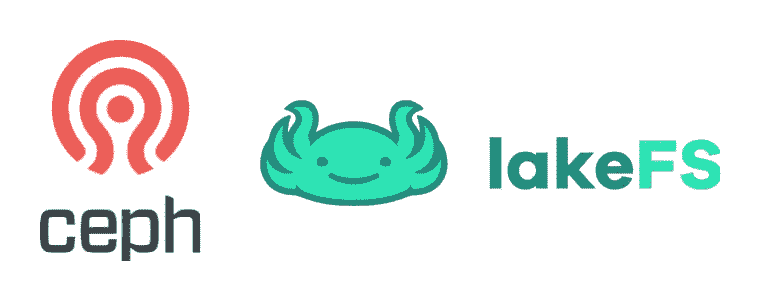

# 使用 LakeFS 和 Ceph S3 实现类似 Git 的数据集版本控制

> 原文：<https://medium.com/codex/git-like-data-set-versioning-using-lakefs-and-ceph-s3-c2da810ba3a0?source=collection_archive---------3----------------------->



今天，数据已经成为每个现代组织的核心业务，无论是用于决策、报告、预测、分析还是其他许多不可或缺的用例。最终，数据将以其最终形式呈现给利益相关者，以便他们了解组织内部或外部发生了什么。

如果我们以人工智能为例，我们会看到人工智能做出的许多假设都是算法使用的数据的直接结果。人工智能正在使用数据工程师提供的数据集来大规模训练模型，这些模型将提供商业建议和预测，供利益相关者使用。

你可以肯定地理解，由于上述原因，数据的完整性是一件重要的事情，它应该足够可靠，以便人工智能模型可以基于它的理论。

我们看到，在 Kubernetes 上运行的 AI 不是一个笑话，许多工作负载正在向 Kubernetes 迁移，因为它将 AI 模型视为通过 CI/CD 管道的微服务(使用 MLOps、Kubeflow 等工具)。源代码被保存到 git 存储库中，打包到容器映像中，并最终作为数据管道的一部分部署到 Kubernetes 中(使用 GitOps、CD 或任何其他部署策略)。

这大大增强了我们的控制能力，因为当问题发生时(例如不准确)，我们可以提升或回滚我们的人工智能模型的特定版本。

不仅如此，我们现在甚至可以控制我们的数据集版本，并将其视为 git 存储库。通过这样做，我们控制了作为数据集的版本。例如，如果添加了一个新的数据源，并且应该将其写入数据湖，我们可以对当前数据集进行分支，验证新数据源是无害的(通过运行单元/集成测试)，然后将这些更改合并回原始数据，并将测试数据提供给我们的科学家或 BI 工程师。

今天，我们将看到如何使用`LakeFS`来实现这一点，以便将我们的数据湖版本化，因为它是一个 git 存储库。我们将使用 Ceph S3 作为一个数据湖，它将作为一个 S3 块存储直接连接到 LakeFS。

# 先决条件

*   公开 RadosgW S3 接口的 Ceph 集群
*   Docker-compose 安装在您的计算机上

# 装置

让我们创建一个 radosgw 用户，以便与 Ceph 的 S3 界面进行交互:

```
radosgw-admin user create --uid=lakefs --display-name="Lakefs User" --access-key=lakefs --secret-key=lakefs
```

接下来，我们将在 Lakefs 的配置文件中保存 Ceph 的 S3 配置，以确保 Lakefs 使用 Ceph 作为其 S3 块存储:

```
LAKEFS_CONFIG_FILE=./.lakefs-env
echo "AWS_ACCESS_KEY_ID=lakefs" > $LAKEFS_CONFIG_FILE
echo "AWS_SECRET_ACCESS_KEY=lakefs" >> $LAKEFS_CONFIG_FILE
echo "LAKEFS_BLOCKSTORE_S3_ENDPOINT=http://192.168.1.53:8080" >> $LAKEFS_CONFIG_FILE
echo "LAKEFS_BLOCKSTORE_TYPE=s3" >> $LAKEFS_CONFIG_FILE
echo "LAKEFS_BLOCKSTORE_S3_FORCE_PATH_STYLE=true" >> $LAKEFS_CONFIG_FILE
```

我们将使用`docker-compose`部署 Lakefs，它将部署 Lakefs 和 Postgres 来保存数据和元数据的持久性:

```
curl [https://compose.lakefs.io](https://compose.lakefs.io) | docker-compose --env-file $LAKEFS_CONFIG_FILE -f - up
```

现在我们已经建立并运行了 Lakefs 堆栈，让我们创建我们的 S3 桶，LAkefs 将使用它来存储版本化的对象:

```
aws s3 mb s3://lakefs/ --endpoint-url [http://192.168.1.53:8080](http://192.168.1.53:8080)
make_bucket: lakefs
```

我们现在已经准备好了所有的基础设施需求，我们可以创建实际的存储库了:

```
lakectl repo create lakefs://repo s3://lakefs -d mainRepository: lakefs://repo
Repository 'repo' created:
storage namespace: s3://lakefs
default branch: main
timestamp: 1625919817
```

如您所见，该存储库实际上指向创建的 S3 存储桶，该存储桶是作为配置中 S3 上下文的一部分给出的/让我们确保可以查询该存储库:

```
lakectl repo list+------------+-------------------------------+------------------+-------------------+
| REPOSITORY | CREATION DATE                 | DEFAULT REF NAME | STORAGE NAMESPACE |
+------------+-------------------------------+------------------+-------------------+
| repo       | 2021-07-10 15:23:37 +0300 IDT | main             | s3://lakefs       |
+------------+-------------------------------+------------------+-------------------+
```

现在，让我们创建一个简单的文本文件，其中包含一个字符串，这样我们就可以将它上传到 LakeFS:

```
echo "My name is Shon" >> txtfile.txt
```

现在我们可以将文本文件从源文件上传到我们的目标存储库，在`main`分支中:

```
lakectl fs upload -s txtfile.txt lakefs://repo/main/txtfile.txtPath: txtfile.txt
Modified Time: 2021-07-10 15:24:35 +0300 IDT
Size: 20 bytes
Human Size: 20 B
Physical Address: s3://lakefs/84935fb66e4947338cb934d6318302db
Checksum: ad44412ae72bc202dcb12891111a1864
```

正如您所看到的，LakeFS 返回 S3 对象本身的物理地址，这意味着我们可以用给定的凭证像访问任何其他 S3 对象一样访问它。现在让我们读取对象的内容，以验证它是否适合我们放入其中的内容:

```
lakectl fs cat lakefs://repo/main/txtfile.txtMy name is Shon 
```

像任何其他 git 存储库一样，一旦我们有了我们想要的文件，我们就可以将我们的更改提交到我们所在的当前分支，所以我们将把这个文件提交到“主”分支:

```
lakectl commit -m "added one version of the txt file" lakefs://repo/mainBranch: lakefs://repo/main
Commit for branch "main" completed.ID: 3a08e3da303b4b722d426cff458264b391c0209dacf9280b6bf5d73d0c92ff07
Message: added one version of the txt file
Timestamp: 2021-07-10 15:25:27 +0300 IDT
Parents: 7263176783ca345a7782d36ec14205b78a0f92b4956a4e93a0e704af32353052
```

现在我们在 Lakefs 中有了一个稳定版本的文件，让我们对它稍加改动，创建第二个版本:在接下来的步骤中，我们将在文本文件中添加一行来创建第二个版本:

```
echo "And my last name is Paz" >> txtfile.txt
```

现在我们将创建一个新的分支，用于文本文件的第二个版本:

```
lakectl branch create lakefs://repo/txtfile_change -s lakefs://repo/mainSource ref: lakefs://repo/main
created branch 'txtfile_change' 3a08e3da303b4b722d426cff458264b391c0209dacf9280b6bf5d73d0c92ff07
```

让我们确保创建了第二个分支:

```
lakectl branch list lakefs://repo+----------------+------------------------------------------------------------------+
| BRANCH         | COMMIT ID                                                        |
+----------------+------------------------------------------------------------------+
| main           | 3a08e3da303b4b722d426cff458264b391c0209dacf9280b6bf5d73d0c92ff07 |
| txtfile_change | 3a08e3da303b4b722d426cff458264b391c0209dacf9280b6bf5d73d0c92ff07 |
+----------------+------------------------------------------------------------------+
```

太好了！现在，我们的 Lakefs 存储库下有两个分支。让我们将更新后的文件上传到我们的新分支:

```
lakectl fs upload -s txtfile.txt lakefs://repo/txtfile_change/txtfile.txtPath: txtfile.txt
Modified Time: 2021-07-10 15:26:57 +0300 IDT
Size: 44 bytes
Human Size: 44 B
Physical Address: s3://lakefs/cb9f5d4a125b421ea819c32a71b77e0a
Checksum: b25434f55350323f5f543ee0b92939bf
```

接下来，我们将读取更新文件的内容，并验证我们是否有更新的行:

```
lakectl fs cat lakefs://repo/txtfile_change/txtfile.txtMy name is Shon 
And my last name is Paz
```

厉害！现在我们将第二个变更提交到我们新创建的分支中:

```
lakectl commit -m "added second version of the txt file" lakefs://repo/txtfile_changeBranch: lakefs://repo/txtfile_change
Commit for branch "txtfile_change" completed.ID: c25f69534a85da7b1afcc38ef293d57724c1e14a79e24e23aa7c8cdbab74336f
Message: added second version of the txt file
Timestamp: 2021-07-10 15:28:11 +0300 IDT
Parents: 3a08e3da303b4b722d426cff458264b391c0209dacf9280b6bf5d73d0c92ff07
```

就像在我们拥有的每个 git 存储库中一样，一旦我们验证了数据集，我们就可以合并更改了！让我们将新创建的分支(txtfile_change)中的更新文件合并到我们的主分支中:

```
lakectl merge lakefs://repo/txtfile_change lakefs://repo/mainSource: lakefs://repo/txtfile_change
Destination: lakefs://repo/main
Merged "txtfile_change" into "main" to get "a8b251a43e2e306e5dc170c05d0e83e289a0b162ff272d3a660c644e709b96f0".Added: 0
Changed: 1
Removed: 0
```

我们看到我们被告知变更已经被合并，并且一个文件已经被更改。让我们重新读取来自`main`分支的文件，以验证那些更改确实被合并了:

```
lakectl fs cat lakefs://repo/main/txtfile.txtMy name is Shon 
And my last name is Paz
```

# 结论

我们看到了如何使用 LakeFS 的能力来处理 Ceph 的 S3 块存储，因为它是一个 git 存储库。我们已经讨论了这种能力可以为我们的整体核心业务带来的好处。希望你喜欢这个演示，下次再见:)