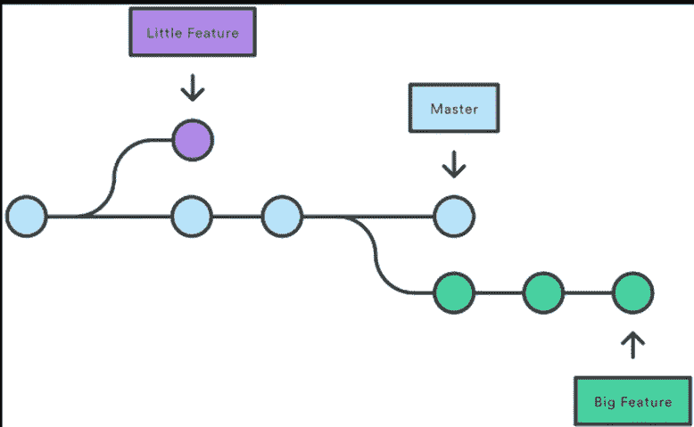

# Git 第 1 部分

> 原文：<https://medium.com/codex/git-part-1-497d15bd8090?source=collection_archive---------3----------------------->


来源:谷歌

让我们从上一篇博客离开的地方开始。如果你没有浏览过之前的博客，你可以阅读它来对 GIT 有一个基本的了解，如果你已经知道 GIT 的成分，在这篇博客中，我将介绍如何用这些成分制作药剂。

这些是我将要谈论的话题，只是一个简短的话题。

1.Git 推送

2.Git 拉

3.Git 贮藏

4.Git 分支

# Git 推送

简单来说，Push 意味着将某些东西推到某个地方，在这种情况下，我们将文件/代码推送到一个中央服务器上，该服务器可以是 GitHub、GitLab、Bitbucket 或私有中央存储库。简单吧？帮助我们做到这一点的命令也很简单。

```
git push origin master
```

等等，这“起源”和“主人”是什么？我来解释一下，原点是你想往哪里推？您要推送至的存储库的 URL。URL 必须有一个“.”。git”扩展名，那么只有您能够推送它，而这里的管理员会建议您想要推送的库的分支。分支名称可以是任何名称，不是强制的，它应该是主分支。按下后，它会要求您输入用户名和密码。这很重要:

> 密码将是您从中央 repo(GitHub/Bitbucket 等)请求的身份验证令牌。)

下面是 Github 的一步一步的步骤


点击设置


向下滚动到开发者设置


单击个人访问令牌


生成新令牌

在这之后，它会问你的权限只是寻找管理员，读，写，修改，并给予所有需要的权限。只是不要把这个令牌给别人，为不同的用户生成不同的令牌，以确保零信任策略和代码的安全性。复制令牌并将其用作 git 推/拉的密码

# Git 拉

就像推一样，拉也以同样的方式工作，你从一个中央存储库把文件/代码拉到你的本地存储库。该命令的工作原理也是一样的

```
git pull origin master
```

分支名称“master”可以是您喜欢的任何东西或任何分支。它应该存在，虽然工作。

# 在 Git 中设置原点

我们如何在 git 中设置这个源 URL？让我带你经历这个紧张的过程。你要做的就是运行这个

```
git remote add origin <URL>
```

现在让我来给你分解一下这个命令，remote 表示 URL 代表一个远程/远处的存储库，add 表示将它添加到 git 配置中，现在 origin 是一个以 URL 命名的占位符。URL 被赋予一个名为“origin”的变量，这样我们就可以调用它，它很小，比一次又一次地编写整个 URL 要简单得多。如果你熟悉编码概念，有一种东西叫做变量，它可以保存任何值，它不是固定的，可以改变。原点也是我们可以改变的变量，但是第一次尝试**而不是**来设置错误。

现在怎么看哪个网址在原点？

```
git remote show origin
```

简单。

# Git 贮藏

假设你正在为你的产品实现一个新的特性。您的代码正在进行中，突然客户升级来了，因此，您必须将您的新功能工作搁置几个小时。您不能提交您的部分代码，也不能丢弃您的更改。因此，您需要一些临时存储，在那里您可以存储您的部分更改，并在以后提交它们。这是藏东西的地方，用来藏我们用的东西:

```
git stash
```

要查看隐藏文档的列表:

```
git stash list
```

要恢复 Git 中隐藏的更改

```
git stash apply stash@{<number>}
```

去清理藏毒点

```
git stash clear
```

# Git 分支

我们知道 GIT 中有一个分支方法，但是为什么会有呢？它解决了什么问题，以及最初为什么要引入它。让我们更深入地研究一下。分支系统的需要是为了在生产过程中提供灵活性。我这句话是什么意思？让我们举一个例子，你正在开发一个网站的新功能，现在假设网站的整个代码都在主分支上，那么如果你的新功能代码有一些问题呢？就像兼容性问题、模块问题和基本错误一样，在最坏的情况下，它会使整个网站瘫痪，但是如果你有自己的个人空间来做这件事会怎么样呢？这不会影响生产环境。所以你的经理会做的是，他/她会为你创建一个单独的分支，用网站的其余部分测试和运行你的功能代码，这不会影响生产代码，你也可以自由地测试进一步的附加功能。



GIT 中的分支(来源:Google)

您在其他分支上所做的任何事情都不会影响存储库的主分支。

创建和管理分支的命令如下，请尝试一下:

要查看可用分支的列表

```
git branch
```

创建新的分支

```
git branch <branch name>
```

切换分支

```
git checkout <branch name to switch to>
```

删除分支

```
git branch -d <branch name>
```

在下一部分，我将介绍其余的主题:

1.Git 重置

2.Git 还原

3.标签/克隆

4.冲突

5.清除未跟踪的文件

6.Git 合并

试一试这些命令，练习一下，事情会对你更清楚。

让我们赶上 Git 的下一部分

> 又及:我发誓这下一个将是最后一个，在这之后，让我们去做一些不同的事情。

谢谢大家！