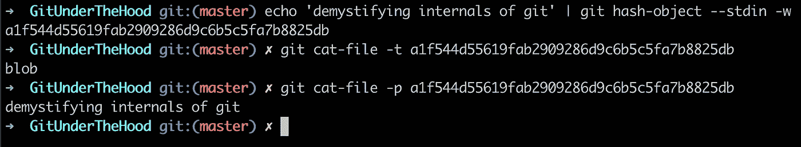
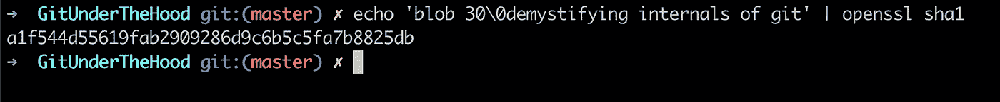
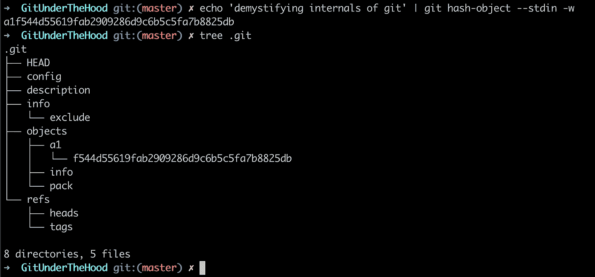
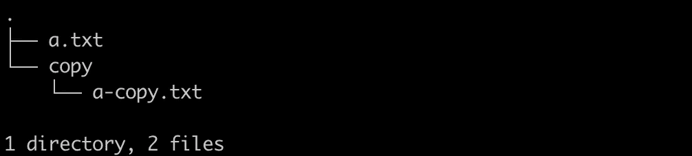
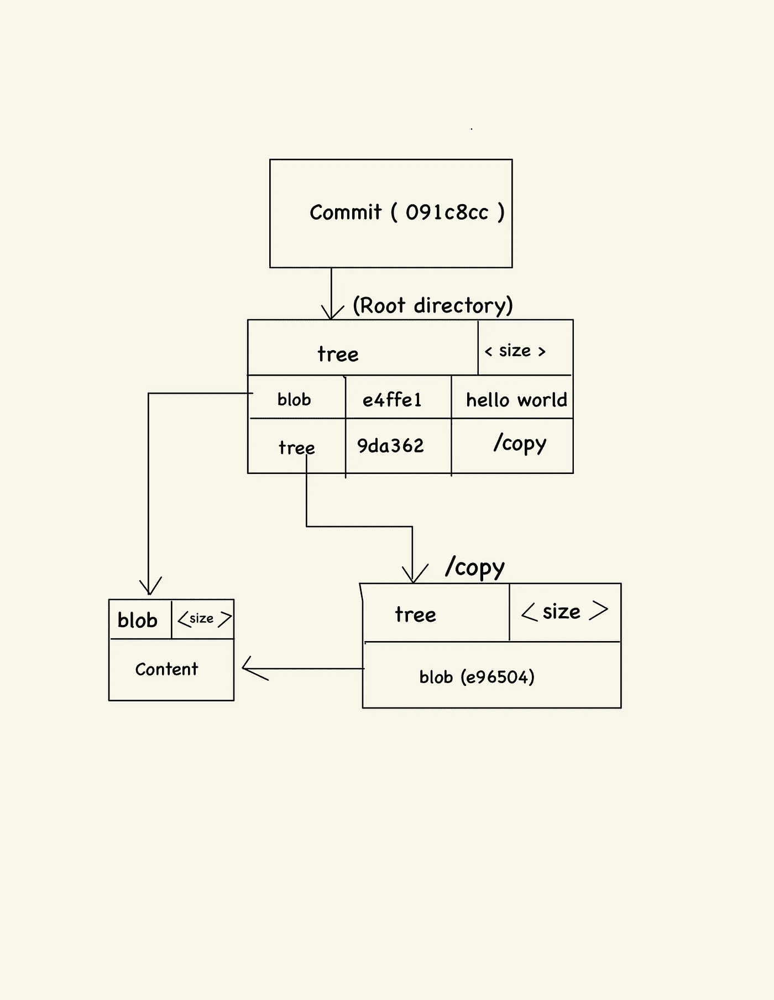
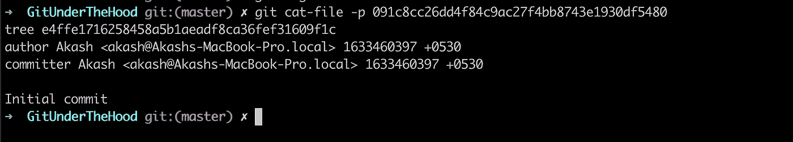

# 藏在引擎盖下

> 原文：<https://medium.com/codex/git-under-the-hood-82c027b00b17?source=collection_archive---------7----------------------->

# git 是如何存储信息的？

在其核心，git 就像一个键值存储。这里的 key 指的是将要存储的数据或内容的散列，value 指的是实际的内容

git 在给出一段数据时生成的散列密钥使用 SHA1 散列函数，它是一个 **40 位十六进制数**。如果给定的输入数据相同，则生成的哈希键将总是相同的。这种类型的系统也称为内容可寻址系统

git 存储信息的方式是以 **Git 对象**的形式，即所谓的

*   一滴
*   树
*   犯罪

让我们一个一个去揭开它们的神秘面纱吧！

# **斑点:**

Git 将压缩数据存储在一个 blob 中，并在它的头中存储一些元数据。

存储在 git 对象中的信息有:

*   类型，即斑点
*   内容的大小
*   \0 空字符
*   内容

git 用来生成 git blobs 的管道或内部命令是 git hash-object。因此，如果我们要求 git 生成字符串的 SHA1，即"**解密 git *，*** ，我们得到散列"**a1f 544d 55619 fab 2909286d 9 c 6 b 5 C5 fa 7b 8825 db "**

使用 git hash-object 命令生成了 sha1 哈希

现在让我们生成内容的相同 SHA1，就像使用任何其他工具存储在 git 中一样。我使用 OpenSSL 命令行工具，用于演示目的。python 或 node 等编程语言的所有其他工具或库都会产生相同的结果

使用第三方工具 openssl 生成的哈希

请参见 OpenSSL 为字符串生成的哈希

> “blob 30 \解密 git 的内部”与 git 哈希对象生成的相同

## 那么 git 在哪里存储这些 git 对象呢？

Git 将这些对象存储在。git 目录。它是在空的 git 目录中运行 git init 命令时创建的。下面是 GitUnderTheHood git 存储库的屏幕截图，正如您所看到的，生成的 blob 对象存储在。git/objects 目录，前 2 个字符代表目录名，其余字符代表文件

# **树:**

Blob 是 git 对象的基本单元，但它遗漏了一些信息，即

*   文件名
*   目录结构

因此，如果我们将一个文件保存为 blob，我们如何知道关于该文件的信息以及它存储的目录结构。Git 将这些信息存储在一个称为树的特殊 git 对象中。

所以 git 中的树是一个**有向无环图，也称为 DAG** 。它包含一个使用 SHA1 的指针

*   到 blobs
*   到另一棵树

以及一些元数据

*   指针的类型(blob 或树)
*   文件名
*   文件模式*(文件模式提供关于文件类别的信息，例如它是目录、可执行文件还是符号链接？)*

这是我的 git 存储库的示例截图，其中 a.txt 内容与/copy 目录中的 a-copy.txt 内容相同，因此其哈希也相同。

**DAG 将看起来像这样:**

git 回购的 DAG

因为 sha1 散列键对于给定的内容是唯一的，所以在 git 中，相同的内容总是存储一次。这就是 git 优化内存使用的方式。这就是为什么在 git 中检查分支会非常快。这只是从一个 git 对象到另一个对象的指针引用的变化。

# 提交:

提交是项目在那个时间点的代码快照。这是指向树的第三种类型的 git 对象，它还包含一些元数据，比如

*   委托人或作者
*   日期
*   消息
*   父提交

如果您更改了关于提交的任何数据，提交将会生成一个新的 SHA1。即使提交指向相同的树/文件内容，日期和时间也会发生变化，因此会创建新的哈希。

如果您想查看存储在。git/objects 目录使用 cat，你不会找到任何有用的东西，因为这些是二进制压缩对象。为了查看对象的内容和类型，我们可以使用 git 的另一个管道命令，即分别带有-p 或-t 标志的 git cat-file

*   git cat-file -t <hash>将打印 git 对象的类型</hash>
*   git cat-file -p <hash>将打印 git 对象的内容</hash>