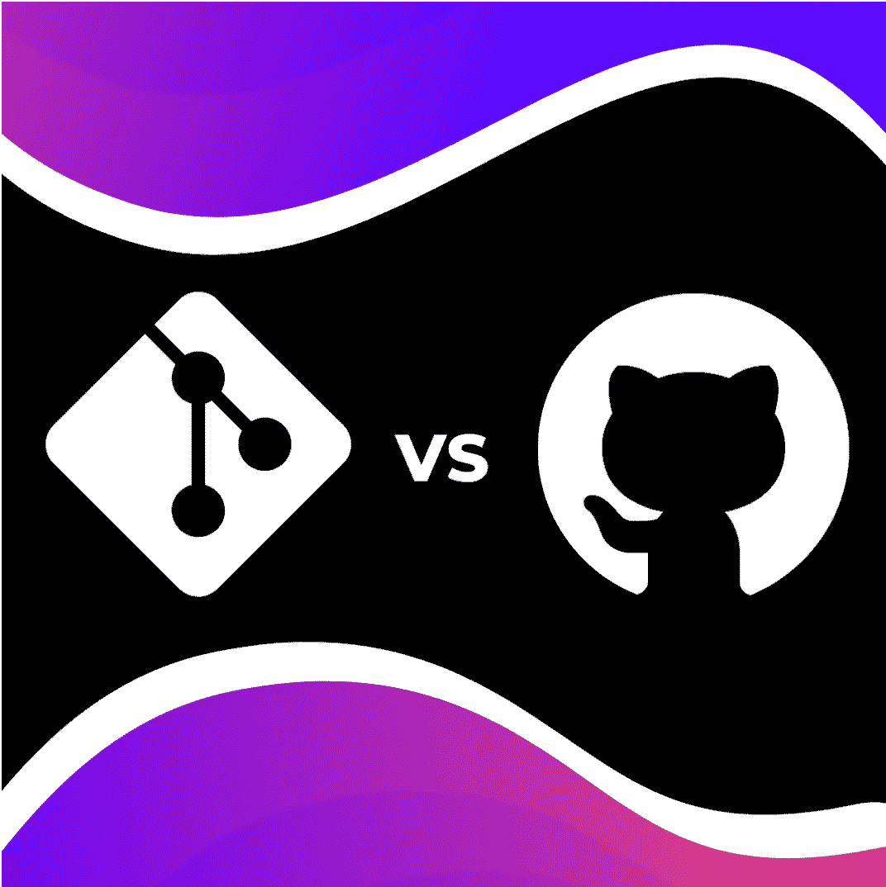
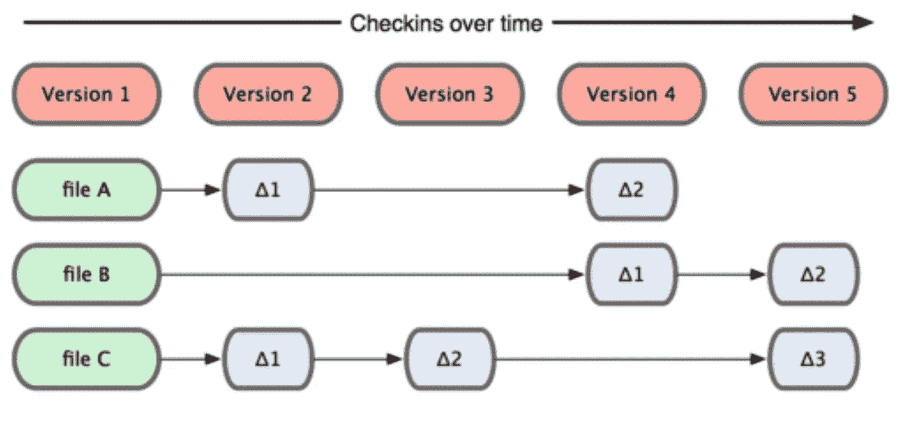
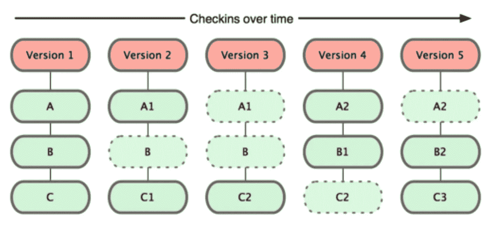
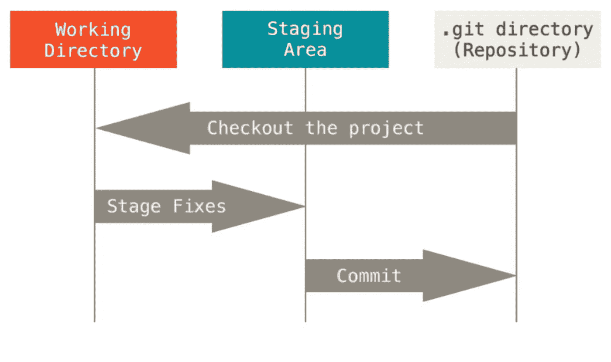
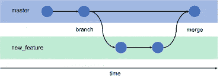

# Git vs Github 有什么区别？

> 原文：<https://medium.com/codex/git-vs-github-whats-the-difference-c39c96a9909?source=collection_archive---------7----------------------->

你有没有发现自己已经准备好开始一个很棒的项目，但是偶然发现了这个古老的问题；Git 和 Github 到底有什么区别？别担心，看完这篇文章，你终于可以夜不能寐，固化 Git 和 Github 的区别了！咱们别叽叽喳喳了，直接开始吧，好吗？

# Git 诞生了

Git 是由 Linux 的创建者 Linus Torvalds 在 2005 年为开发 Linux 内核而开发的。Linux 几乎在所有的项目中都使用 BitKeeper，一个版本控制系统。但随后 BitKeeper 的版权所有者 Larry McVoy 在声称 Andrew Tridgell 通过逆向工程 BitKeeper 协议创建了 SourcePuller 后，取消了该产品的免费使用。Linux 发现自己处于一个需要替代品的境地，需要创建一个自由、开源的版本控制系统。他们用了不到一年的时间开发出了 Git 的首个版本。

# 饭桶

Git 在计算机上本地运行，它不需要任何云托管服务来运行，并且是自给自足的。Git 也是一个版本控制系统，允许您保存项目的不同状态，并在必要时回滚到以前的版本。

版本控制系统(VCS)是通过提交(也称为快照)记录对一个文件或一组文件所做的所有更改的系统。你可以把提交想象成在视频游戏中保存你的进度。当一个游戏保存时，它会将所有新的进度记录到初始保存文件中:完整地记录所有的更改，并保持先前记录的更改。

无论如何，假设你有一个名为 [ElonMuskMeme.py](http://elonmuskmeme.py/) 的图像，并且你正在对它进行修改，VCS 将能够跟踪这些具体的修改，这样你就可以在你进行任何编辑之前回到你的图像的任何先前版本。这创造了一个尽最大能力构建程序员协作的环境，这正是每个程序员所寻求的！

# Git 如何存储它的数据

如果你深入 Git 的大脑，你会发现它对数据的思考方式与其他大多数 VCS 不同。其他系统将其信息存储为基于文件的更改列表。其他 VCS 认为它存储的信息是一组文件，包括随着时间的推移对每个文件所做的更改(这通常被描述为基于增量的版本控制，如下所示)。

另一方面，Git 认为它的数据更像一系列微型文件系统的快照。使用 Git，每次您提交或保存项目状态时，Git 实际上会拍摄一张当时所有文件的图片，并存储对该快照的引用。为了提高效率，如果文件没有改变，Git 不会再次存储该文件，只是链接到它已经存储的前一个相同的文件。Git 认为它的数据更像一个快照流，就像下面的图片一样。

# 主要国家

Git 有三种主要的文件存储状态。这些部分对应于项目的三个阶段——修改、分阶段和提交。

- Modified 表示您已经更改了文件，但尚未将其提交到数据库中。

- Staged 表示您已在其当前版本中标记了一个修改过的文件，以进入您的下一个提交快照。

- Committed 表示数据安全地存储在本地数据库中。

现在我们已经熟悉了修改的 staged 和 committed 状态，我们可以进入 Git 项目的三个主要部分:工作树、staged 区域和 Git 目录。

# 主要部分

工作树包括您当前正在处理的所有文件。在工作树中，您可以随心所欲地修改和更改文件——例如，使用文本编辑器对 markdown 内容进行小的更改。它可以被视为一个文件系统，您可以在其中查看、编辑和修改您当前的文件。这些文件从 Git 目录下的压缩数据库中取出，放在磁盘上供您使用或修改。

暂存区是一个文件，通常包含在您的 Git 目录中。在您将变更提交到存储库之前，使用临时区域。这是一个安全的区域，在这里您可以检查变更，组织那些将要提交的变更，并丢弃那些不会提交的变更。在处理部分暂存文件时，您也可以在此处排除更改。用 Git 的术语来说，它的技术名称是“索引”，但是短语“暂存区”也可以。

Git 目录是 Git 存储项目的元数据和对象数据库的地方。这是 Git 最重要的部分，当您从另一台计算机上克隆一个存储库时，它就是被复制的内容。

**基本的 Git 工作流程是这样的:**

1.  您可以修改工作树中的文件。

2.您可以有选择地只暂存那些您希望成为下一次提交的一部分的更改，这将只把那些更改添加到暂存区域。

3.您执行一个提交操作，该操作将文件保存在临时区域中，并将快照永久存储到 Git 目录中。

# 外卖食品

总的来说，git 是一个非常强大的版本控制系统，用于跟踪文件的变化和协调多人之间的工作。团队项目从未如此简单！您可以将您的项目上传到在线存储库，以便团队中的任何其他人都可以做出贡献。因为有了 git，多人可以同时一起处理同一个文件，而不会有任何问题。过去需要花几个小时在不同版本的文档之间来回转换，现在你可以在任何地方几分钟内完成。

# Github 的历史

软件工程师汤姆·普雷斯顿-沃纳(Tom Preston-Werner)看到了开发人员之间共享和管理源代码的更有效方式的需求，于 2008 年 3 月开始从事 GitHub 的工作。以前是少数胆大的人用，公司就更少了。这家小型自举创业公司从一位天使投资人那里筹集了 100 万美元的资金。到 2008 年 9 月，他们从风险投资家那里筹集了 1 亿美元。不到两年后，它已经成为软件开发的中心枢纽，用户达到 100 万。由于这家初创公司显示出快速增长的巨大潜力，他们被微软以 75 亿美元收购。这一切都是因为一个简单的文本编辑器，它是在几个月的时间内创建的。

# 开源代码库

GitHub 是一个基于 web 的托管服务，用于使用 Git 版本控制系统的软件开发项目。它提供了 Git 的所有分布式版本控制和源代码管理功能，并添加了自己的特性。它为每个项目提供了访问控制和几个协作特性，比如 bug 跟踪、特性请求、任务管理和 wikis。

Github 的入门可能有点吓人。所有这些存储库、拉请求和分支，都意味着什么？让我们看看我们会发现什么。

# 仓库

GitHub 上下文中的呼吸文件是一个文件，它包含一系列用于解释、更新和编译计算机代码的指令。程序员和 web 开发人员最常用它来测试和更新新版本的计算机代码。从 GitHub 便利的在线资源 [Github Docs](https://docs.github.com/en/github/creating-cloning-and-archiving-repositories/creating-a-repository-on-github/about-repositories) 中可以看到一个受益者列表；

您可以使用存储库来管理您的工作并与其他人协作。

您可以使用问题来收集用户反馈、报告软件错误以及组织您想要完成的任务。更多信息，请参见[“关于问题”](https://docs.github.com/en/issues/tracking-your-work-with-issues/about-issues)

您可以使用讨论来提问和回答问题、共享信息、发布公告以及进行或参与有关项目的对话。更多信息，请参见[“关于讨论”](https://docs.github.com/en/discussions/collaborating-with-your-community-using-discussions/about-discussions)

您可以使用“拉”请求来提出对存储库的更改。更多信息，请参见[“关于拉取请求”](https://docs.github.com/en/github/collaborating-with-pull-requests/proposing-changes-to-your-work-with-pull-requests/about-pull-requests)

您可以使用项目板来组织和优先处理您的问题，并提出请求。更多信息，请参见[“关于项目板”](https://docs.github.com/en/issues/organizing-your-work-with-project-boards/managing-project-boards/about-project-boards)

# 拉取请求

GitHub 是开发者存储代码的好地方。它有很多对其他开发者有用的特性。其中一个特性是创建拉请求的能力。这实际上意味着什么以及它是如何工作的，这可能有点令人困惑，尤其是如果您不使用 Git 的话。但是最简单的说法是，GitHub pull 请求允许您将现有项目或存储库的代码变更从您的个人帐户发送给该存储库的原始所有者。一旦所有者接受了您的请求，代码将被合并到原始存储库中。

# 分支

什么是 GitHub 分支？Github 分支，或者仅仅是分支，是版本控制结构中一个不同的路径。重要的是，不要将分支视为您的存储库的副本(因为它们可能在其他一些版本控制系统中)，而是视为通过相同版本控制结构的不同路径。分支是复制中央存储库并使其不同于父存储库的行为。与创建精确副本并携带所有历史的存储库副本相比，分支删除了一些历史。虽然副本旨在成为单独的“副本”，但是分支旨在彼此分离或不同，这是通过限制分支之间共享的历史来实现的。

# 外卖食品

GitHub 是一个网站，允许开发者创建项目，然后与其他用户共享代码。这些项目由不同的用户用不同的编程语言编写。它有一个社交网络方面(类似于脸书)，允许用户讨论与项目相关的问题以及提交新功能。总的来说，该网站用于程序的版本控制，这对于希望上传他们的程序并允许其他人编辑和修改他们的程序的开发者来说很重要。

# 什么是 Prajix？

Prajix 是我和我的团队已经工作了将近一年的创业项目。我们的使命是让世界各地的开发者能够通过在线协作来彻底改变我们希望拥有的未来。

我们所做的是允许开发人员在我们的平台上创建或加入项目想法，他们可以在我们的协作室中找到志同道合的个人进行团队合作。

我们正努力将全世界最有价值的程序员、编码员和开发人员的网络集中到一个地方，创建一个技术发电站，帮助全球的个人和社区。

如果你对此感兴趣，或者你只是想了解更多，请访问我们的网站:[http://www.prajix.com](http://www.prajix.com)

# 来源:

[https://Git-SCM . com/book/en/v2/Getting-Started-What-is-Git % 3F](https://git-scm.com/book/en/v2/Getting-Started-What-is-Git%3F)

[https://www . theserverside . com/video/Git-vs-GitHub-他们之间的区别是什么](https://www.theserverside.com/video/Git-vs-GitHub-What-is-the-difference-between-them)

[https://www.youtube.com/watch?v=wpISo9TNjfU](https://www.youtube.com/watch?v=wpISo9TNjfU)

[https://www.youtube.com/watch?v=xJXgvr8bPes](https://www.youtube.com/watch?v=xJXgvr8bPes)

[https://towardsdatascience.com/git-for-noobs-7a846ce98c9a](https://towardsdatascience.com/git-for-noobs-7a846ce98c9a)

[https://stack overflow . com/questions/8198105/how-git-store-files](https://stackoverflow.com/questions/8198105/how-does-git-store-files)

[https://docs . github . com/en/github/creating-cloning-and-archiving-repositories/creating-a-repository-on-github/about-repositories](https://docs.github.com/en/github/creating-cloning-and-archiving-repositories/creating-a-repository-on-github/about-repositories)