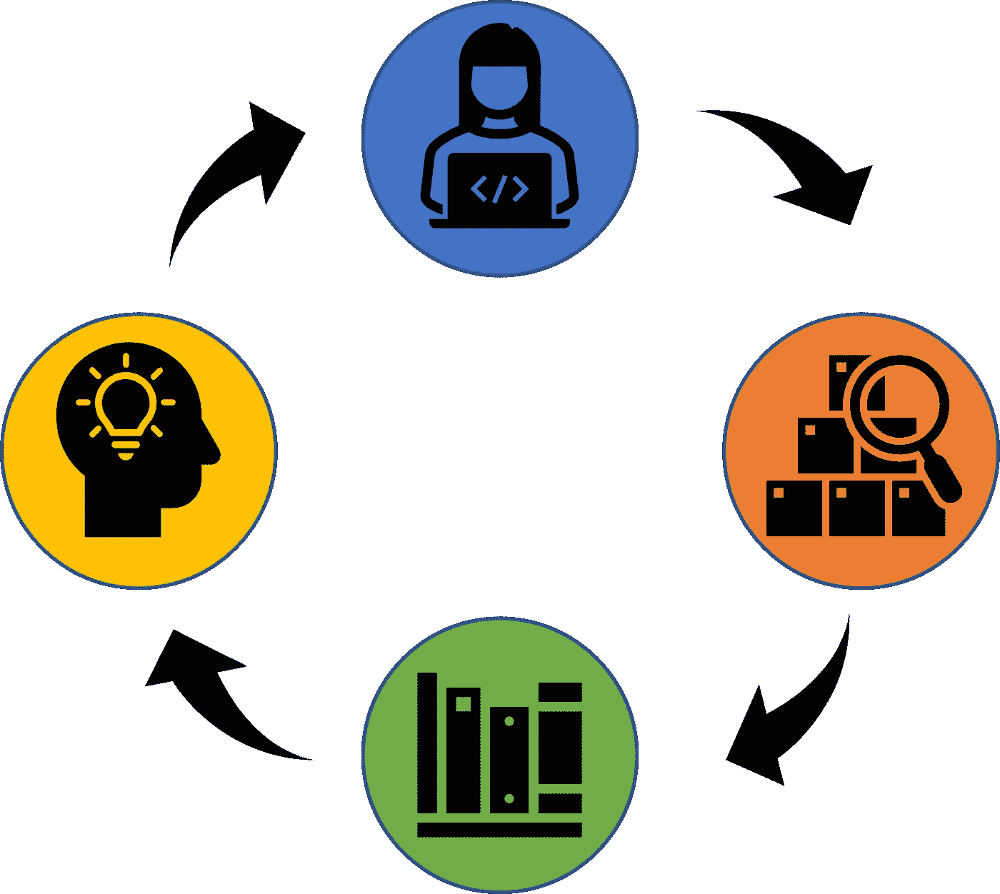
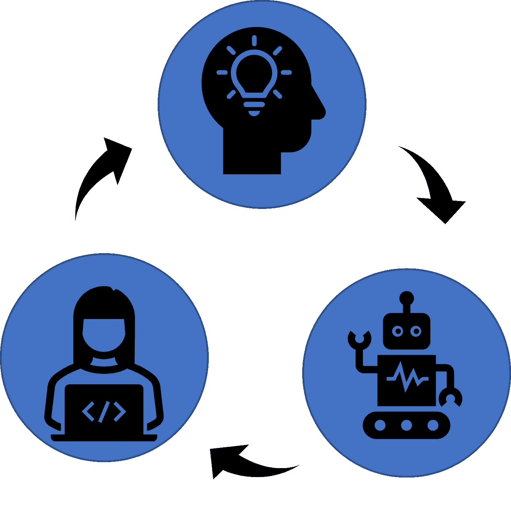

# GitHub Copilot 是游戏规则的改变者

> 原文：<https://medium.com/codex/github-copilot-is-a-game-changer-cd0a2bbe6de8?source=collection_archive---------7----------------------->

Avel Chuklanov 在 [Unsplash](https://unsplash.com?utm_source=medium&utm_medium=referral) 上拍摄的照片

微软最近为 [Github Copilot](https://copilot.github.com/) 开放了测试版，这是一款基于 [OpenAI 的 codex](https://openai.com/blog/openai-codex/) 的强大代码完成工具。我是大约一周前获得访问权限的少数幸运者之一，我对此印象深刻。印象极其深刻。也有点害怕。但主要是印象深刻。

当我滚动浏览我的 feed 时，我可以看到许多朋友和同事写了关于它的文章，他们并不像我这样印象深刻。他们更多地把它看作是一个“有趣的工具”，尽管“写复杂的代码有困难”。在这篇文章中，我认为 Copilot 不仅仅是一个有趣的工具，甚至是优秀的自动完成功能。相反，我认为 Copilot 从根本上改变了编程。

这是一个大胆的声明。科技的历史上充满了人们对大胆言论的误解。尽管如此，我写这篇文章的原因是:a)我认为数据科学界的普遍态度有点过于悲观，我希望这篇文章能有助于改变这种趋势，b)我很想改变我对此的看法，c)我真的很敬畏。

## 为什么印象深刻？

为了理解我的敬畏，我们首先需要讨论一个问题代码生成与机器学习中的其他问题相比有多难。(剧透:真的很辛苦)。拿[预测房价](https://www.kaggle.com/c/house-prices-advanced-regression-techniques)这个“简单”的例子来说。当你开始训练一个分类器时，它的表现会很差:它可能会预测 10 万美元的价格，而实际价格是 20 万美元。然而，很容易 a)准确地说出预测有多错误(-$100k)和 b)告诉模型如何改进(即使用一些优化算法调整这些权重)。

对于代码生成来说，情况并非如此。在程序员中有一个由来已久的迷因，那就是即使是一个[错放的分号也会对你的代码](https://www.google.com/url?sa=i&url=https%3A%2F%2Fvincentdnl.com%2Fprogramming-memes%2F&psig=AOvVaw2BvI4188Rkn_4OJT2jSVuw&ust=1649487475718000&source=images&cd=vfe&ved=0CAoQjRxqFwoTCOCgie7xg_cCFQAAAAAdAAAAABAP)造成严重破坏。稍微调整输出不会产生稍微不同的结果；这很可能会产生语法错误。即使程序运行，它也很可能会有完全不同的输出。

即使是自然语言，在人工智能领域因复杂而臭名昭著的，也更加宽容。即使你的文章中充满了拼写错误和不恰当的词语，大多数人仍然能理解它的意思。

然而，OpenAI 解决了这个问题。即使对于相对复杂的提示，如“[对 MNIST 数据进行逻辑回归训练并输出混淆矩阵](https://dmkothari.github.io/Machine-Learning-Projects/Logistic_Regression_with_MNIST.html)”，输出也很不错。当然，它可能不符合一个人的个人风格，可能会采用一种时髦的文件夹结构，但它是明智的。

## 副驾驶失败的地方

您现在可能会想“它可以进行逻辑回归，这很好，但在进行 X 时却失败了”，其中 X 代表您正在处理的任何数据科学问题。根据我自己(有限的)使用 Copilot 的经验，我经历了几个 X，包括:

1.从任意网站抓取数据

2.特定领域的数据转换(即，提取新闻文章中提到的[公益](https://en.wikipedia.org/wiki/Benefit_corporation)人工智能公司)

3.冗长复杂的规范(即把你的作业描述复制粘贴到一个 python 文件中(不要评判！))

虽然所有这些都是数据科学家经常遇到的任务，但了解解决这些问题所需的工作量是很重要的。从任意网站抓取数据基本上需要 Copilot 对每个网站的结构有一个准确的看法(并了解需要什么输出)。了解特定领域的转变意味着 Copilot“了解”数据科学家工作的每一个领域(这正在成为大多数领域！).理解长期复杂的规范基本上意味着完全自动化数据科学家的工作(并使我的作业容易得多)。

所有这些问题的共同点是，它们在某种意义上是 [*A(G)I-complete*](https://en.wikipedia.org/wiki/AI-complete) ，这意味着让人工智能解决它们需要一般的智能。这将意味着有很长的路要走。尤其是自从 [AGI 已经蠢蠢欲动很久了](https://www.openphilanthropy.org/focus/global-catastrophic-risks/potential-risks-advanced-artificial-intelligence/what-should-we-learn-past-ai-forecasts)。

或者会吗？副驾驶不需要解决我们所有的问题来改变游戏规则。即使它解决了 20%的问题，也会节省很多时间。

重要的是要记住，副驾驶是从不可能变成可能的；他们从零到一。迈出第一步通常是困难的部分。人类大约花了 12000 年才学会飞行。只花了 60 多分钟就到达了月球。如果[当前的比例定律成立](https://arxiv.org/abs/2001.08361)，Copilot 可能会跑得更快。

## Copilot 改变你的编码方式

既然我已经列出了*为什么*我相信 Copilot 是一个游戏改变者的宏观原因，现在是时候进入*它如何改变游戏了。一个好的起点是 Copilot 改变了你的编码方式。*

当我开始尝试时，我很快意识到我很快适应了我的编码风格。在 Copilot(公元前)之前，我的编码经历是一个快速迭代，得到一个想法，试图让它工作，谷歌搜索问题，实现堆栈溢出/一些博客帖子/一些论文。这种方法对我(和我的许多程序员朋友)很有帮助。

典型的开发人员工作流程(至少对我来说是这样)。每种不同的颜色都是一个上下文切换。

在副驾驶(空调)之后，气流看起来不同了。根据我的经验，我花更多的时间考虑我希望程序如何工作，然后如何通过注释/函数头来指定，然后评估结果——也是以迭代的方式。

使用 Copilot 的(理想化)工作流程。你有了一个想法，然后检查 copilot 产生的代码。请注意缺少上下文切换。

这一转变简单而深远。虽然体验明显不同，但有三个主题:

1. **Copilot 让你成为架构师:**因为 Copilot 把注释变成了代码，你可以花更多的时间和精力去思考代码的整体结构。从这个意义上说，你的角色变得更像软件架构师，而不是程序员。

2. **Copilot 让尝试新框架变得更加容易:**简单地写下“使用 [beautifulsoup4](https://pypi.org/project/beautifulsoup4/) 刮 randomsite.com 的东西”就能让 Copilot 给你一个结构良好的输出。这使得根据项目的具体情况修改代码变得更加容易。

3.**副驾驶减少环境切换:**这是一个主要的。通常 Copilot 会取代[堆栈溢出](https://stackoverflow.com/)作为第一帮助来源。这使您可以在 ide 中做更多的事情，而不会被互联网的奇迹分散注意力。

在上面我确实夸大了一点。我仍然花很多时间在堆栈溢出和“手动”解决 Copilot(不可避免地)失败的问题上。我夸大其词的原因是为了让你看清这是如何工作的。作为我最喜欢的 YouTubers 用户之一， [Two Minute Papers](https://www.youtube.com/channel/UCbfYPyITQ-7l4upoX8nvctg) 喜欢说:“接下来还有两份文件，谁知道我们会在哪里”。活着是多么美好的时光啊！

## 关于数据作业(以及潜在的数据缺失)

现在，也许我的一些数据科学家同事已经阅读了这篇文章，并开始寻找美发、治疗、执行决策或其他难以自动化的任务的课程。毕竟我刚才不是论证过副驾驶会抢走我们的工作吗？

不完全是。我的主要论点是副驾驶改变了游戏，而不是取消了游戏。工作和技术之间的关系很复杂。然而，一个相当有力的发现是，尖端技术让高技能工人变得更有价值。因此，Copilot 可能*通过 a)向领域专家开放这项工作和 b)提高数据科学家的生产力来增加对数据科学家的需求。*

关键原因是人工智能系统(像副驾驶一样)[自动化*任务*而不是*工作*](https://www.forbes.com/sites/joemckendrick/2018/08/14/artificial-intelligence-will-replace-tasks-not-jobs/) 。不管感觉如何，数据科学家的工作不仅仅是写样板文件和清理数据。最高价值的技能更加非结构化，如创建和交付业务关键指标、与利益相关者沟通以及其他业务内容。

对于数据科学家来说，这不全是好消息。通过自动化枯燥的工作，Copilot 青睐有经验的数据科学家，他们对 T2 软件设计原则以及如何构建项目有很深的了解。但是初级数据科学家(和其他程序员)怎么办，他们仍然需要学习如何编写[实心代码](https://www.geeksforgeeks.org/solid-principle-in-programming-understand-with-real-life-examples/)和其他基本模式？他们应该如何区分好的和坏的建议？

这些问题可能没有简单的答案。但我希望通过这篇文章，这些问题至少会得到讨论。虽然我对这篇文章的措辞相当强烈，但如果有我遗漏的关键论点，我很乐意改变我的想法。在那之前，我会享受我的新僚机——直到我被取代(希望不是被一个[回形针](https://www.lesswrong.com/tag/paperclip-maximizer)！).

## 承认

本文基于与 Andrei Alexandru、 [Esben Kran](https://kran.ai/) 和 Luke Ring 的对话。特别感谢 Esben 看了粗糙的初稿。所有观点和错误都是我自己的。