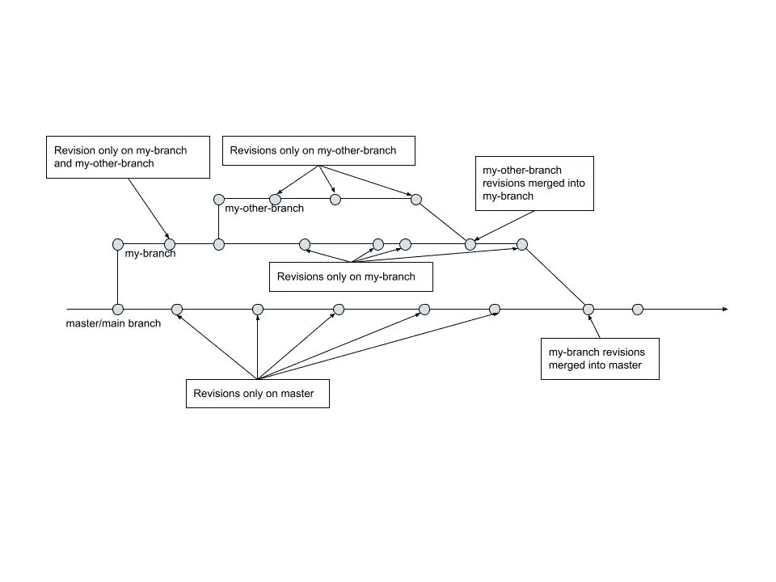

# Gitting Started(第一部分):Git 初学者入门

> 原文：<https://medium.com/codex/gitting-started-part-i-a-total-beginners-intro-to-git-761715f5cc13?source=collection_archive---------10----------------------->

任何与我谈论过这个话题的人都知道我对那些想开始学习编码的人的建议:在你做任何事情之前，从 Linux/UNIX 命令行*基础**开始，然后学习一些基本的 Git。Git 是一个复杂而强大的工具，用于管理对代码库的更改，学习起来可能会令人望而生畏。连我都不知道其中的奥妙。尽管如此，你还是可以不太费力地学到你需要的东西。还有其他的 Git 指南，但是很多都不是专门针对那些很少或者没有工程经验的人，这些人是我这篇 6 部分指南的目标读者。此外，大多数其他指南更全面地介绍了 Git 命令，而我在本系列中的目标是只给你我认为最有用和最基本的命令。

我在这篇文章中的目标是引导你了解 Git 的基础知识。这篇文章不会详细讨论如何使用这个工具——它的目的是给你一个 Git 如何工作的基本概念概述，这样你就能更完整地理解第二部分到第六部分。在开始之前，有一些注意事项和先决条件:

*   因为我只熟悉[基于 UNIX 的](https://unix.org/)操作系统(包括各种 [Linux 发行版](https://en.wikipedia.org/wiki/Linux_distribution)和 Mac OS X)，所以在这些帖子里我没有任何在 Windows 下使用 Git 的例子。我想大部分的基础都是相似的，但是你必须自己去检验这个假设。
*   如果您刚刚开始您的编码之旅，我强烈建议您首先从 Linux 命令行基础*开始。(对于从事 web 开发方向的人来说尤其如此，因为大部分互联网都运行在 Linux 服务器上。)因此，这些帖子将假设你对 Linux 命令有基本的了解——导航你的终端应用程序和最常用的命令，如`pwd`、`cd`、`ls`和`rm`。当这些命令出现时，我将简要地解释它们，但是先了解一些知识会有所帮助。
*   在这些帖子中，我将坚持使用`[bash](https://en.wikipedia.org/wiki/Bash_(Unix_shell))`语法，尽管 Git 命令在 [zsh](https://ohmyz.sh/) 和其他常见 shells 中是相同的。我建议先学习`bash`,因为它可以在所有的 Linux 系统(以及我所知道的其他 UNIXes 系统)上使用。
*   我将在关于远程存储库的帖子中谈论 GitHub，但是因为我想强调 GitHub(一个专有的托管服务)和 Git(一个你可以独立使用的开源工具)之间的明确区别，我将避免在这些指南中过多地谈论 GitHub。
*   **这并不是 Git** 的全面指南，它是一个功能非常全面的工具。相反，我的目标是让您大致了解 Git 是什么以及它是如何工作的，并带您浏览我在职业生涯中最常用的命令。这意味着我不会深入讨论 Git 命令和它们采用的所有不同选项。我也不会涵盖每个 Git 命令。我只想让你开始。更全面的信息请点击[这里](https://git-scm.com/)。
*   你可能会发现这篇文章非常复杂和专业——也许比本系列的其他文章更复杂。如果你不是什么都懂，也不要担心。在你的编码之旅中，你将会学到很多东西，包括对一个概念的部分理解和死记硬背，直到你开始更全面地理解它。你不能也没有必要一下子学会所有的东西。

既然已经解决了，那就让我们开始吧！

# Git 是什么？

Git 是当今使用最广泛的[版本控制系统](https://git-scm.com/book/en/v2/Getting-Started-About-Version-Control)。**版本控制**对开发工作至关重要，因为它解决了许多问题:

*   防止您丢失对代码所做的更改
*   允许多人同时在同一个代码库上工作，而不会影响到彼此
*   如果您真的搞砸了，可以让您的代码恢复到以前的状态
*   记录对您的代码所做的所有更改以及是谁做的更改，这有助于故障排除以及对代码库如何随着时间的推移而发展的总体理解
*   使您能够维护仍在开发中的应用程序的不同版本，例如，修复 1.x 版本中的错误，同时构建应用程序的 2.x 版本

版本控制系统是一种工具，它记录您对代码(或您设置系统跟踪的任何其他类型的文件)所做的不同更改或修订。每次在版本控制中更新一个或多个文件时，版本控制系统都会永久地记住文件在该状态下的样子，使您能够查看文件的以前版本，如果需要，甚至可以快速地将文件恢复到以前的状态。

Git 已经是您使用的任何 Linux 发行版的一部分。如果你使用 Mac OS X，你需要安装 [XCode](https://developer.apple.com/xcode/) 和 [XCode 命令行工具](https://www.embarcadero.com/starthere/xe5/mobdevsetup/ios/en/installing_the_commandline_tools.html)才能使用 Git。如果您试图在没有安装这些程序的情况下在终端中运行 Git 命令，系统会提示您安装它们。

Git 有一个[命令行界面](https://searchwindowsserver.techtarget.com/definition/command-line-interface-CLI#:~:text=A%20command%20line%20interface%20(CLI,interfaces%20and%20character%20user%20interfaces.)，或 CLI。还有各种工具可以将 Git 与图形用户界面结合使用。在本指南中，我将介绍命令行界面。一旦你理解了命令行界面是如何工作的，如果你喜欢的话，你就能很容易地学会一种 GUI 工具。

Git 中您需要马上了解的主要概念是**库**、**修订**(也称为**提交**)和**分支**。在这些指南中，还有许多其他概念我不会讲太多，包括**指针**、**参考文献**和**树**。虽然很重要，但你可以在不了解它们的情况下走得很远，让你开始是这里的目标。如果您想了解更多关于 Git 如何工作和高级功能的详细信息，我推荐您访问 [git-scm](https://git-scm.com/) 网站了解更多信息。

在这篇文章中，我最后要提到的是**远程存储库**的概念。

# 仓库

一个**存储库**，或者“repo”，是一个目录——通常，但不总是，代表一个单一的应用程序或者代码库——它的版本和修订使用 Git 来跟踪。一般来说，存储库是应用程序的根目录，应用程序的所有代码都存储在这里。代码写在文件中，这些文件要么直接位于存储库的根目录中，要么位于其中的子目录中。有时候，存储库中还有其他文件，比如 web 应用程序中使用的图像。Git 将跟踪存储库中任何已经“提交”的文件，不管文件类型如何。(一般来说，尤其是在开始时，您将提交 repo 中的所有文件和子目录，但是，可以将 Git 配置为不跟踪某些特定的文件或子目录。)

创建 Git 存储库时，Git 会在 repo 的根目录下创建一个名为`.git`的子目录。这个目录是 Git 施展魔法的地方。如果您删除或重命名这个目录，您将丢失所有已经提交给 Git 的修订——换句话说，永远不要删除或重命名这个目录。(注意，因为这个目录名以`.`开头，所以您需要使用`ls -a`在 repo 中的文件和目录列表中查看它。如果你只使用没有`-a`标志的`ls`，它不会显示出来。)

你几乎永远不会直接与`.git`目录交互。Git 命令行工具为您提供了管理存储库所需的一切。这个解释只是为了揭开 Git 实际上是如何变魔术的神秘面纱。

# 修订

一个**版本**是您对 repo 中的代码或其他文件所做的一组更改，并“提交”给 Git。事实上，修订通常也被称为**提交**。请注意，您所做的更改不会自动存储为修订版—您必须主动提交它们。我们将在本系列的第三部分讨论如何提交变更。

每当您向 Git 提交一组更改时，Git 都会将对这些更改的引用存储在`.git`目录中，作为一个单独的修订。每个版本都被分配了一个阿沙哈希形式的唯一标识符。(此时不要担心阿沙散列是什么——您需要知道的重要事情是，这些看似随机的字母数字字符串充当 Git 修订版的唯一标识符。)比如我最近修改的一个，标识为`128cdce651e69852d61798ee25b775c490704eef`。您还可以通过 SHA 的前七个字符来识别修订版，所以我刚才提到的修订版可以被引用为`128cdce`，然而，Git 确实通过整个 SHA 散列在内部引用它。**您不需要知道或记住这些版本标识符**，因为当您需要它们时，您可以在命令行上使用 Git 来检查它们。

每个修订都存储在由 SHA 命名的文件中的`.git`目录中(或者，在某些情况下，存储在目录中)。该文件或目录包含作为该修订的一部分所做的更改的参考，并将永久保存在`.git`目录中，以便您能够查看早期状态的应用程序或将应用程序恢复到该状态。在你需要担心 sha 的修订之前，本指南中会有几个帖子，所以如果这一点有点抽象，不要担心，你做得很好。

# 分支

我将在这篇文章中介绍的第三个核心 Git 概念是**分支**。每个 Git 存储库都从一个分支开始。历史上，这个分支被称为`master`，尽管行业正朝着命名基本分支`main`的方向发展，主要是出于包容性的原因。我将假设您的基本分支在本系列中被称为`master`,因为不幸的是，这是 Git 使用的默认名称，鉴于 Git 维护者的观点，这不太可能改变。(如果你想把你的`master`分公司改名为`main`，这是我鼓励的一个习惯，这里有这样做的说明。此时，您只需要按照“将本地`master`分支重命名为`main`”下的说明进行操作。)分支`master`或`main`通常包含部署到产品中的代码版本，或构成最新版本的代码。虽然其他工作流也是可能的，但这是最常见的，也是我假设您在本系列中使用的工作流。

一般来说，您不希望直接向`master`提交新的修订。(这有几个原因，但出于本文的目的，我想把重点放在分支的概念上，因为它是 Git 中最基本的概念之一。)所以，在您开始开发工作之前，您将创建一个新的分支。新分支通常基于`master`，但也可以基于任何其他现有分支。新分支所基于的现有分支称为**基础分支**。这个新分支通常被称为**特色分支**或**开发分支**。

当您第一次创建一个新的分支时，它将与基础分支相同(同样，通常这将是`master`)。但是，您提交到新分支的任何修订将只存在于该分支上。基本分支将保持不变。如果有人在您创建新分支后对基础分支进行了修订，这些修订也不会出现在新分支上。所有修订都提交给一个特定的分支，并且仅限于该分支。

一旦你完成了你在一个特性分支上所做的工作，你将会想要做两件事情中的一件:(1)把那些修改放到基础分支上/放到`master`上或者(2)销毁你已经修改过的分支(如果你真的搞砸了什么或者你在那个分支上所做的修改是不需要的/不想要的)。假设您想要将修订添加到基础分支中，您将把您的分支合并到基础分支中。(现在还不要担心如何做到这一点。)

下图显示了分支和修订在 Git 中的工作方式。这里，`master`是`my-branch`的基础分支，`my-branch`是`my-other-branch`的基础分支。从左到右，图中的情况如下:

1.  `my-branch`是以`master`为基础创建的
2.  在`my-branch`进行了修改。
3.  对`master`做了修改(不影响`my-branch`)。
4.  `my-other-branch`是以`my-branch`为基础创建的。它包括在`my-branch`所做的修订，但不包括在`my-branch`创建后在`master`所做的修订。
5.  修订出现在每个分支上—这些是不同的修订，并且只出现在显示它们的分支上。
6.  `my-other-branch`的修订合并到`my-branch`中。这些修订现在出现在`my-branch`上。
7.  `my-branch`合并为`master`。它的修订版，包括那些来自`my-other-branch`的，现在都在`master`上。
8.  对`master`进行了额外的修订。

图 Git 中的修订和分支

那么，如果在您创建新的分支和您想要合并它之间，在基础分支上有其他的修订，会发生什么呢？答案是，看情况。

通常不会有问题。如果基础分支上的修订影响了与您在分支上更改的文件不同的文件(或者有时甚至它们影响了相同文件的不同部分)，Git 足够聪明，能够识别出修订并不冲突。在这种情况下，当您将分支合并到基本分支中时，您的修订将被添加到基本分支中，同时不会影响对基本分支所做的更改。没问题！

现在，假设基础分支上的修订影响了您在要合并的分支上更改的相同文件的相同部分。在这种情况下，在合并完成之前，您必须手动解决合并冲突。您必须确定哪些更改应该保留，哪些应该放弃。在某些情况下，当修订版特别不兼容时，您需要在成功合并之前对代码进行额外的更改。从 Git 的角度来看，这个过程很简单，但是合并冲突仍然是一个很难处理的问题，因为很难确定要保留哪些修订，以及是否需要进一步添加或修改代码。

一旦你将你的分支合并到`master`(或者无论它的基础分支是什么)，你的分支将仍然存在。您可以在此时删除它，如果您不打算对它做额外的工作，通常建议您这样做。如果您离开这个分支，它将变得“陈旧”,因为在基础分支上做了进一步的工作。

在专业设置中，多个开发人员经常在基于同一基础分支的不同分支上工作。通常这不会导致问题，但是当合并冲突发生时，很可能是因为其他人对您所做的相同文件进行了更改。多个开发人员同时在同一个分支上工作也是可能的。然而，以我的经验来看，如果你不小心与你的同事协调，这往往会导致从令人讨厌到灾难性的问题。

# 远程存储库

您可能想知道，当一个分支在您的机器上时，多个开发人员如何能够在同一个基础分支上工作！答案是通常有一个中央**远程存储库**(通常简称为“远程”)。如今，这个存储库通常位于 GitHub(T4)或其他类似的托管服务上。(我建议马上申请一个 GitHub 账户——有一个功能非常全面的免费层。)

当你开始新的工作时，你首先要确保你的机器(你的个人电脑也被称为你的**本地**)上的修改与远程同步。然后你将在你选择的基础上创建你的分支。有时你会合并到本地的基础分支。更常见的是，在专业设置中，您会将您的分支发送到远程，并让其他开发人员在合并到基本分支之前检查更改。

# 结论

如果你已经走到这一步，恭喜你！已经读了很多了，我鼓励你休息一下:)

总结一下:Git 是一个复杂而强大的工具，你可以用它来管理你的代码随时间的变化或修订。代码存储在 Git 跟踪的一个名为存储库的目录中。Git 还允许多个开发人员使用 Git 分支同时处理不同的事情。

现在你已经(希望)理解了一些基础知识，接下来的文章将向你展示如何实际使用 Git 命令行工具来管理本文中描述的变更。

如果这个帖子让你头疼，不要担心！Git 非常复杂，大多数开发人员(包括我自己)并不了解所有的细节。我还将在本系列中专门讨论这些主题的其他文章中重述这篇文章中的主题。

感谢您的阅读，我们在[第二部](https://dana-scheider.medium.com/gitting-started-part-ii-initialising-a-repository-with-git-init-b0914a0a8f7e)再见！

— — — — — — —

*在这些帖子中，就像在野外一样，你会看到术语“终端”、“命令行”和“shell”交替使用。从技术上讲，终端是您使用命令行或 shell 的应用程序。命令行和 shell 是同义词。关于这个话题的更多信息可以在[这个 Reddit 帖子](https://www.reddit.com/r/learnprogramming/comments/6xr0l9/whats_the_difference_between_terminal_shell/)中找到。

**我对学习 Linux 基础知识的推荐一直是[这本书](https://linuxcommand.org/tlcl.php)，但不幸的是它是在 [systemd](https://www.linux.com/training-tutorials/understanding-and-using-systemd/) 成为 Linux 的一部分之前出版的，因此有些过时。我的同事已经推荐了[巫师杂志](https://wizardzines.com/)作为现在开始的好地方，但是我实际上还没有读过它们。