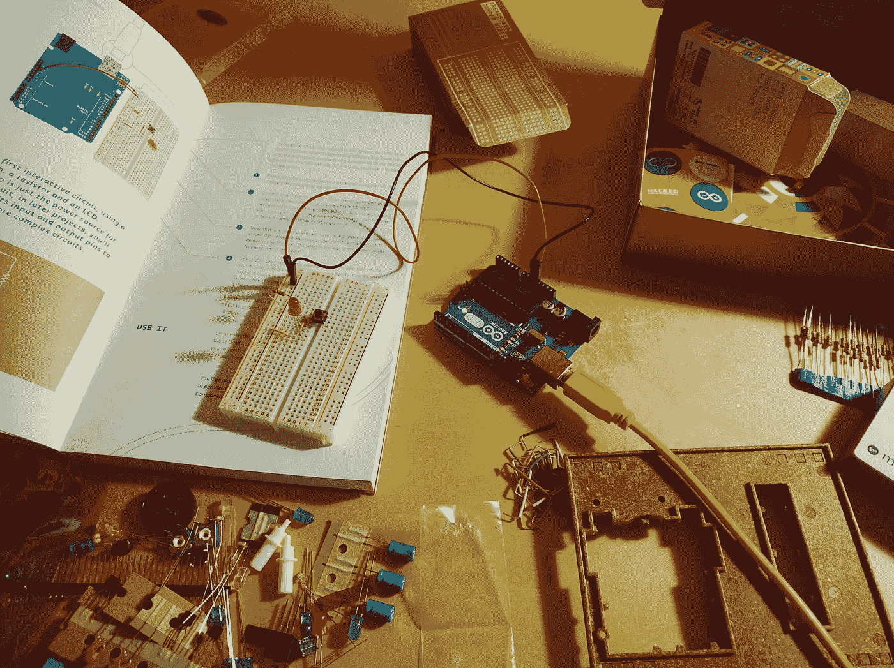
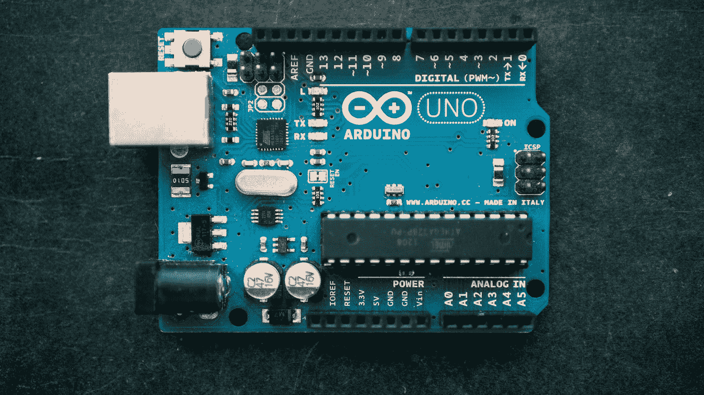
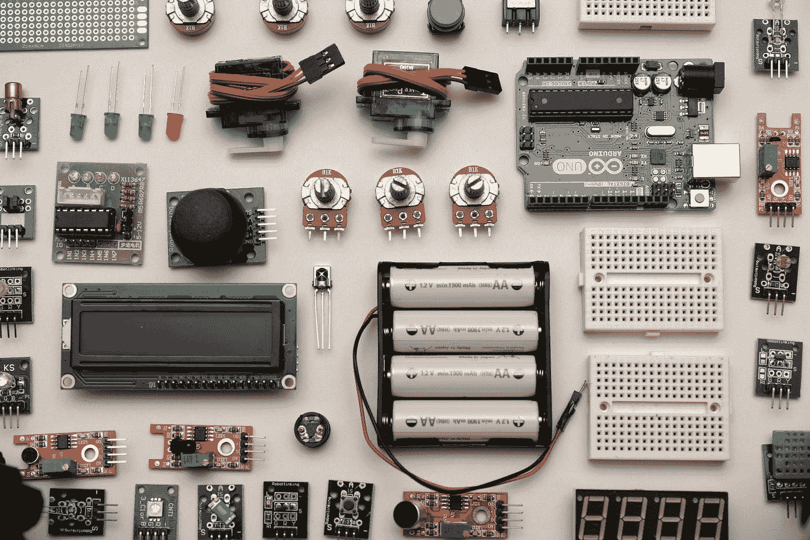
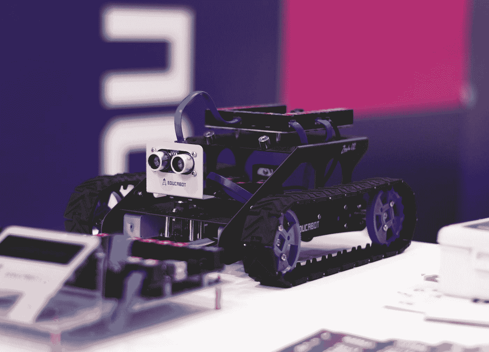

# 给你(内心)的孩子一台 Arduino，丰富他们的未来

> 原文：<https://medium.com/codex/give-your-inner-child-an-arduino-and-enrich-his-future-d5eaab0ce6d?source=collection_archive---------7----------------------->

[斯潘塞](https://unsplash.com/@spen?utm_source=medium&utm_medium=referral)在 [Unsplash](https://unsplash.com?utm_source=medium&utm_medium=referral) 上拍照

无论你是软件工程师、电气/电子工程师、电力系统工程师，还是以上任何一个都不是，你都应该真正考虑在你孩子的早期给他们一个 Arduino(或任何其他开发板)。到目前为止，你的孩子可以从中获得的大量知识超过了旧的智能手机/平板电脑，孩子可能会在上面无意识地玩糖果粉碎游戏，并记住所有现存的脸书广告。如果你没有孩子，可以考虑送一个 Arduino 给你朋友的孩子或者你家里的任何一个孩子。如果你不知道什么是 Arduino，不妨帮自己一个忙，买一个自用。让我们更深入地探讨这个问题:

# **什么是 Arduino？**

Arduino 是一个小型开发板，使您能够将计算机科学、电气/电子工程和许多其他技术领域(化学、航空学等)的许多有趣的项目带入生活。可能性是无限的，在线上有大量免费资源和分步指南，使您能够在没有任何上述领域知识的情况下完成非常复杂的项目。

照片由[哈里森·布罗德本特](https://unsplash.com/@harrisonbroadbent?utm_source=medium&utm_medium=referral)在 [Unsplash](https://unsplash.com?utm_source=medium&utm_medium=referral) 上拍摄

这是 Arduino UNO 开发板的样子。它只是比信用卡大一点点(其他 Arduino 型号非常小，只有拇指驱动器的大小),它可以通过 USB 连接到计算机，并通过编程做许多有趣的事情。

我不想深入讨论它能做什么和你如何设置它，网上有大量的教程，只要使用你最喜欢的搜索引擎，键入“顶级 Arduino 项目”，你就会被人们多年来所做的巧妙项目迷住。我只举几个来激发你的想象力:遥控车、气象站、游戏机、智能手表等等。

罗宾·格劳泽在 [Unsplash](https://unsplash.com?utm_source=medium&utm_medium=referral) 上拍摄的照片

玛丽亚·卡斯泰利在 [Unsplash](https://unsplash.com?utm_source=medium&utm_medium=referral) 上的照片

# **真的必须是 Arduino/我该选哪个板？**

市面上有许多开发板。我是说很多。一开始选择一个可能会很难，但考虑到入门产品有多便宜，我建议你先看看 Arduino UNO 和 Arduino Nano。如果您有 web 开发/网络方面的想法，不妨去看看 ESP8266 开发板。任何都可以。如果你对 Python 感兴趣，你可以考虑 STM32，但这已经是高级领域了。

# 我在哪里可以买到/它的价格是多少？

亚马逊、全球速卖通、易趣、本地商店，应有尽有。它不一定是原创的，它可以是克隆的，实际上，如果它是你(或你孩子)的第一块板，我不建议花费超过 10 美元。当你设置克隆体的时候，需要一个额外的步骤，但是互联网上有很多关于这个的信息。我会给你留一个全球速卖通的链接:

 [## 1.18 美元 10%折扣|Nano，带兼容 arduino CH340 USB 的引导加载程序 Nano 3.0 控制器…

### 便宜的集成电路，直接从中国供应商购买高质量的电子元件和用品

www.aliexpress.com](https://www.aliexpress.com/item/4000903444456.html) 

# **我为什么要给孩子(或自己)这个？**

好问题，让我们深入本文的实际主题！后来，我得到了我的第一个开发板，但从那时起，我学到了很多东西。学习如何使用 Arduino 有很多积极的方面。我会尽量突出最重要的几个。

*   你可以通过做 Arduino 项目(低级/高级编程，目标/函数，从二进制到 API，你说吧)获得编程技巧，从初学者到编程大师。
*   您将了解开源软件社区及其概念。
*   你将获得电气/电子工程领域的大量知识(根据你选择的项目，你可以获得焊接、PCB 设计、传感器、数据采集等方面的知识)。
*   你会在其他技术领域获得丰富的知识，这取决于你决定用它做什么项目。
*   你以一种有趣、容易理解的方式完成以上所有工作，从非常详细地解释每一步的文档资料中学习(同样，只需在网上搜索 Arduino 项目)。这是一个获取技能的好方法，不仅仅是为了业余爱好，也是为了职业目的。你通过玩 Arduino 获得的技能实际上可以让你找到一份工作(这里有许多其他因素在起作用)

玩开发板的另一个重要方面是，它有助于您的孩子(或您)了解他们喜欢专攻哪个技术领域。

此外，你可以和你的孩子一起开始一个 Arduino 项目，这会是一个很好的结合体验。

我经常就此事开以下玩笑:

[附身摄影](https://unsplash.com/@possessedphotography?utm_source=medium&utm_medium=referral)在 [Unsplash](https://unsplash.com?utm_source=medium&utm_medium=referral) 上拍照

给你的孩子一个 Arduino。

*   如果你的孩子给它编程来计算太阳的轨道，但没有连接任何硬件，他将成为一名成功的软件工程师。
*   如果他用它做了一个多功能混合示波器，但是复制粘贴了互联网上的所有代码，他将成为一个成功的电子工程师
*   如果他用它制造了一辆太阳能充电汽车，但仍然从互联网上复制粘贴代码，他将成为一名成功的电气工程师
*   如果他把它插入主电网，在不烧坏电路板的情况下断开断路器，他将成为一名成功的电力系统工程师
*   如果他把 Arduino 浸入酸中，Arduino 仍然工作，他将成为一名成功的化学工程师

我可以把这个笑话延伸到更多的领域，但是你明白了。

# **结论:**

你可以给你的孩子一个更好的未来，只要给他们一个开发板，可能会激发他们真正的热情，让他们真正聪明，甚至可能为他们建立一个职业道路。如果你也花时间在这上面，你可以加强你和孩子的联系，在一个充满有害习惯的世界里，你可以找到一个健康的爱好，让你的大脑保持活跃。