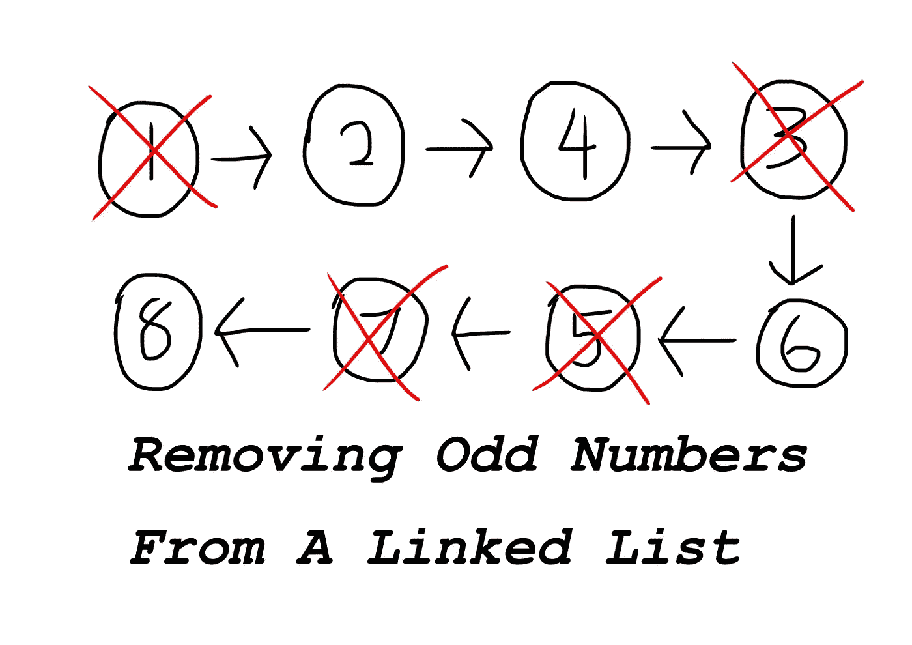
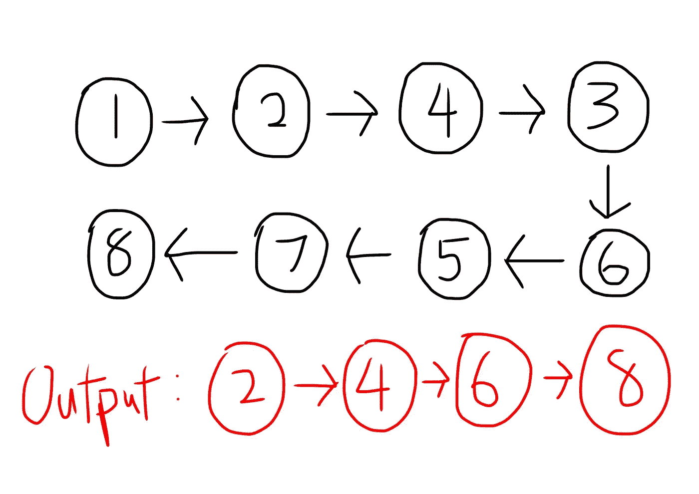

# 给定一个整数链表，移除所有奇数

> 原文：<https://medium.com/codex/given-a-linked-list-of-integers-remove-all-odd-numbers-808944cc5f7b?source=collection_archive---------6----------------------->

> 给定一个包含一堆整数的链表，移除链表中的奇数。

