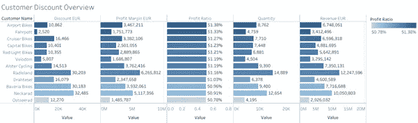
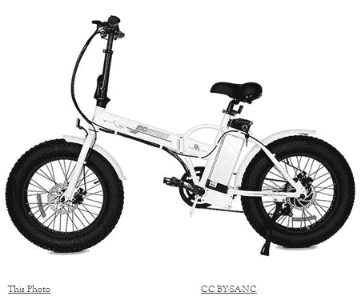

# 全球自行车公司需要帮助！

> 原文：<https://medium.com/codex/global-bike-inc-is-in-need-of-help-d1b9abf411ce?source=collection_archive---------1----------------------->

## [法典](http://medium.com/codex)

在这个项目中，我得到了全球自行车公司(GBI)的数据集，这是一家由约翰·戴维斯和彼得·施瓦茨于 2001 年通过合并海德堡复合材料公司和弗兰肯斯坦自行车公司而成立的自行车公司。

** GBI 是一家虚构的公司，由 Epistemy Press books 创建。

GBI 组织结构

让我们来探索数据！

德国和美国的收入分配趋势相同。2015 年收入最低，2019 年收入最高。可以观察到 2020 年营收有所减少。

与德国相比，美国的收入一直较高。似乎当前的数据集只包含 Q2 2020 年的销售记录。

从全球来看，美国西部的收入最高，其次是美国东部。在德国，德国北部的收入高于德国南部。

上图显示，德国和美国的净利润分布相同，与收入保持一致。

大多数情况下，最高销售额出现在 3 月至 4 月，最低销售额出现在 6 月至 8 月。2019 年，7 月和 10 月至 12 月可以观察到利润飙升，这与历史数据不同。

配件产品没有折扣。对于自行车，最打折的产品是豪华旅行自行车银。

平均而言，成本最高的产品是专业旅行自行车(银色)。成本最低的产品是水瓶和水瓶笼。

在德国，销量最高的产品是 t 恤，其次是护肘。与一般配件相比，自行车的销量较低。在美国，销量最高产品是充气泵，其次是 t 恤。

创建了一个新变量来计算付款周转时间。

付款周转时间=收款日期-账单日期

对于德国，红灯自行车从计费到付款平均需要 29 天。在美国。硅谷自行车从计费到付款平均需要 19 天。

创建了一个新变量来计算从报价到订单的周转时间。公式是这样的:

报价到订单周转时间=销售订单创建日期-报价日期

对于美国和德国，客户从报价到订购过程需要 6 天时间。

2015 年利润率最低，2019 年利润率最高。2020 年的数据必须使用 Q1 和 Q2 的历史数据进行进一步分析，因为第三季度和第四季度的记录不可用。

可以观察到，红灯自行车的净利润率有上升趋势，但在 2020 年没有购买。

上图显示，Q1 和 Q2 2020 年自行车产品的净利润呈下降趋势。

利润率最高的前 3 名客户是机场自行车、Fahrpott 和 Cruiser 自行车。利润率最低的后 3 名客户是 Bavaria Bikes、Neckarad 和 Osteerad。

对于自行车，利润率最高的产品是豪华旅游自行车(银)。对于配件，利润率最高的产品是护膝。

好吧。我们已经研究了 GBI 的历史销售数据，现在让我们继续进行一些信息分析。

当比较美国和德国的利润和收入时，可以观察到，总体而言，德国的利润和收入远低于美国。数据分析结果显示，GBI 德国客户的平均利润率相差不大，从 50% — 52%不等。如简介中所述，GBI 主要致力于制造耐用、高质量和高可靠性的旅行和越野赛车。这些自行车已经出现在主要的自行车比赛中，如环法自行车赛。然而，在信息分析过程中，发现自 2008-2017 年以来，由于运动员兴奋剂丑闻，环法自行车赛和环德自行车赛等比赛已经暂停。这可以解释为什么德国尽管是世界上对自行车最友好的城市，但与美国相比，其整体销售收入和利润较低。如果该地区没有自行车比赛，可以高度假设没有客户购买旅游和越野赛车的意向。2018 年德国巡回赛的恢复可以解释为什么德国在 2018-2019 年的销售收入会增加。这是因为对赛车专用自行车的需求增加了。然而，与 Q1-Q2 的历史数据和 2020 年数据相比，销售额有所下降。11 月下旬，一场名为新冠肺炎的疫情席卷所有地区，迫使政府当局实施封锁政策。与此同时，卫生部敦促公众减少公共交通的使用，以尽量减少接触。封锁导致 GBI 2020 年的销售收入和利润下降。此外，2018-2019 年销量增长的红灯自行车在 2020 年没有与 GBI 进行任何采购。这也导致了 GBI 在 Q1 — Q2 2020 的销售收入下降。由于封锁政策的实施，环法自行车赛等主要比赛被推迟。与此同时，由于所有比赛的重大改期工作，2020 年德国之旅不得不取消。今年 4 月德国解除封锁后，自行车行业出现了销售热潮。尤其是电动自行车，与传统自行车相比，需求有所增长。这并不是电动自行车第一次出现需求增长。根据 Vanderpool (2017)的数据，自 2017 年以来，电动自行车一直在稳步增长。下图也显示了这一点。在全球范围内，与旅游和越野自行车相比，对电动自行车的需求不断增加。如下图所示。

由于更多的比赛被推迟或取消，预计德国 GBI 第 3-4 季度的销量不会有任何增长。德国最近实施了第二次封锁，以阻止新新冠肺炎菌株的传播(Taube，2020)。不可避免的是，消费者目前不太可能进行长途自行车旅行。正如 Ricker 和 Hawkins (2020 年)所提到的，相比休闲自行车，消费者更有可能出于方便日常使用运输的目的购买电动自行车。随着德国当局推出国家自行车计划 3.0，建设更安全的自行车道和自行车高速公路，后新冠肺炎自行车销售可以看到休闲自行车的需求增加。自行车旅游将推动对旅游和越野自行车以及共享自行车的需求。

德国销量的季节性趋势可以用德国的主要比赛日期和天气来解释。德国在 12 月至 2 月期间经历冬季，因此在此期间人们骑长途自行车可能性较小。此外，根据上面的数字，大多数比赛在德国的 Q2-Q3 之间举行，这可以解释为什么德国 GBI 在 Q1-Q2 之间的销售额较高。参赛者可能会提前购买旅游或越野自行车用于训练。

唷。那是很难接受的。那么，我应该提出什么建议来增加德国的净利润呢？我想出了 3 个策略。

# 策略 1:销售拜访红灯自行车

据观察，红灯自行车的销售收入在 2018-2019 年有所增长，但令人惊讶的是，在 2020 年的 Q1-Q2 没有销售。专门的销售代表应拜访红灯自行车公司，以了解当前的情况——经销商是否受到新冠肺炎局势的影响，或者他们是否由于某些方面的原因决定停止从 GBI 订购。实施这一战略的成本很低，应该放在其他战略的首位。

# 策略 2:转变服务于直接面向消费者的市场

目前，GBI 是通过授权经销商销售，受到可能的市场份额规模的限制。这种情况应该改变，以增加市场份额，并开始建立客户忠诚度。通过直接面向消费者的战略，GBI 可以通过从直销中收集数据来更好地了解客户的偏好和反馈。该战略分三个阶段实施。

# 第一阶段:做 GBI 最擅长的事情——推出在线按单生产服务

自弗兰肯斯坦自行车和海德堡复合材料时代以来，GBI 一直专注于制造高耐用性、可靠性和高质量的旅游和越野自行车，然后用于大型自行车比赛。在弗兰肯斯坦自行车时代，约翰·戴维斯一直为朋友和竞争对手定制自行车。应该恢复这种做法，并将其作为一种专门的在线服务在网上推出。自行车定制服务根据客户的需求和偏好打造客户理想的自行车。这对于参赛者来说尤其重要，他们会喜欢基于他们的竞争策略定制的自行车。

# 第二阶段:在线销售 GBI 配件

在数据分析过程中观察到，配件部门的产品没有给经销商折扣。因此，如果 GBI 决定在网上销售，就不会有定价问题。GBI 可以开始扩大其配件选择，从利润率较高的产品和最畅销的产品开始，提供仅限在线的特价商品——t 恤、护肘和护膝。而且消费者购买配件也不需要在实体店。通过在网上直接销售这些产品，GBI 有可能接触到更多的顾客，不仅仅局限于德国，而是全世界。这可能是创造品牌忠诚度的开始。

# 第三阶段:建立 GBI 的直营实体店，在网上销售自行车

从第一阶段开始，GBI 可以开始寻找新的销售点。理想情况下，该位置应符合交通部的国家循环计划 3.0。甚至在 GBI 第一家实体商店开业之前，GBI 也可以开始在网上销售自行车。从第三阶段开始，必须进行进一步的分析，以确定 GBI 是否应该停止所有经销商的合作关系，还是双管齐下。

# 策略 3:新产品开发

与前几年相比，2017 年德国的传统自行车销量呈下降趋势(Vanderpool，2017)。Zweirad-Industrie-Verband(德国自行车行业)报告称，取代传统自行车，电动自行车的销量在 2017 年增长了 30%。根据 Ricker 和 Hawkins (2020)的研究，尽管封锁导致 4 月份销售额下降了 20-30 %,但随着新冠肺炎限制的放松，与传统自行车相比，零售商看到了电动自行车需求的增长，因为公众行为已经从休闲转向日常使用的购买

这可以与策略 2 并行执行，因为它很耗时。如前所述，GBI 的销售收入主要依赖于旅游和越野自行车。GBI 应该开始扩大其市场份额，因为传统自行车的预测销量呈下降趋势。GBI 可以考虑开发两条产品线:

# 电动自行车和折叠式电动自行车

未知作者的这张照片获得了 [CC BY-SA-NC](https://creativecommons.org/licenses/by-nc-sa/3.0/) 的许可

根据目前的趋势和预测模式，对电动自行车的需求一直在增加。GBI 可以考虑通过与电动自行车汽车公司建立合作伙伴关系来进军这一市场。GBI 可能会有所创新，推出可折叠电动自行车，以满足那些在家里或办公室都有自行车存放问题的消费者。可折叠电动自行车产品线可以进一步推广到日本或新加坡等储物能力较低的国家。

# 儿童自行车

[这张由未知作者拍摄的照片](https://en.wikipedia.org/wiki/Balance_bicycle)获得了 [CC BY-SA](https://creativecommons.org/licenses/by-sa/3.0/) 的许可

在现有的产品线中，GBI 不提供儿童类自行车。考虑到国家自行车计划有望在德国各城市推广骑自行车的习惯，这是 GBI 可以考虑尝试的事情。

## 我能做得更好吗？评论下面，让我知道我应该如何更好地改善这一点！如果你喜欢我在这里做的，给我鼓掌！

## 还有…今天就到此为止。塔塔！

**参考文献**

阿米纳斯博士(2020)。*德国制定国家循环计划 3.0* 。【在线】。7 月 21 日。可从:[https://www . world highways . com/wh12/news/Germany-sets-national-cycle-plan-30 获取。](https://www.worldhighways.com/wh12/news/germany-sets-national-cycle-plan-30.)【访问日期:2020 年 12 月 21 日】。

贝肯多夫，J. (2020)。在封锁后的德国，IBD 的销售增长达到两位数。*自行车欧洲*。【在线】。6 月 4 日。可从:[https://www . bike-eu . com/market/nieuws/2020/06/ibds-reach-two-digital-sales-increase-in-post-lockdown-Germany-10138002？_ ga = 2.19856124.1608472095-88202 . 5586586](https://www.bike-eu.com/market/nieuws/2020/06/ibds-reach-two-digit-sales-increase-in-post-lockdown-germany-10138002?_ga=2.19856124.595810022.1608472095-882023698.1608472095.)【访问日期:2020 年 12 月 21 日】。

百灵达，M. (2020)。德国之旅 2020:取消！巡演将推迟到 2021 年。*速度运动*。【在线】。4 月 28 日。可查阅:[https://www . velo motion . de/magazin/2020/04/rad sport-Deutschland-tour-2020-abgesagt/。](https://www.velomotion.de/magazin/2020/04/radsport-deutschland-tour-2020-abgesagt/.)【访问日期:2020 年 12 月 21 日】。

贝内克，M. (2020)。滚开冠状病毒引发德国自行车狂潮。 *DW* 。【在线】。5 月 19 日。可从:[https://www . dw . com/en/on-your-bike-coronavirus-prompts-cycling-frenzy-in-Germany/a-53462018 获取。](https://www.dw.com/en/on-your-bike-coronavirus-prompts-cycling-frenzy-in-germany/a-53462018.)【访问时间:2020 年 12 月 21 日】。

bhandary a .和 MAS lach d .(2018 年)。组织记忆。载于:m .奥吉耶和 D. J .蒂斯(编辑。).*帕尔格雷夫战略管理百科全书*。【在线】。伦敦:帕尔格雷夫·麦克米伦。可从:[https://link . springer . com/reference workentry/10.1057% 2f 978-1-137-00772-8 _ 210 获取。【访问日期:2020 年 12 月 22 日】。](https://link.springer.com/referenceworkentry/10.1057%2F978-1-137-00772-8_210.)

昆士兰商业(2020)。*提高利润的策略|商业昆士兰*。【在线】。2020.昆士兰商业。可从:[https://www . business . qld . gov . au/running-business/financies-cash-flow/managing-money/more-profit/strategies 获取。](https://www.business.qld.gov.au/running-business/finances-cash-flow/managing-money/more-profit/strategies.)【访问日期:2020 年 12 月 21 日】。

j . cisyk(2015 年)。*在体育运动中使用兴奋剂有什么经济影响？*【在线】。2015.世界经济论坛。可查阅:[https://www . weforum . org/agenda/2015/07/whats-the-economic-impact-of-doping-in-sport/。](https://www.weforum.org/agenda/2015/07/whats-the-economic-impact-of-doping-in-sport/.)【访问日期:2020 年 12 月 21 日】。

Cisyk 和 p . Courty(2015 年)。体育迷关心遵守兴奋剂条例吗？PED 停赛对棒球的影响。*体育经济学杂志*。【在线】。18 (4).第 323-350 页。可从:[https://doi.org/10.1177/1527002515587441.](https://doi.org/10.1177/1527002515587441.)【访问时间:2020 年 12 月 21 日】。

COYA (2019 年)。*2019 年全球自行车城市指数*。【在线】。2019.COYA。可从:[https://www.coya.com/bike/index-2019.](https://www.coya.com/bike/index-2019.)【访问日期:2020 年 12 月 21 日】。

Dowd，J. (2020 年)。安德玛将退出多达 3000 家批发合作伙伴，专注于 DTC。*零售接触点*。【在线】。11 月 3 日。可从:[https://retailtouchpoints . com/features/news-briefs/under-armour-will-exit-up-to-3000-wholesale-partnerships-to-focus-DTC 获得。](https://retailtouchpoints.com/features/news-briefs/under-armour-will-exit-up-to-3000-wholesale-partnerships-to-focus-on-dtc.)【访问时间:2020 年 12 月 22 日】。

法兰德，S. (2020 年)。UCI 揭示了新的男子和女子后新冠肺炎比赛日历。 *cyclingnews* 。【在线】。5 月 5 日。可从:[https://www . cycling news . com/news/UCI-reveal-new-mens-and-women-post-新冠肺炎-race-calendar/。【访问日期:2020 年 12 月 21 日】。](https://www.cyclingnews.com/news/uci-reveal-new-mens-and-womens-post-covid-19-race-calendar/.)

联邦交通和数字基础设施部(2020)。德国的自行车运动正在蓬勃发展。*联邦交通和数字基础设施部*。【在线】。5 月 13 日。可从:[https://www . bmvi . de/shared docs/EN/filials/Cycling/Cycling-in-Germany-is-boomering . html](https://www.bmvi.de/SharedDocs/EN/Dossier/Cycling/cycling-in-germany-is-booming.html.)【访问时间:2020 年 12 月 21 日】。

菲利里河(2013 年)。消费者共同创造与新产品开发:食品行业的案例研究。*营销情报和策划*。【在线】。31 (1).第 40-53 页。可从:[https://www . research gate . net/publication/263719660 _ Consumer _ co-creation _ and _ new _ product _ development _ A _ case _ study _ in _ the _ food _ industry。](https://www.researchgate.net/publication/263719660_Consumer_co-creation_and_new_product_development_A_case_study_in_the_food_industry.)【访问日期:2020 年 12 月 21 日】。

Iqbal Butt，t . Akhtar，m . Abdul Jabar Adnan，Munir，I . Waheed Mughal，a . Saeed，n . Hamid Butt，r .和 Fozia，T. (2016 年)。兴奋剂信念对体育消费者购买意愿的影响——运动员品牌形象存在的情况下。*科学国际(拉合尔)*。【在线】。28 (4).第 3735-3741 页。来自:[http://www.wada-ama.org。](http://www.wada-ama.org.)【访问日期:2020 年 12 月 21 日】。

南洛维特(2020 年)。冠状病毒:德国将道路变成自行车道，以帮助预防新冠肺炎病毒。*独立*。【在线】。4 月 13 日。可从:[https://www . independent . co . uk/news/world/Europe/Germany-coronavirus-road-space-cycle-lanes-Berlin-a 9462771 . html .](https://www.independent.co.uk/news/world/europe/germany-coronavirus-road-space-cycle-lanes-berlin-a9462771.html.)【访问时间:2020 年 12 月 21 日】。

Parvez，m .，Ullah，n .，Sabuj，M.A .和 Islam，S. (2018)。戴尔公司通过笔记本电脑制造的按单生产供应链实现利润最大化。*美国工商管理杂志*。【在线】。08 (06).第 1657-1671 页。可从:【https://www.scirp.org/pdf/AJIBM_2018062615311445.pdf. 【访问时间:2020 年 12 月 21 日】。

里克和霍金斯(2020 年)。随着电动自行车销量飙升，城市正在转型。*濒临绝境*。【在线】。5 月 14 日。可从:[https://www . the verge . com/2020/5/14/21258412/city-bike-lanes-open-streets-ebike-sales-bicycleist-pedestrian 获取。【访问日期:2020 年 12 月 21 日】。](https://www.theverge.com/2020/5/14/21258412/city-bike-lanes-open-streets-ebike-sales-bicyclist-pedestrian.)

rté。ie (2008)。2009 年德国之旅被取消。*rté。即*。【在线】。10 月 16 日可从:[https://www . rte . ie/sport/cycling/2008/1016/239686-tourofgermany/。](https://www.rte.ie/sport/cycling/2008/1016/239686-tourofgermany/.)【访问日期:2020 年 12 月 21 日】。

Smee，J. (2020 年)。“外面很危险”:安全担忧驱动柏林新自行车道。*守护者*。【在线】。6 月 27 日。可从:[https://www . the guardian . com/cities/2019/jun/27/its-dangerous-out-there-safety-fears-drive-new-Berlin-bike-lanes 获取。](https://www.theguardian.com/cities/2019/jun/27/its-dangerous-out-there-safety-fears-drive-new-berlin-bike-lanes.)【访问日期:2020 年 12 月 21 日】。

斯托克斯，S. (2016 年)。ASO 将恢复德国巡回赛，作为在德国发展自行车运动的主要协议的一部分。*骑行小贴士*。【在线】。3 月 8 日。可从:[https://cycling tips . com/2016/03/aso-to-revive-Deutschland-tour-as-part-of-major-agreement-to-develop-cycling-in-Germany/获取。](https://cyclingtips.com/2016/03/aso-to-revive-deutschland-tour-as-part-of-major-agreement-to-develop-cycling-in-germany/.)【访问日期:2020 年 12 月 21 日】。

陶贝，F. (2020)。冠状病毒:德国第二次封锁期间空荡荡的街道和广场。 *DW* 。【在线】。12 月 21 日可从:[https://www . dw . com/en/coronavirus-empty-streets-and-squares-amid-germanys-second-lockdown/g-56012769 获取。[访问日期:2020 年 12 月 23 日]。](https://www.dw.com/en/coronavirus-empty-streets-and-squares-amid-germanys-second-lockdown/g-56012769.)

托马斯和科斯格罗维(2020 年)。耐克将不再直接向亚马逊销售产品。*美国消费者新闻与商业频道*。【在线】。11 月 13 日可从:[https://www . CNBC . com/2019/11/13/Nike-wont-sell-direct-to-Amazon-more . html .](https://www.cnbc.com/2019/11/13/nike-wont-sell-directly-to-amazon-anymore.html.)【访问时间:2020 年 12 月 21 日】。

Trefis 团队(2019)。为什么 Lululemon 的直接面向消费者部分是其增长的关键。*福布斯*。【在线】。11 月 7 日。可从:[https://www . Forbes . com/sites/great speculations/2019/11/07/why-lululemons-direct-to-consumer-segment-is-key-to-its-growth/？sh=3c463d123c90。【访问日期:2020 年 12 月 22 日】。](https://www.forbes.com/sites/greatspeculations/2019/11/07/why-lululemons-direct-to-consumer-segment-is-key-to-its-growth/?sh=3c463d123c90.)

Vanderpool，V. (2017)。2017 年迄今为止，电动自行车销量在德国市场保持领先|自行车零售商和行业新闻。*自行车零售商*。【在线】。8 月 29 日。可从:[https://www . bicycle retailer . com/international/2017/08/29/e-bike-sales-carry-german-market-so-far-2017-0 #获取。X-AFGdgzbIU。](https://www.bicycleretailer.com/international/2017/08/29/e-bike-sales-carry-german-market-so-far-2017-0#.X-AFGdgzbIU.)【访问日期:2020 年 12 月 21 日】。

Velowire (2018)。*德国:2018 年 1 月 1 日星期一至 2018 年 12 月 31 日星期一之间的所有自行车比赛*。【在线】。2018.金属丝。可从:[https://www.velowire.com/calendar/combinedsearch.php.](https://www.velowire.com/calendar/combinedsearch.php.)【访问时间:2020 年 12 月 23 日】。

韦伯，J. (2018)。关于德国之旅你需要知道的。 *DW* 。【在线】。8 月 22 日。可从以下网址获取:dw . com/en/what-you-need-to-know-the-Deutschland-tour/a-45184243。[访问日期:2020 年 12 月 21 日]。