# 使用逻辑回归的信用评分模型的全局模块化解释

> 原文：<https://medium.com/codex/global-modular-interpretation-of-credit-scoring-model-using-logistic-regression-422db15f0e8a?source=collection_archive---------11----------------------->

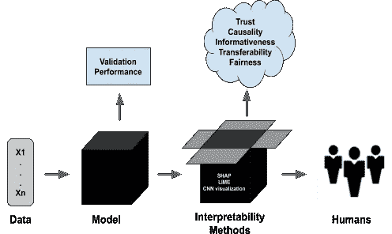

我们生活在一个规则和程序受数据和算法控制的世界。例如，有规则规定谁可以获得信贷批准或保释，以及哪些社交媒体帖子可能会受到审查。还有一些程序来确定哪种营销策略是最有效的，以及哪些胸部 x 光特征可能诊断出肺炎阳性病例。

# **什么是机器学习可解释性？**

解释某事就是解释它的意义。在机器学习的背景下，这个东西就是算法。更具体地说，该算法是一种数学算法，它接受输入数据并产生输出，就像任何公式一样。

# **理解可解释性和可解释性的区别**

考虑到解释就是解释某事的意思。尽管如此，相关的术语可解释性和可解释性不应该互换使用，即使它们经常被误认为同义词。

# **什么是可解释性？**

可解释性是人类(包括非主题专家)能够理解机器学习模型的因果关系以及输入和输出的程度。说一个模型具有高度的可解释性意味着你可以用一种人类可解释的方式来描述它的推论。换句话说，为什么模型的输入会产生特定的输出？输入数据的要求和约束是什么？预测的置信界限是什么？或者说，为什么一个变量比另一个变量有更实质性的影响？对于可解释性来说，详细描述一个模型是如何工作的只有在它能够解释它的预测并证明它是用例的正确模型的范围内才是相关的。

# **什么是可解释性？**

可解释性包含了可解释性的一切。不同之处在于，它在透明性要求上比可解释性更深入，因为它要求对模型的内部工作和模型训练过程进行人类友好的解释，而不仅仅是模型推断。根据应用程序的不同，这个需求可能扩展到不同程度的模型、设计和算法透明性。

# **信用评分案例研究**

假设你被指派了一个新的工作角色，你的`CTO`要求你建立一个信用评分的预测模型。为此，您的任务是在数据中寻找线索，以确定以下内容:

1.  可以解决哪些风险因素？

2.如果未来的案例是可以预测的，在个案的基础上解释预测？

# **贷款预测详情**

在我们深入研究数据之前，我们必须收集一些关于信用评分的重要细节，以便完成以下工作:

1.  理解问题的背景和相关性。
2.  提取能够为我们的数据分析和模型解释提供信息的领域知识信息。
3.  将专家知识背景与数据集的要素相关联。

# **接近**

逻辑回归是在财务用例中对风险因素进行排序的一种常用方法。与线性回归不同，它并不试图预测每个观测值的连续值，而是预测某个观测值属于某个特定类的概率得分。在这种情况下，我们试图预测的是，给定每个贷款申请人的 x 数据，他们违约偿还贷款的概率是多少，从 0 到 1。

# **加载库**

您需要安装以下库:

1.  pandas 和 numpy 来操作数据集。
2.  statsmodels 来拟合逻辑回归模型。
3.  sklearn 拆分数据。
4.  matplotlib 来可视化解释。

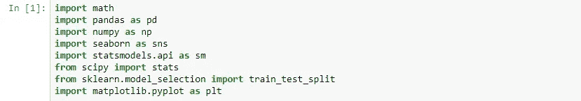

# **理解和准备数据**

教程中使用的数据将被加载到一个 dataframe 中，我称之为`credit_df`

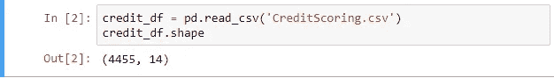

从这里，我得到了 4455 条记录和 14 列。我们可以一窥`info()`装了什么。该命令将输出每个列的名称及其类型，以及它包含的非空记录的数量:

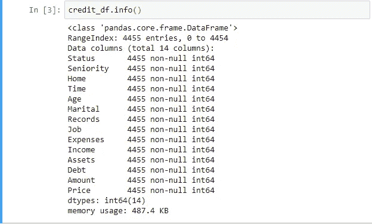

# **数据准备**

出于可解释性和模型性能的考虑，有几个数据准备任务我们可以处理，但是现在最突出的是`age`。事实上，对于像这样的信用评分和贷款预测，我们甚至可能希望将它们分成不同的年龄组，因为人们的年龄往往不同。

# 分位数宁滨

分位数是将数据分成相等部分的值。例如，中位数将数据分成两半；一半的数据点比中位数小，一半比中位数大。分位数将数据分成四分之一，十分位数分成十分之一，等等。

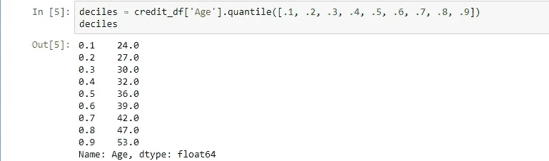

可视化直方图上的十分位数

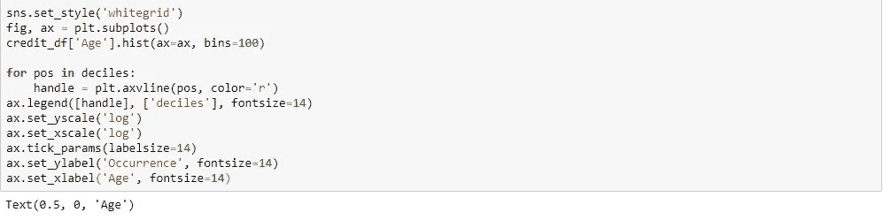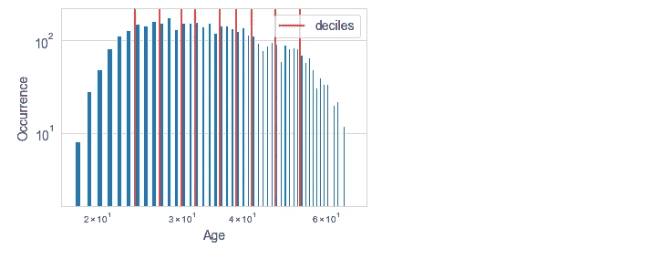

要计算十分位数并将数据映射到十分位数条块中，我们可以使用 Pandas 库。

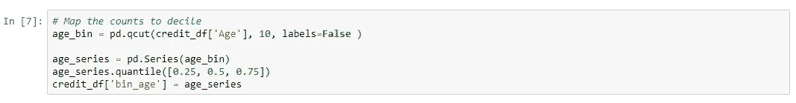

这是特征工程的一个例子，即使用数据的领域知识来创建更好地代表问题的特征，从而改进模型。在接下来的博文中，我会写关于`Feature Selection and engineering for interpretability`的内容，也会关注`Monotonic Constraints and Model Tuning for interpretability`

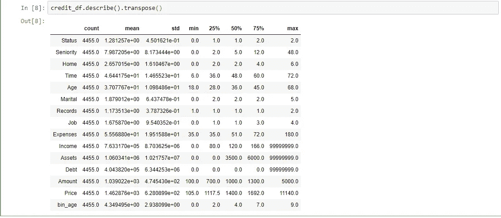

这显示了前面代码输出的汇总统计信息。`age`看起来不错，因为它介于 18 岁和 68 岁之间，这并不罕见，但在债务、资产和收入方面有一些异常的异常值。这些异常值必须被移除，因为它们可能导致模型性能和可解释性差。

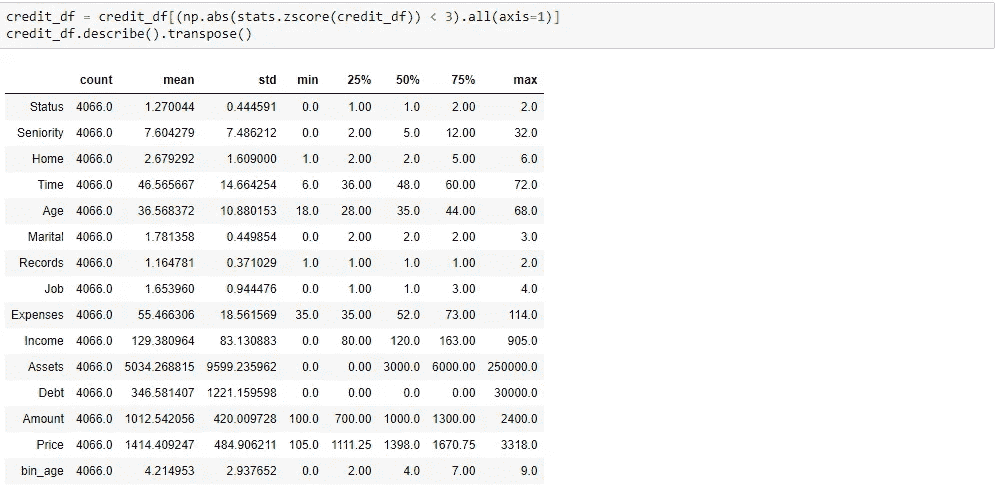

现在，为了拟合逻辑回归模型，我们必须将所有客观和主观特征放在一起作为 X，将目标特征单独作为 y。之后，您将 X 和 y 分成训练和测试数据集，但我确保包括 random_state 以实现可重复性:

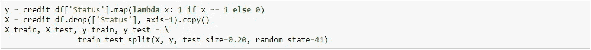

我们将使用训练数据拟合模型，并打印结果摘要:

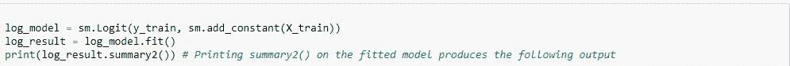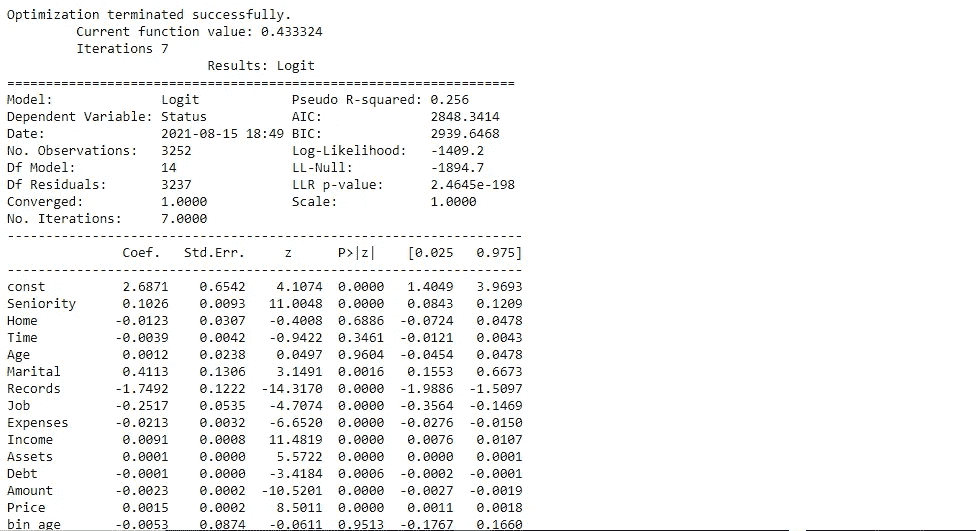

前面的总结有助于我们理解哪些 X 特征对使用模型系数(标记为 Coef)的 y 信用评分贡献最大。表中)。与线性回归非常相似，它们就像应用于每个预测值的权重。然而，线性组合指数是一个逻辑函数。这使得解释更加困难。我将在下一篇关于解释挑战的文章中解释这一点。

我们可以通过查看来判断具有绝对最高值的特征是`Marital`和`Seniority`

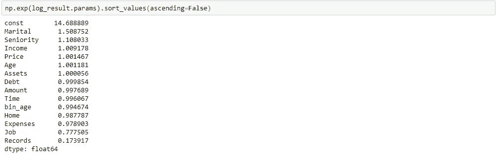

我们需要问的问题是为什么？系数是对数概率，即概率的对数。此外，赔率是正面案例的概率超过负面案例的概率，其中正面案例是我们试图预测的现象。

回到我们的信用评分案例。现在我们有了几率，我们可以解释它的含义。例如，在已婚的情况下，几率意味着什么？这意味着，在其他特征保持不变的情况下，每增加一个结婚单位，信用评分的几率就会增加 1.51 倍。能够用如此有形的术语解释一个特性对模型的影响是像逻辑回归这样的`intrinsically interpretable`模型的优势之一。

虽然`odds`为我们提供了有用的信息，但是它们并没有告诉我们什么是最重要的，因此，它们本身并不能用来衡量特性的重要性。但这怎么可能呢？如果某样东西有更高的可能性，那么它一定更重要，对吗？首先，它们都有不同的规模，所以这有很大的不同。这是因为如果你要测量某样东西增加的几率，你必须知道它通常增加多少，因为这提供了背景。例如，我们可以说，申请人在获得第一笔贷款后，获得贷款的几率是 0.66。除非你知道申请人的收入净值和申请人的信用记录，否则这种说法对你毫无意义。

为了给我们的赔率提供上下文，我们可以使用`np.std`函数轻松计算我们特征的标准偏差:

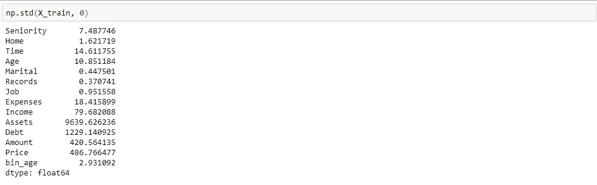

从输出中可以看出，顺序特征通常最多只能变化一个，但是连续特征，如`Assets`和`Debt`可以变化 100 - 1000 倍，这可以通过特征的标准偏差来证明。

`odds`不能用来衡量特征重要性的另一个原因是，尽管有有利的可能性，有时特征在统计上并不显著。它们与其他特征纠缠在一起，看起来很重要，但我们可以证明它们并不重要。如果`p-value`小于 0.05，则意味着有强有力的证据表明该特征是显著的。然而，当它高于 0.05 时，尤其是大幅度高于 0.05 时，没有统计证据表明它会影响预测得分。至少在这个数据集中，`Home`、`Time`、`Age`、`bin_age`就是这样。

如果我们试图获得最重要的特征，一种近似的方法是将系数乘以特征的标准偏差。纳入标准偏差说明了特征之间方差的差异。因此，当我们在做这件事的时候，最好把`Home`、`Time`、`Age`、`bin_age`也去掉:

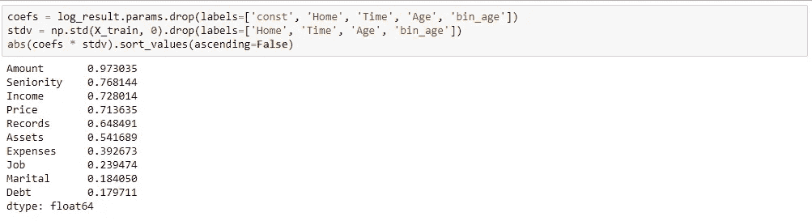

上表可以解释为根据型号从高到低的一个`approximation of risk factors`。它也是一种`model specific`特征重要性方法，换句话说，是一种全局模型(模块化)解释方法。这里有许多新概念要解释，所以让我们把它们分解开来。

有两种模型可解释性方法类型:

1.  **特定于模型:**当方法只能用于特定的模型类时，那么它就是特定于模型的。
2.  **模型不可知:**这些方法可以用于任何模型类。

# 模型可解释性范围

有几个模型可解释性范围:

*   **全局整体解释:**你可以简单地解释一个模型是如何做出预测的，因为你可以在完全理解数据的情况下立刻理解整个模型，而且它是一个经过训练的模型。
*   **全局模块化解释:**你可以用同样的方式解释内燃机零件在将燃料转化为运动的“整个”过程中的作用，你也可以用模型来解释。例如，在信用评分风险因素示例中，我们的特征重要性方法告诉我们，`amount of loan`、`seniority`、`price`、`income`、`records`是对“整体”影响最大的部分。特征重要性只是许多全局模块化解释方法中的一种，但可以说是最重要的一种。我的后续文章将详细讨论特性重要性的模型。
*   **局部单预测解释:**你可以解释为什么要做单预测。下一个例子将说明这个概念。
*   **局部组预测解释:**除了适用于预测组之外，与单一预测相同。

恭喜你！你已经用全局模型解释方法确定了风险因素，但是你公司的`CTO`还想让你知道模型是否可以用来解释个别案例。因此，我们将在我的下一篇文章中探讨这个问题。敬请关注下一篇关于局部单预测解释和局部群预测解释的文章。

数据集/代码链接:[https://bit.ly/2VRfMo5](https://bit.ly/2VRfMo5)

谢谢大家！！！