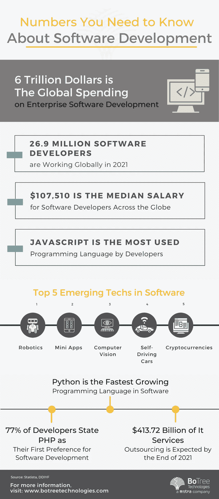

# 全球软件开发服务市场趋势

> 原文：<https://medium.com/codex/global-software-development-services-market-trend-157b4d4c6bce?source=collection_archive---------3----------------------->

软件是一系列独立于硬件的编码指令集，使计算机可编程。软件开发是软件开发服务提供商制作计算机程序的一系列步骤。它不仅仅局限于编码人员或开发团队。科学家、硬件制造商等专业人士。此外，创建软件代码，即使他们主要不是软件开发人员。

主要的著名软件领域包括生产力软件、[企业软件](https://topdigital.agency/top-20-reasons-to-choose-net-for-enterprise-application-development/)、系统基础设施软件和应用开发软件。这些市场中的大多数软件开发都是为了在专业环境中使用，但也可能被私人使用。

# 全球软件开发市场增长

根据 [Grand View Research](https://www.grandviewresearch.com/industry-analysis/business-software-services-market) 进行的市场研究，2021 年全球商业软件和服务市场规模价值为 4295.9 亿美元，预计 2022 年至 2030 年的复合年增长率(CAGR)为 11.7%。这种增长预计将受到以下因素的推动，如企业数据量的增加、跨行业的自动化实践、成本和库存削减工作以及利润最大化计划。此外，未来十年，市场预计将受益于区块链、混合架构、人工智能和机器学习等创新技术的日益使用。

全球企业正在部署许多定制软件开发公司，通过将多个系统合并到单个屏幕单个软件来提高运营效率。企业数据实时更新，从而做出更好、更快的决策。企业根据自己的需求选择最佳的定制应用程序开发公司。

许多[定制软件开发](https://www.botreetechnologies.com/blog/top-skills-software-development-companies-looking-for/)供应商提供软件解决方案，从 SAAS(软件即服务)开发、基于云的解决方案、企业软件开发到商业软件咨询。

在新冠肺炎疫情期间，由于不可避免的隔离，在家工作的模式成为世界范围内的一种规范。这刺激了对减轻安全顾虑的增值服务的需求。经济的不稳定和对未来不确定性保持敏捷的渴望导致企业关注客户驱动的方法，因此他们已经开始积极主动地向[定制应用程序开发服务](https://www.botreetechnologies.com/blog/customized-software-what-is-it-types-and-examples/)发展。

[软件开发公司](https://botreetechnologies.medium.com/top-10-custom-software-development-companies-in-2022-5045e31cadd3)提供低成本、快速的数据定制和控制部署。它们还通过保护数据和提供维护支持来增强灵活性。此外，它们还支持所有 IT 基础设施的集成，以及从遗留系统到更好的新平台的迁移。

所有这些因素都归功于全球软件开发服务收入的增长。根据[决策前瞻](https://www.decisionforesight.com/reports/software-development-services-market#:~:text=Software%20Development%20Services%20Market%20size%20accounted%20390.72%20billion%20in%202020,are%20operating%20in%20the%20market.)的报告，2020 年市场规模为 3907.2 亿美元，预计到 2030 年将超过 1 万亿美元。在此期间，预计 CAGR 将增长 10%。

> 阅读更多:[定制软件对金融科技行业有益的 6 个理由](https://www.botreetechnologies.com/blog/reasons-custom-software-is-great-for-the-fintech-industry/)

# 市场洞察

# 软件开发服务洞察

由于对用于计划、预算、分析和报告的财务管理工具的需求不断增长，银行、金融服务和保险(BFSI)部门似乎占据了软件开发市场 25%以上的最大份额。财务管理软件广泛用于风险合规、运营效率和提高生产力。促进财务数据管理的移动应用程序的数量不断增加，预计也将增加对软件开发的需求。

人力资源[软件开发](https://www.botreetechnologies.com/blog/why-companies-use-net-for-enterprise-development/)是另一个将在未来十年显著增长的领域。诸如培训、工资和招聘等职能广泛受益于业务解决方案的集成和计算机化。

# 支持和服务洞察

支持和维护部门在任何软件开发服务提供商的业务中都占有相当大的份额。这可以归功于识别和解决产品质量问题的商业管理系统的日益普及。由于它们的成本效益和训练有素、经验丰富的专家，估计对它们的需求会增加。组织越来越依赖定制软件来提高其运营效率，这将进一步推动增长轨迹。

# 最终用户洞察

由于不断增加的[企业软件](https://www.botreetechnologies.com/blog/strategies-to-speed-up-software-development-process/)的部署，BFSI 市场占据了大部分市场份额，以改善客户体验并提供安全交易和对数据库的一致访问。银行和保险服务日益自动化和数字化，以改善客户体验和简化复杂的程序，预计将推动细分市场的增长。

IT 和电信行业紧随其后。预计在未来十年，这一数字还将快速增长。这些企业中有许多正在成长，并重新评估他们部署的技术。许多运营商正在扩大他们的经营领域，以达到更广泛的市场，从而创造了对更复杂的面向软件的业务解决方案的需求。

# 地理洞察力

从地理上看，亚太地区目前主导着软件开发市场。东方的新兴经济体，如印度、中国和日本，是软件开发市场增长的技术和自动化解决方案的主要贡献者。

根据 [Decision Foresight](https://www.decisionforesight.com/reports/software-development-services-market#:~:text=Software%20Development%20Services%20Market%20size%20accounted%20390.72%20billion%20in%202020,are%20operating%20in%20the%20market.) 的报告，由于使用智能手机的电信用户数量不断增长，2018 年北美大陆的信息和通信行业占整体软件开发服务市场份额的 15%以上。这被认为对软件开发市场有积极的影响。此外，北美的公司专注于实施基于软件和分析的计划。该地区还有大量从事企业解决方案和服务的计算机科学家、数据分析师和软件工程师。美国和加拿大的客户[软件开发公司](https://www.botreetechnologies.com/)直接受益于这一因素。

在中东，阿布扎比和迪拜启动了各种数字化项目，旨在加速经济增长。

在欧洲，区域市场的良好增长可以归功于技术进步。由于基于云的设施和 endeavor 业务开发解决方案的兴起，定制软件开发的需求预计将会增长。

> 阅读更多:[每个公司都应该避免的 7 个定制软件开发错误](https://www.botreetechnologies.com/blog/custom-software-development-mistakes/)

# 结论

公司在数字化转型和全球人民采用智能技术方面的普遍努力推动了对全球[软件开发服务](https://www.botreetechnologies.com/software-development-company)的投资。然而，市场已经迅速开始向云转移。从内部部署到软件即服务的转变正日益成为现实，许多公司将努力追赶这一趋势。

*原载于*[*https://www . code mentor . io*](https://www.codementor.io/@parthbarot/draft/1skwvvk340)*。*