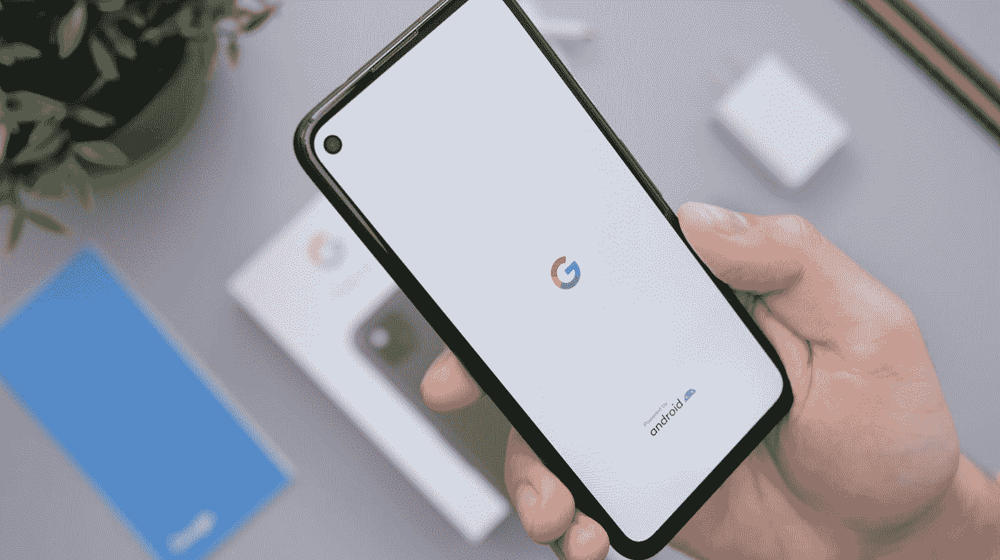

# 谷歌如何保护其应用生态系统

> 原文：<https://medium.com/codex/gms-the-holy-grail-of-google-on-android-b9352e971bdd?source=collection_archive---------16----------------------->

丹尼尔·罗梅罗在 [Unsplash](https://unsplash.com?utm_source=medium&utm_medium=referral) 上的照片

当谷歌同意从中国智能手机中撤出他们的服务时，整个惨败都围绕着一个单一的包，谷歌移动服务。

# 什么是 GMS？

GMS 或[谷歌移动服务](https://www.android.com/gms/)是谷歌要求安装在智能手机上的一套服务，这样所有谷歌服务都可以在智能手机上使用。无论是 Chrome、Youtube、地图、PlayStore 等等。根据谷歌的法律要求，任何想要在手机(或平板电脑)上安装这些应用程序的智能手机制造商都必须在设备交付给客户之前，以“某种方式”在设备上预装这套服务。

# 背景

如果你想在手机上安装脸书、抖音或 Slack，你需要从应用程序市场安装。你看，谷歌 PlayStore 是世界上最大的应用市场。因此，当你想在你的三星或 LG 手机上安装这些应用程序时，你会希望在你的手机上安装**谷歌 PlayStore** 。你很可能从未听说过许多其他的应用市场，比如 APKPure。

# 谷歌的优势

在这里，谷歌玩了把戏。谷歌要求，如果三星(或任何其他安卓手机用户)想在三星手机上使用谷歌的 PlayStore，三星需要在你的手机上安装完整的谷歌移动服务包。只有这样，作为三星手机用户，你才能在手机上安装 PlayStore 应用程序。*我在这里以三星为例，但这个条件字面上适用于每一个 Android 智能手机或平板电脑制造商*。

不仅如此，谷歌实际上验证了任何厂商想要发布的每一款手机或平板电脑。他们通过一系列“测试”检查设备的软件是否与 Android 兼容，然后与智能手机制造商签订一份名为**移动应用分发协议(MADA)** 的协议。一旦这些都准备好了，谷歌移动服务套件才被允许在这个设备上发布。

# 还有更多的吗？

这里还有一点细节。在谷歌 Play 商店应用程序(也是 GMS 套件的一部分)中，有一个名为“ **Google Play Services** ”的模块。该模块负责确保您的手机或平板电脑作为谷歌认证设备的有效性，通过该模块，其他谷歌服务也可以在手机上“验证”自己的功能。

> 因此，如果你在一个根 Android 手机上安装了一个升级版的 YouTube 应用程序，而该应用程序无法工作，这很可能是由于该模块拒绝了它。

你可以在 APKPure 等应用市场上找到各种“纯化”版本的 Play Store 应用，但不能保证它们能在你的手机上流畅运行。事实上，谷歌尽最大努力确保来自这些实际 PlayStore 修改版本的后端调用不会绕过谷歌已经为其服务生态系统制定的任何安全措施。

作为第一道防线，你手机上所有属于谷歌移动服务的应用都是系统应用。这意味着，不破坏操作系统，你真的不能篡改应用程序。

第二道防线是 **Google Play 服务**模块为其他 Google 应用提供的安全性。

# 这不是一个邪恶的原因

像任何软件制造商一样，谷歌有保护其应用生态系统的正当意图。特别是，如果这些应用程序是免费的。即使是最新版本的苹果设备也无法与谷歌服务提供的高级服务相媲美。对于任何这样的大型软件制造商来说，在应用程序之外采取措施来确保应用程序的安全性是非常重要的，谷歌在操作系统层采取保护措施完全有道理。

# 谷歌服务在一些中国手机上停止了

当美国政府决定从中国制造商生产的手机中撤出美国服务时，谷歌也效仿了这一决定，实际上，谷歌必须撤出的“核心”软件是 Google Play 服务。一旦某一类 Android 手机的后端服务被关闭，这些手机上的 Google Play 服务应用程序(或推而广之，Google 移动服务应用程序)就不再能够验证他们正在运行的手机，因此无法正常运行。

我定期撰写不同的技术主题，包括职业指导、最新消息、即将到来的技术等等。这篇博客最初发表在【我在 anirban-mukherjee.com 的博客】的