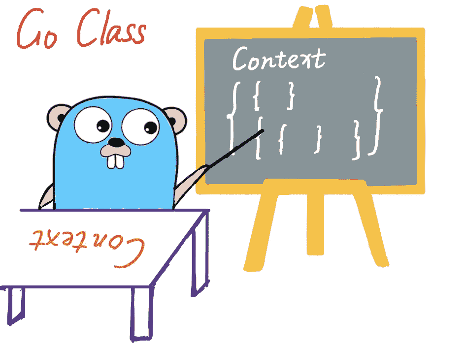

# 转到上下文 101

> 原文：<https://medium.com/codex/go-context-101-ebfaf655fa95?source=collection_archive---------1----------------------->

## 掌握 Go 环境的基本知识，避免陷阱

按作者

在 1.7 中引入后，Go 上下文被认为是使用最广泛的 Go 类型之一。通常与 goroutines 结合使用，它简化了数据处理、取消和其他操作。作为一个只有四个功能的接口，时间(`Deadline`)、信号(`Done`)、异常(`error`)和数据(`Value`)，它并不复杂，但在不同的应用中非常有用