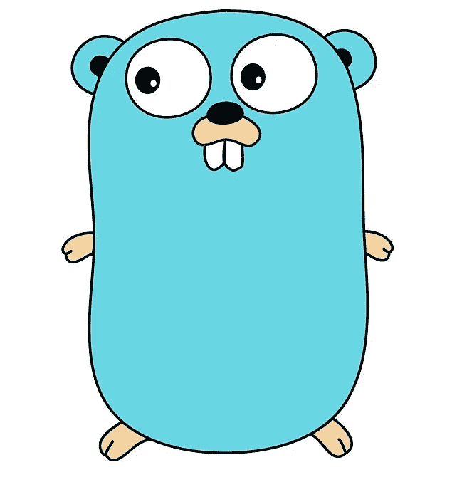

# 面向 Python 开发人员

> 原文：<https://medium.com/codex/go-for-python-developers-d24c35b9a684?source=collection_archive---------3----------------------->

## 第 2 部分:原始数据类型

我们继续检查 Python 和 Go 中的原始数据类型。对于本系列中的其他文章，请查看文章末尾的参考资料。

# 整数

整数是非分数。它们可以是已签名的，也可以是未签名的。

**尺寸**