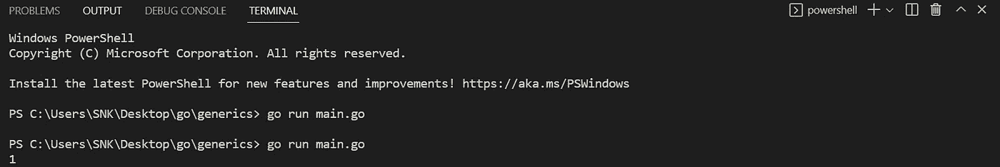
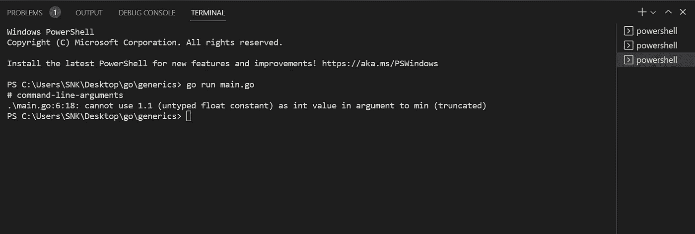
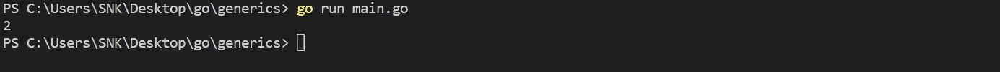
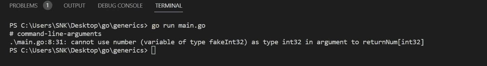
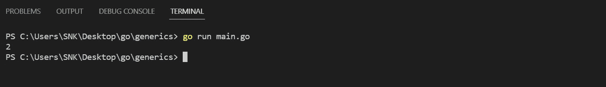
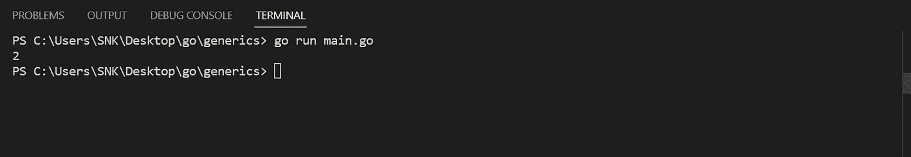

# (Go)ing 泛型:用 Go 编写无类型函数

> 原文：<https://medium.com/codex/go-ing-generic-writing-type-free-functions-in-go-40c736c422e5?source=collection_archive---------5----------------------->

如果你熟悉 C++，你可能听说过模板。模板。模板背后的简单思想是将数据类型作为参数传递，这样我们就不必为不同的数据类型编写相同的代码。Golang 中的泛型也是如此，它们被表示为以下三种类型:

**类型参数:**

首先，让我们编写一个简单的函数，它将两个整数作为参数，并返回这两个数字中的最小值:

```
package mainimport "fmt"func main() {
fmt.Println(min(1, 2))
}func min(a int, b int) int {
if a < b {
return a
}
return b
}
```

该函数返回最小值 1:



但是如果我们将 1.1 作为其中一个值传递给这个函数，它会给我们一个编译时错误:



这是因为该函数预期接收的是 int 而不是 float。我们如何解决这个问题？这就是类型参数发挥作用的地方:

为此，我们将暂时使用一个单独的函数，稍后将返回到最小函数:

```
func returnNum[T any](a T, b T) T {
return b
}
```

可以这样称呼:

```
func main() {
fmt.Println(returnNum[int32](1, 2))
}
```

这个函数返回给它的任何类型。



这就是类型参数允许我们在 Go 中传递任何类型给函数的方式。

我们需要讨论的第二种类型是:

**式推断:**

这基本上是处理底层类型，例如在下面这段代码中，我们声明了一个新的类型 fakeInt32，它基本上是 Int32，但是我们的函数不接受 fakeInt32，因为它不完全是 int32:

```
func main() {
type fakeInt32 int32
var number fakeInt32 = 23
fmt.Println(returnNum[int32](number, 2))
}func returnNum[T int32](a T, b T) T {
return b
}
```

但是这给了我们一个编译时错误:



因此，类型推理帮助我们处理这个问题，我们只需要在期望的类型前面添加一个“~”操作符，这将确保所有以 int32 作为基础类型的类型也被接受。

```
func returnNum[T ~int32](a T, b T) T {
return b
}
```

因此，现在的输出将是:



这是预期的输出。

现在，把我们的注意力转向:

**类型设定:**

让我们回到 min 函数:

```
func min[T any](a T, b T) T {
if a < b {
return a
}
return b
}
```

这将导致编译时错误，因为没有为所有类型定义


类型集可以帮助我们做到这一点，我们可以这样定义一个类型集:

```
type typeSet interface {
~int32 | float32
}
```

因此，这定义了一个包含支持

```
func min[T typeSet](a T, b T) T {
if a < b {
return a
}
return b
}
```

它给出了预期的输出:



所以，这就是 Go 中的泛型。