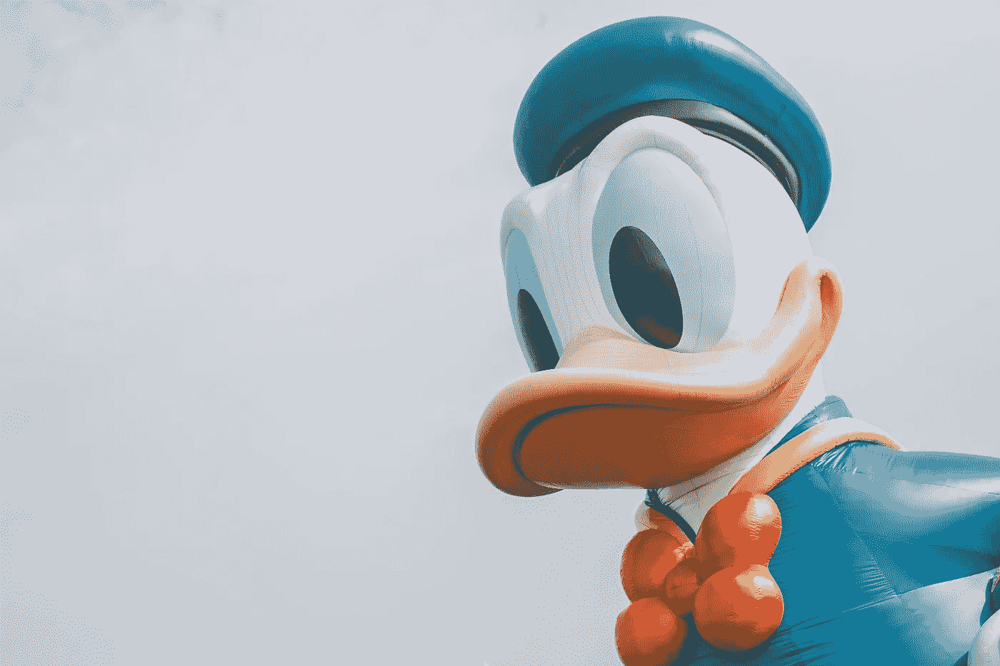
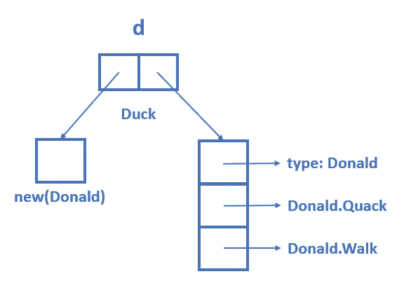

# Go 接口简介

> 原文：<https://medium.com/codex/go-interfaces-for-new-gophers-3d608db99d46?source=collection_archive---------3----------------------->


你好地鼠！照片由[卢克亚什·vaňátko](https://unsplash.com/@otohp_by_sakul?utm_source=unsplash&utm_medium=referral&utm_content=creditCopyText)在 Unsplash 上拍摄。

当我第一次开始用 Go 编程时，我发现 Go 接口是一个很难理解的话题。经过几个小时的阅读和研究，我写了这篇文章，试图为初露头角的地鼠简化 Go 接口。

在本教程中，我旨在用**简单明了的英语**和童趣十足的例子来回答以下问题。

1.  什么是 Go 界面？你如何使用它？
2.  Go 接口为什么有用？
3.  界面是如何在引擎盖下工作的？

我假设你熟悉基本的 Go 语法，比如函数和结构。我们开始吧！🏃

# 什么是 Go 界面？

从形式上来说，Go 接口是一组**类型**可以**实现**的方法签名。迷茫？让我们将这一陈述分成三个问题来引导你的理解。

## 🤔️What 是一个类型？

类型是指**数据类型**。在 Go 中，每个变量、函数参数和返回值都必须有一个类型。Go 使用了一个非常容易使用的极简类型系统。


Go 中一些常见的数据类型。

我们可以通过**将函数**附加到 Go 数据类型来添加行为。与类型相关的函数称为**方法**。为了演示这个想法，让我们首先定义一个`Donald`结构和两个函数`Quack`和`Walk`。

```
package mainimport "fmt"type Donald struct {}func Quack() {
    fmt.Println("I am Donald Duck!")
}func Walk() {
    fmt.Println("I waddle")
}func main() {
    Quack() // I am Donald Duck!
    Walk() // I waddle
}
```

在这个(无聊的)例子中，`Quack`和`Walk`是与`Donald`无关的普通围棋函数。为了使它们成为`Donald`的方法，我们将代码更新如下:

```
package mainimport "fmt"type Donald struct {}// Make Quack a method of Donald
func (d Donald) Quack() {
    fmt.Println("I am Donald Duck!")
}// Make Walk a method of Donald
func (d Donald) Walk() {
    fmt.Println("I waddle")
}func main() {
    d:= new(Donald)
    d.Quack()
    d.Walk()
}
```

注意我们是如何在`Quack`和`Walk`前面添加`(d Donald)`的。这就把函数变成了`Donald`的方法。要使用这些方法，我们需要创建一个`Donald`的实例，并通过**点操作符**调用它们。



唐老鸭。由 [Kin Li](https://unsplash.com/@kinli?utm_source=unsplash&utm_medium=referral&utm_content=creditCopyText) 在 Unsplash 上拍摄的照片。

## 🤔什么是方法签名？

方法签名是方法的标识，就像人的手写签名一样。在 Go 中，方法签名由**方法名**、**返回类型**及其**参数**组成。

例如，上面的方法`Quack`不接受任何参数并且**不返回任何内容**，其方法签名如下:

```
Quack()
```

方法`Walk`有一个相似的签名，但方法名不同。

```
Walk()
```

值得注意的是，方法签名**没有方法体**。换句话说，它没有告诉我们任何关于方法底层实现的信息。

现在，我们终于可以创建我们的第一个 Go 界面了！记住，一个接口仅仅是方法签名的集合。我们将用`Quack`和`Walk`的签名来命名我们的接口`Duck`。

```
type Duck interface {
    Quack()
    Walk()
}
```


Josue Michel 在 Unsplash 上拍摄的照片。

这很好，但是界面现在什么都不做。我们如何使用它？类型如何实现接口？

## 🤔如何实现一个接口？

在 Go 中，如果一个数据类型的方法**满足该接口的方法签名**，那么这个数据类型就实现了一个接口。

换句话说，当一个类型提供了一个接口中定义的方法的实现以及相同的参数和返回类型时，它就实现了这个接口。

例如，`Donald`结构实现了`Duck`接口，因为它有两个方法`Quack`和`Walk`，这两个方法不接受参数也不返回任何东西。

> 💻Go 语言:Donald 实现了 Duck 接口。
> 
> 🧍人类语言:唐老鸭是一只鸭子！

```
type Duck interface {
    Quack()
    Walk()
}// Donald implements the Duck interface
type Donald struct {}func (d Donald) Quack() {
    fmt.Println("I am Donald Duck!")
}func (d Donald) Walk() {
    fmt.Println("I waddle")
}
```

记住一个类型隐式地实现一个接口**是很重要的。不需要额外的语法或关键字。唯一的条件是该类型必须有接口的方法。**

# 为什么要用 Go 接口？

在上一节中，我解释了什么是 Go 接口以及使用它的必要语法。概括地说，我创建了一个结构`Donald`，它用两个方法`Quack`和`Walk`实现了`Duck`接口。

为了有效地使用 Go 接口，我们需要理解一个接口为什么以及如何在我们的程序中有用。本质上，Go 接口允许我们实现所谓的**鸭子打字**。

> 💡Duck typing 通过**它能做什么**而不是它实际上是什么来定义一个对象或类型。

像往常一样，这样的概念可以通过例子变得更清楚。让我们基于我最喜欢的漫威角色定义一个名为`Thor`的新结构！

```
type Thor struct {}
```

对于那些不知道索尔是谁的人来说，他是漫威电影宇宙和北欧神话中的雷神。


漫威的雷神。

如你所见，他绝不是一只鸭子。不过多亏了 Go interfaces，**我们才能让他变成鸭子**！我们所要做的就是通过给他`Quack`和`Walk`方法，让`Thor`实现`Duck`接口！

```
// Thor implements the Duck interface
type Thor struct {}func (t Thor) Quack() {
    fmt.Println("I am the God of Thunder!")
}func (t Thor) Walk() {
    fmt.Println("I fly and shoot lightning")
}
```

因为雷神现在可以嘎嘎叫，像鸭子一样走路，可以像鸭子一样被对待！这是 duck typing 背后的核心思想:一个对象是由它能做什么(**它拥有的**方法)而不是它是什么(**它的类型**)来定义的。

> 🦆如果它走路像鸭子，叫起来像鸭子，那它一定是鸭子！

好吧…所以我可以让雷神变成一只有 Go 接口的鸭子。这对我写围棋程序有什么帮助？让我们假设你正在开发一个应用程序，它能让物体嘎嘎叫，像鸭子一样走路。

首先，像上一节一样，用方法`Quack`和`Walk`创建一个名为`Donald`的结构。然后，创建一个普通函数，它接受一个类型为`Donald`的参数，并调用这两个方法。

```
func behaveLikeDonald(d Donald) {
    d.Quack()
    d.Walk()
}
```

人们喜欢唐纳德，你的申请越来越受欢迎！有一天，你的用户希望雷神表现得像只鸭子。很简单，你重复你用`Donald`做的事情。

```
func behaveLikeThor(t Thor) {
    t.Quack()
    t.Walk()
}
```

现在，您的应用程序变得更好了！越来越多的人开始要求不同的物体表现得像鸭子。突然，你意识到你的代码是不可伸缩的，因为你需要为每个对象创建一个新的函数！


每个对象一个函数。

如果您可以只创建一个函数来处理任何同时具有`Quack`和`Walk`方法的对象，这不是很好吗？你猜对了，*去救援*！

在 Go 中，接口在函数参数和返回值中可以被**当作类型**。在上面的例子中，`Donald`和`Thor`都是接口类型`Duck`，因为**实现了接口**(即拥有`Duck`的方法)。

这样，您只需要一个接受接口类型为`Duck`的参数的函数。这使得您的应用程序可以随着与 Duck 相关的对象的数量而轻松扩展！

```
// Define function argument to be of type Duck
func behaveLikeDuck (d Duck) {
    d.Quack()
    d.Walk()
}
```

如果你熟悉面向对象编程(OOP)，你可以说函数`behaveLikeDuck`实现了[](https://en.wikipedia.org/wiki/Polymorphism_(computer_science))****。****

****

**只有一个功能的 n 个对象。**

**总之，Go 接口允许我们基于**输入类型拥有的方法**而不是其实际的具体类型来创建抽象。这允许我们设计灵活、可扩展和可伸缩的抽象！**

**如果你仍然看不到 Go 接口的好处，现在还不要太担心。当你开始使用 Go 时，你很少需要设计自己的界面。**

**主要的要点是**使用接口作为数据类型的想法**，因为这是 Go 抽象的一种常见设计模式。永远记住下面这句话:**

> **接口类型关心的是一个对象能做什么，而不是它实际上是什么。换句话说，鸭子打字🦆。**

# **带接口值的引擎盖下**

**在上一节中，我给出了一个简单的例子，说明 Go 接口在设计强大的可重用抽象时是如何有用的。**

**概括地说，我创建了一个自定义结构`Donald`，它用两个方法`Quack`和`Walk`实现了一个`Duck`接口。还有一个函数`behaveLikeDuck`接受接口类型`Duck`的参数。**

```
func behaveLikeDuck (d Duck) {
    d.Quack()
    d.Walk()
}
```

**让我们思考一下 Go 接口是如何工作的。具体来说，当我们调用函数`behaveLikeDuck`时会发生什么？**

****

**嗯。马库斯·温克勒在 Unsplash 上拍摄的照片。**

**当我们将一个变量传递给`behaveLikeDuck`时，Go 在编译过程中执行**静态类型检查**，检查变量是否满足`Duck`接口。如果没有，编译就会失败。**

**在运行时，Go 执行**类型转换**，并在`behaveLikeDuck`内部创建一个`Duck`类型的局部变量`d`。这就产生了一个问题:当方法`Quack`和`Walk`被调用时，*怎么知道要执行*方法的哪个具体实现？**

> **❗:实现`Duck`的类型有很多种，每一种都有自己版本的`Quack`和`Walk`。**

**局部变量`d`是一个**接口值**。在最简单的意义上，你可以把一个接口值想象成一个包含两条信息的列表:接口的**底层数据**和**具体** **类型。****

**例如，如果我们提供一个类型为`Donald`的变量，那么`d`的底层数据指向`Donald`的实例，而具体类型是具有其方法实现的结构`Donald`。**

****

**接口值的简化表示**

**一个接口值也公开了一个方法，让我们用它的底层具体类型执行 [**类型断言**](https://tour.golang.org/methods/15) 。我们现在不会深入讨论这个问题，因为这需要一篇单独的文章。**

**当我们调用接口值`d`上的方法时，Go **在具体类型下寻找同名**的方法并执行。从这个意义上说，Go 足够动态，可以在运行时处理不同但相关的对象。**

**您必须记住的一个警告是，您可以在接口值上访问的方法仅仅是那些在接口中定义的方法。**

**回到上面的例子，如果`Donald`有另一个叫做`Eat`的方法，你不能用接口值`d`调用它，因为它没有在`Duck`接口中定义。同样，如果你熟悉 OOP，这与**向上转换**在 Java 等语言中的工作方式是一致的。**

# **最后的想法**

**这就结束了对围棋初学者的围棋界面介绍！在本文中，我解释了什么是 Go 接口，为什么它们有用，Go 接口的底层实现，以及 duck 类型。**

**关于 Go 接口还有很多要讨论的，但是我将把它们留到我以后的文章中，因为这篇文章有点长。**

**感谢您的阅读。和平✌️！**

# **参考**

1.  **[Jordan Orelli 的《如何在 Go 中使用接口？](https://jordanorelli.com/post/32665860244/how-to-use-interfaces-in-go)**
2.  **[Russ Cox 的《Go 数据结构:接口》](https://research.swtch.com/interfaces)**