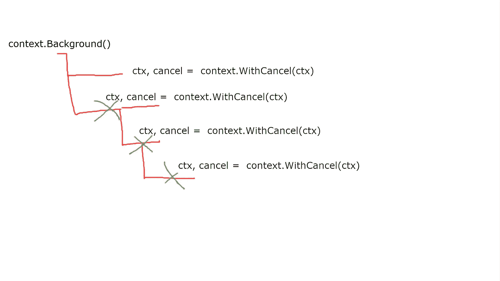

# 结合一些背景

> 原文：<https://medium.com/codex/go-with-some-context-a4a55266c78?source=collection_archive---------0----------------------->

Go 中的`context`包相当简单，也是众所周知的。另一方面，在使用它的同时也存在一些误区。今天，我将尝试解释所有最受欢迎的问题，并更清楚地说明何时以及如何使用`Context`。

先说语境是什么。

> *包上下文定义了上下文类型，它携带截止日期、取消信号和其他跨 API 边界和进程间的请求范围值。参考:*[*https://golang.org/pkg/context/*](https://golang.org/pkg/context/)

换句话说，上下文用于停止 goroutines，它携带请求范围的值。在实践中到底是什么意思？

最流行的用例是当你有一个请求-响应模式时。该请求可以是 HTTP 请求或 CLI 命令。通常，为了完成工作，您必须进行数据库查询，向外部 API 发送请求，从 redis 集群中读取一些数据，或者将这些字节写入文件系统。一切都需要时间。

按照惯例，上下文作为函数中的第一个参数传递。几乎在任何地方你都会发现称它为`ctx`。

```
func myFunc(ctx context.Context, param1 int) error }
```

事实上，`context.Context`是一个小界面，但非常强大。我们要讨论的第一种方法是`Done()`。

```
type Context interface {
    Done() <-chan struct{}
```

取消上下文可能有三个原因:

*   在父上下文或当前上下文的某个地方调用了一个`cancel()`函数
*   截止日期已到
*   已超时

如果设置了超时或截止日期，我们可以使用`Deadline()`功能读取在取消截止日期之前我们还有多少时间。

```
type Context interface {
    Done() <-chan struct{}
    Err() error
    Deadline() (deadline time.Time, ok bool)
```

如果`ok`参数返回一个`true`，这意味着截止日期或时间已经设定。第一个返回值将包含上下文将被取消的时间点。

`context.Context`界面的最后一个功能是`Value(key, value)`。您可以使用它来获取先前存储在上下文中的值。

# 对上下文的操作

您可以使用两种方法之一创建上下文:`context.Background()`和`context.TODO()`。当接受来自客户端(HTTP、gRPC、TCP 等)的新请求或在测试中，在`main()`函数中启动新应用时，应始终使用第一种方法。每当你想把上下文添加到你的代码中，但是调用者函数还不支持的时候，你应该使用`context.TODO()`。

```
func foo(param1 int, param2 string) error {
    // doing some work...
    return bar(context.TODO(), param1, param2)
}
```

三个 next 函数中的每一个都返回一个新的上下文(它是父上下文的副本，但有一点修改)和一个 cancel 函数。cancel 函数立即取消上下文。

`context.WithCancel(ctx)`函数除了用 cancel 函数返回一个新的上下文之外什么也不做。

```
func foo(ctx context.Context, second int, last string) error {
    ctx, cancel := context.WithCancel(ctx)
    defer cancel()

    // do your job here
}
```

函数`context.WithTimeout(ctx, timeout)`返回一个新的上下文，该上下文在指定的超时后被取消。让我解释下一个例子是如何工作的。

```
func slowOperationWithTimeout(ctx context.Context) (Result, error) {
    ctx, cancel := context.WithTimeout(ctx, 100*time.Millisecond)
    defer cancel()
    return slowOperation(ctx)
}
```

让我们假设`slowOperation()`可以非常慢。由于在上下文中添加了超时，我们可以确保操作时间不会超过 100 毫秒。

`context.WithDeadline`的工作方式与前一个非常相似，但区别在于我们定义了想要取消上下文的时间点(在未来)。

```
const shortDuration = 1 * time.Millisecond

func main() {
    d := time.Now().Add(shortDuration)
    ctx, cancel := context.WithDeadline(context.Background(), d)
    defer cancel()

    select {
    case <-time.After(1 * time.Second):
        fmt.Println("overslept")
        case <-ctx.Done():
        fmt.Println(ctx.Err())
    }
}
```

代码的输出是`context deadline exceeded`。为什么？截止时间设置为现在+ 1 毫秒。早于计时器中定义的 1 秒。

下一个可用的方法是`context.WithValue:`

```
func WithValue(parent Context, key, val interface{}) Context
```

它基于设置了键值的父上下文返回一个新的上下文。键可以是任何东西，但是有一个惯例是创建一个自定义类型，而不是像`int`或`string`这样的内置类型。为什么？这有助于避免命名冲突。想象一下，两个包在同一个键中设置了不同的值。这可能会令人困惑，并导致很难找到错误。你可以只使用一个空的结构。

```
type myKey struct{}

func foo(ctx context.Context) {
    // ctx = WithValue(ctx, "my key", "my awesome value") - it can lead to a naming conflicts
   ctx = ctx.WithValue(ctx, myKey{}, "my awesome value")
}
```

# 是否应该一直调用`cancel()`函数？

函数`WithTimeout`和`WithDeadline`不仅设置取消上下文的时间点，还返回取消函数。您可以使用它在截止日期或超时之前取消上下文。问题是:即使上下文被取消了，你也应该总是取消吗？答案是:**是的。**

```
func main() {
    d := time.Now().Add(shortDuration)
    ctx, _ := context.WithDeadline(context.Background(), d) // careful!

    // do what you have to do
    foo(ctx)
}
```

想象一下`foo(ctx)`跨越了其他 goroutines 并包含了上下文。当`foo()`完成它的工作时，那些 goroutines 仍然可以运行并等待截止日期。对于一两个 gorutines 来说，它可能不会有很大的影响，但是当你在一秒钟内跨越几百次时，它可能会很明显。

# 取消是如何工作的？

我想下面这张图会帮助你理解。



在某些情况下，你可以用一种更有创造性的方式来使用这个包。您可以使用取消机制来削减一些指标的尾部。想象一种情况，您向外部 API 发送请求。一般来说，API 发送响应的速度非常快。假设平均时间在 50 到 100 毫秒之间。然而，有时，API 在一秒钟内发送响应，然后，一切都回到正常行为。

较慢的外部 API 响应也会使您的 API 变慢，因为您正在等待来自其他地方的数据。让我们假设我们发送的请求是不可变的。这意味着 ti 不会改变任何东西——它只是获取一些数据。你可以用(至少)两种方法解决这个问题。

第一个是一次发送多个请求，当我们收到最快的请求时，取消每个请求。它有一些弱点。您增加了网络流量，也给其他人的服务带来了更大的压力。

第二件事是为请求设置一个超时，比如说 150 毫秒，当它到达最后期限时，再次发送请求。每次重试都会有稍长的超时时间，在几次尝试后，您可能会使请求失败。

我知道这些例子并不完美，而且非常具体，但是我希望我给了你一点提示，告诉你`context.Context`如何在你的代码中有用。

# 摘要

我希望我在`context`包如何工作的问题上帮助了你更多。如您所见，这是一个简单的工具，但对我们的代码行为有很大的控制。感谢它，你可以利用资源，使你的代码更有弹性。

[给我买杯咖啡](https://www.buymeacoffee.com/bklimczak)

【https://developer20.com】最初发表于[](https://developer20.com/go-context/)**。**