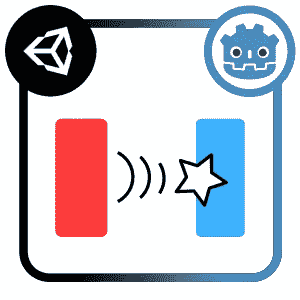

# 戈多的惊人事件系统

> 原文：<https://medium.com/codex/godots-amazing-event-system-aa0aca9ab552?source=collection_archive---------2----------------------->

## 一个真正解耦的事件系统？

最近，我决定尝试一下 [**戈多**](https://godotengine.org/) 。不久前，在 2015 年，我测试了游戏引擎，当时它刚刚开源，我记得一个有趣但相当粗糙的软件……我模糊的记忆把它放在了 Unity 或 Unreal Engine 等更“主流”的引擎之下。