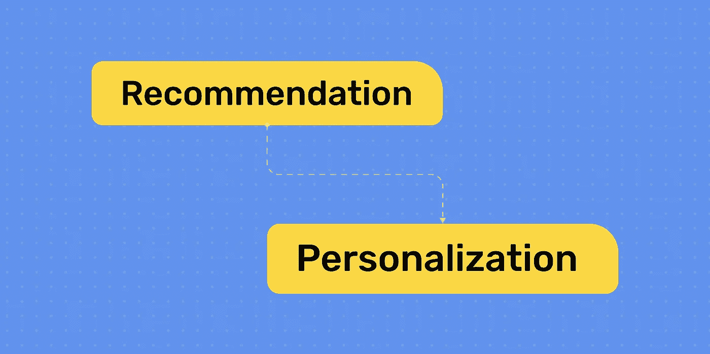

# 从推荐到个性化

> 原文：<https://medium.com/codex/going-from-recommendations-to-personalization-271ea3e73d70?source=collection_archive---------10----------------------->

关于数据科学(以及随后与数据科学家的合作)的一件有趣的事情是，你经常质疑从历史证据中提供的分类。与数据科学家一起工作让我明白，尽管数据(有均值、中位数和众数的缺陷)讲述了一个故事，但美丽——以及你正在寻找的问题的答案——存在于区分…