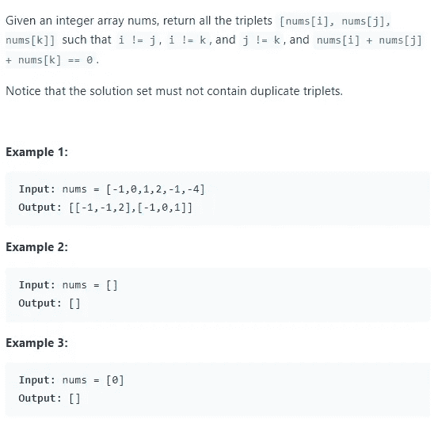
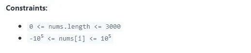
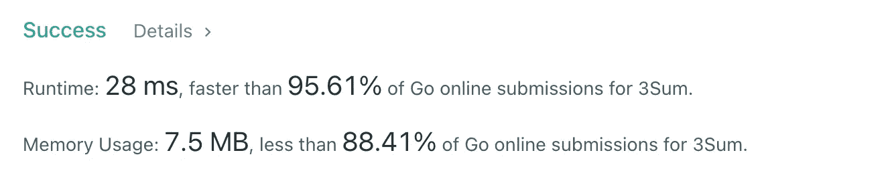

# 带 Leetcode 的 golang:3 sum

> 原文：<https://medium.com/codex/golang-with-leetcode-3sum-af8c9d6d27db?source=collection_archive---------6----------------------->

Leetcode 3Sum Golang 解决方案的运行时性能优于 95%的提交


src:[golang/Go:Go 编程语言(github.com)](https://github.com/golang/go)

# Leetcode #15: 3Sum

难度:中等

通过率:30.5%



## 3 汇总问题细分

所以本质上，我们需要找到 3 个数的组合，它们的总和是 0。所有的数字都来自一个单独的切片。每个数字组合都存储为一个切片，该切片存储在一个用于返回结果的二维切片中。2D 切片中的每个切片都必须是唯一的，因为在中，不允许重复。

我们将需要设计一些方法来确保条目之间的唯一性，处理边缘情况(例如少于 3 个条目的切片)，并有效地执行必要的计算。

## 天真的 3Sum 解决方案

当然，天真的方法是使用嵌套的 for 循环来完成这项任务。然而，在这种情况下，嵌套的 for 循环将执行 O(n ),而不是典型的 O(n)行为。

在这种情况下，天真的方法产生 O(n)的运行时间，因为我们将跟踪 3 个索引，而不是 2 个。我们需要维护 3 个索引来跟踪传递的切片中的三元组组合。

在实践中，您可能希望通过某种非代码的媒介来完成这些步骤。找到优化解决方案的第一步是简单地找到一个可行的解决方案。写出算法逻辑，画出过程图，写伪代码或任何最有助于你从概念上理解你所写的算法的东西。

一旦你做到了这一点，实现你想出的天真的解决方案。一旦你做到了这一点，重新审视你的解决方案和概念概述，并找到效率，以达到优化的解决方案。

## 优化的 3Sum 解决方案

我们将首先创建一个 2D 切片来保存我们的结果。之后，我们将对输入数组进行排序。如果 nums 片段中的条目是升序的，那么用多个指针来管理它们会更容易。这将使对重复和配对的检查在逻辑上更简单。

之后，我们开始遍历输入切片。我们循环直到 i == size-2，这样我们就不会得到越界错误。索引 I 将是我们最左边的指针。

我们可以在第一个 if 语句中处理一些边缘情况。在那里，我们将检查 I 是否等于 0 或 I 是否大于 0，以及当前的 nums 元素是否不等于前一个 nums 元素。我们检查 I 是否等于 0，因为当 I 大于 0 时，我们还必须检查匹配的值。当 I 为 0 时，没有要检查的前一个元素。

然后我们得到低，高，和总和。low 将是第二个最左边的指针，位于紧接 I 之后的索引处。high 变量将是最右边的指针，位于片的最后一个条目处。然后，我们将从 0 中减去 nums[i]处的元素，得到总和。我们需要另外两个指针，低位和高位，来加总这个和。

接下来，我们将开始一个 while 循环，在该循环中，我们将寻找相加得到所需总和的元素组合。当下限小于上限时，我们将设置循环运行的条件。如果 nums[low]和 nums[high]处的值加起来达到期望的总和，我们将它们和 nums[i]相加到我们的结果片，因为我们已经找到了一个解决方案。

然后我们再进入两个循环。这些循环用于绕过重复项。当 low < high 时，以及当前指针位置的元素等于下一个指针位置的元素时，第一个继续。我们向前移动左指针，直到找到一个唯一的元素。

我们用同样的逻辑在最右边的指针 high 处检查重复项。除了不是向前移动指针，而是向后移动。换句话说，我们向内移动两个指针。在这些循环结束后，我们跳过了所有重复的部分，我们将向内移动两个指针。

如果低和高的总和没有达到期望的总和，我们检查结果是否大于期望的总和。如果是的话，我们就往里走。我们这样做的原因是因为我们在开始时对值进行了排序，向内移动意味着移动到一个更小的值。否则，我们假设计算的总和小于期望的总和，并且我们向前移动低位指针。

以下是 Golang 针对 3Sum 的解决方案:

```
func threeSum(nums []int) [][]int {
    res := [][]int{} 

    sort.Ints(nums) 

    for i := 0; i < len(nums)-2; i++ { 
        if(i == 0 || (i > 0 && nums[i] != nums[i-1])) { 
            low := i+1 
            high := len(nums)-1
            sum := 0-nums[i]

            for (low < high) { 
                if(nums[low] + nums[high] == sum) { 
                    res = append(res, []int{nums[i], nums[low], nums[high]}) 
                    for (low < high && nums[low] == nums[low+1]) 
                        { low++ }      
                    for(low < high && nums[high] == nums[high-1]) 
                        { high-- }
                    low++
                    high--
                } else if (nums[low] + nums[high] > sum) {
                    high--
                } else {
                    low++
                }
            }
        }    
    }

    return res

}
```

## 结束语

以下是我们解决方案的性能指标:

