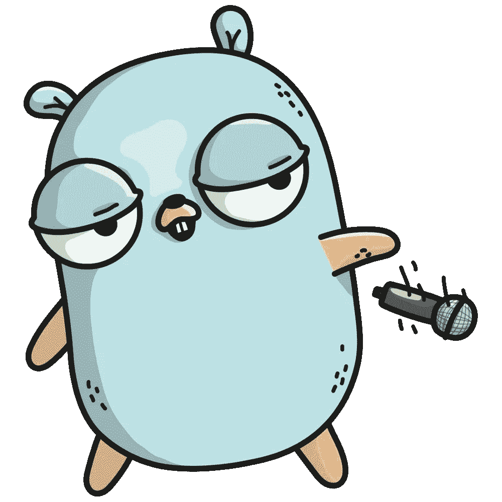
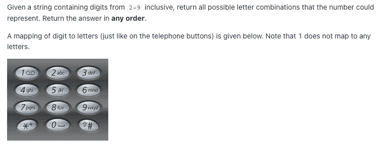
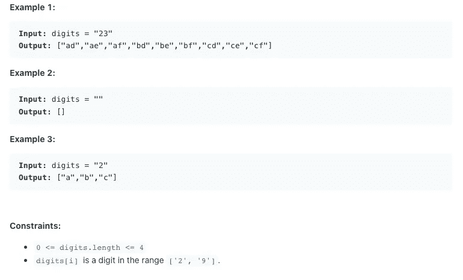
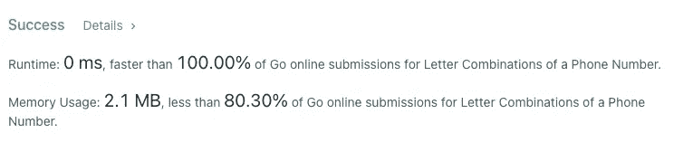

# 带 Leetcode 的 Golang:电话号码的字母组合

> 原文：<https://medium.com/codex/golang-with-leetcode-letter-combinations-of-a-phone-number-d4b1137ec0a8?source=collection_archive---------2----------------------->

Leetcode 问题# 17:Go 中电话号码的字母组合



src:[https://level up . git connected . com/implementing-golang-interfaces-like-a-boss-73 a0f 7757597](https://levelup.gitconnected.com/implementing-golang-interfaces-like-a-boss-73a0f7757597)

# 动机

最近，我决定我要准备面试，编码比赛，并学习一门新的编程语言。为了一箭双雕，我决定每天用 Golang 练习 Leetcode 问题。用你不熟悉的语言解决算法问题，迫使你思考实际需要解决的问题，这有助于你成为更好的开发者。当然，在获得正确的语法时会遇到一些小问题，但是最重要的是不管使用什么工具都能解决问题。

旅程开始后不久，我注意到 Golang 中对 Leetcode 问题的支持远不如 C++、Python 或 Java。鉴于这些语言的历史，像 Go 这样的现代语言得不到同等水平的支持也就不足为奇了。然而，这篇文章将是我为 Golang 中的 Leetcode 问题提供解决方案的系列文章的第一篇。

***免责声明*** *:如前所述，我还在学习围棋。如果有人有任何建议可以让我的代码更地道，请在评论中提供。*

# 电话号码的字母组合

难度:中等

录取率:53.1%



# 问题分解

我们只会得到 2-9 之间的数字，每个数字对应一个数字。这将需要一个允许我们模拟映射行为的数据结构。需要注意的重要事实是，0 和 1 不映射到任何数字，并且每个排列的长度等于我们作为输入给出的数字串的长度。

本质上，我们需要从输入字符串中提取代表数字的字符，并从输入中生成映射字符的所有可能组合，如示例 1 所示。

# 解决办法

我们将首先创建我们的结果片，作为我们排列的返回值和容器。之后，我们将利用另一个切片来表示字符映射。在这种情况下，在传统映射上使用切片的优点是允许我们使用输入数字的整数表示作为索引来访问它们相关的字符值。

下一步将是检查边缘情况，因此我们插入一个条件来检查数字输入字符串是否为空；如果它不为空，我们进入我们的主循环，如果为空，我们简单地返回空的结果片。

我们的主循环从向结果片段添加一个空字符开始。这将需要开始产生我们的初始排列。然后，我们开始用 for 循环迭代数字字符串。

for 循环的第一步是将当前值转换为整数，作为字符映射表中的索引。当我们用 strconv。Atoi()，返回 2 个值:整数表示和一个错误。如果我们不打算使用这个错误，我们可以把它命名为' _ '，就像你在解决方案中看到的那样。

有了索引之后，我们进入 while 循环来执行我们的主要逻辑。我们将结果片视为一个队列，并移除第一个元素(因此需要先添加一个空格)。我们将保存该元素供以后使用，因为它是我们添加更多字符的基本排列。

最后一步是使用基于范围的 for 循环来获取字符映射表当前索引处的字符。然后，我们将这些字符添加到我们之前获取的基本排列中。最后，我们将把它附加到结果中。这个过程将一直持续到所有数字都被处理完

代码如下:

```
func letterCombinations(digits string) []string {
    result := make([]string,0)
    charMapping := []string{"0","1","abc","def","ghi","jkl","mno","pqrs","tuv","wxyz"}

    if(len(digits) != 0){ 
        result = append(result, "")

        for i := 0; i < len(digits); i++ {
            index, _ := strconv.Atoi(string(digits[i]))
            for len(result[0]) == i {
                permutation := result[0]
                result = result[1:]
                for _, c := range charMapping[index] {
                    result = append(result, permutation+string(c))
                }
            }
        }
    }

    return result
}
```

# 表演

