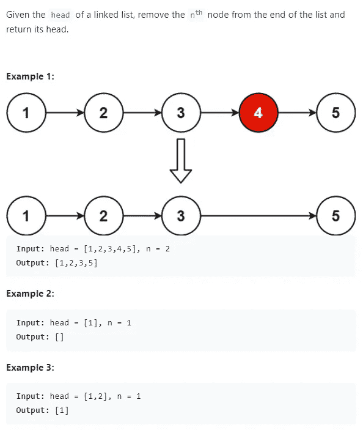
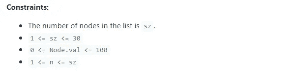
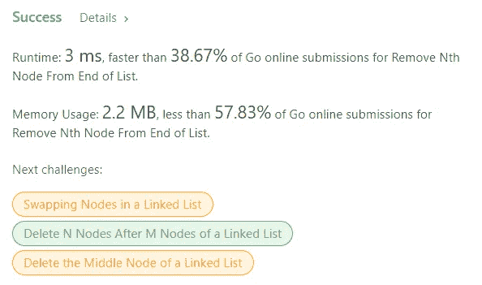

# Golang with Leetcode:从列表末尾删除第 n 个节点

> 原文：<https://medium.com/codex/golang-with-leetcode-remove-nth-node-from-end-of-list-2eda466f517?source=collection_archive---------6----------------------->

Leetcode 问题#19:在 Go 中从列表末尾删除第 n 个节点


src:[Gopher Gala 是第一个世界性的围棋黑客马拉松——围棋编程语言](https://go.dev/blog/gophergala)

# 动机

最近，我决定我要准备面试，编码比赛，并学习一门新的编程语言。为了一箭双雕，我决定每天用 Golang 练习 Leetcode 问题。用你不熟悉的语言解决算法问题，迫使你思考实际需要解决的问题，这有助于你成为更好的开发者。当然，在获得正确的语法时会遇到一些小问题，但是最重要的是不管使用什么工具都能解决问题。

旅程开始后不久，我注意到 Golang 中对 Leetcode 问题的支持远不如 C++、Python 或 Java。鉴于这些语言的历史，像 Go 这样的现代语言得不到同等水平的支持也就不足为奇了。然而，这篇文章将是我为 Golang 中的 Leetcode 问题提供解决方案的系列文章的第一篇。

***免责声明*** *:如前所述，我还在学习围棋。如果有人有任何让我的代码更习惯的建议，请在评论中提供*

# **从列表末尾删除第 n 个节点**

难度:中等

录取率:38.0%



# 问题分解

概括地说，这个问题希望您从链表中移除一个元素。链表的工作原理有几个关键的基础，它们的遍历时间和访问时间都是 O(n)。链表不具有与数组相同的索引功能；这些功能允许阵列具有常数或 O(1)访问时间。在访问链接列表元素之前，必须遍历列表到该元素。

从链表中移除一个元素通常是人们由于对指针的困惑而陷入困境的地方。我们得到了一个单链表，这意味着节点只能指向前，不能向后。这意味着我们只需要改变一个节点指针。此外，Go 利用垃圾收集器进行内存管理，因此我们不需要像在 C++这样的语言中那样执行手动释放。当我们移除第 n 个节点时，我们只需将第 n-1 个节点处的指针改为指向第 n+1 个节点。

这个问题的诀窍是，它希望你从列表的末尾删除 n 个位置。如前所述，我们没有索引功能，这将允许我们从列表中的任何位置开始。所以我们有两个策略可以部署:我们可以保持两个指针相距 n 的距离，或者我们可以遍历列表并获得列表中元素的计数。在我们得到元素的计数后，我们可以减去 n，这将给出我们需要移除的位置。之后，我们简单地遍历列表并删除位于派生位置的节点。提供的解决方案是我在上面提供的第二个可能的解决方案。

有一些边缘情况需要注意:

*   链表大小为 1 并且移除位置为 1 将需要产生一个空列表
*   如果 nodeCount 和 n 相等，那么您将被要求删除列表中的第一个元素，我们只需要将 head 指针指向下一个节点

# 解决办法

```
/**
 * Definition for singly-linked list.
 * type ListNode struct {
 *     Val int
 *     Next *ListNode
 * }
 */
func removeNthFromEnd(head *ListNode, n int) *ListNode {
    tempNode := head
    nodeCount := 0for tempNode != nil {
        nodeCount++
        tempNode = tempNode.Next
    }

    removePosition := nodeCount - n

    if n != 0 {
        if removePosition > 0 {
            tempNode = head
            for i := 0; i < removePosition-1; i++{
                tempNode = tempNode.Next
            }
            tempNode.Next = tempNode.Next.Next
        } else if nodeCount == 1 && n == 1 {
            head = nil
        } else if nodeCount == n {
            head = head.Next
        }
    }
    return head
}
```

# 表演

