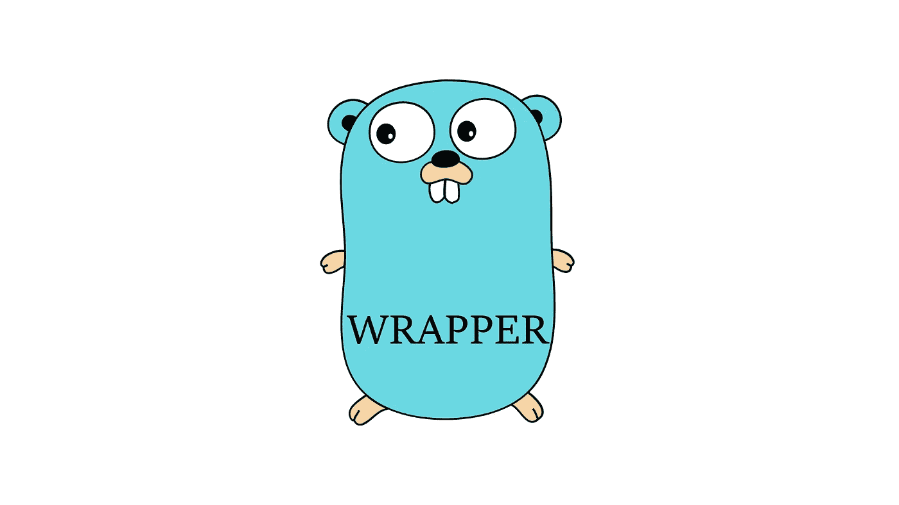

# 接收器函数的 Golang 包装器

> 原文：<https://medium.com/codex/golang-wrapper-for-receiver-function-277921d93edd?source=collection_archive---------5----------------------->



这里讨论的包装器是 Golang 中的一种设计模式，用另一个函数包装一个结构的函数。包装函数可以在不改变原始函数的情况下，在原始函数之前或之后运行一组执行。您可能会发现这类似于适配器、代理或装饰设计模式的术语。

面向对象编程中的对象或类可以用 Golang 中的 struct 来表示。接收器函数是在函数参数列表中有接收器(其结构)的结构的方法。 [*巡回围棋*](https://go.dev/tour/methods/1)

# 基本包装

与接收方函数不同，普通函数可以用一个函数包装，该函数接收原始函数作为参数，并将其作为输出返回。

```
**type** handlerFunc **func**(param int) **error****func** Wrapper(aFunc handlerFunc) handlerFunc {
   **return func**(param int) **error** {
      // Do wrapper stuff
      **defer func**() { // Do post-wrapper stuff }()
      **return** aFunc(param)
   }
}
```

接收器功能有一个不同的故事。它有自己的结构作为专门的参数。因此，函数总是可以访问结构值。基本上，接收器函数是在结构类型内部定义的函数，只能从结构中调用。为了制作这种功能的包装器，可以像以前一样用基本的普通包装器来实现。

```
**type** app **struct** {}**func** (app *app) Run() **error** {
   // Execute application
}**func** appRun(app *app) **error** {
   // Do wrapper stuff
   **defer** func() { // Do post-wrapper stuff }
   **return** app.Run()
}**func** main() {
   myApp := &app{} // Run without wrapper
   err := myApp.Run() // Run with wrapper
   err = appRun(myApp)
}
```

虽然这种包装方法很简单，但是它有很多缺点。

*   如果 struct 有很多函数，并且也想要包装器效果，该怎么办？
*   如何实现对所有使用接收器函数的下游依赖项的包装？
*   如果结构体有一个新的函数也需要包装器效果，会发生什么呢？

# 接收器包装

接收器函数的包装类型必须是**可伸缩的**和**可靠的**。可伸缩意味着包装器支持接收方函数的任何扩展，而无需花费太多精力来维护它。可靠意味着包装器在任何时候都跨依赖项产生一致的结果和性能。

解决方案之一是创建一个新的包装结构来模仿原始结构。为了完全模仿原始结构，包装器结构将具有与原始接收器函数相同的所有函数。最后，包装接收器函数将在调用原始函数之前或之后包含前置或后置指令。

此外，该方法可以应用于将包装器集成到任何现有的代码中，而不改变其行为和结构，同时在将来仍然是可伸缩的和可靠的。

# 应用程序

## 公用事业服务

老实说，可以应用于包装器的实用服务可以是任何东西。例如，常用的是**缓存、验证、认证、授权或监控工具**。与功能目的无关的其他服务或指令也可以在包装器中执行。

## 记录

在包装器中，在函数之前或之后将数据或信息打印到日志中可能很有用。尤其是在出于分析或监控目的将数据打印到日志之前，需要首先处理或重构数据时。

## 版本控制

假设我们有一个不推荐使用的特性，需要更新一个新版本。问题是代码有大量的下游依赖，需要在不影响多方的情况下部分推出。用验证包装函数是解决方案之一。这样，任何与新版本兼容的请求都将被重定向到新版本，而另一个请求仍然使用旧版本。