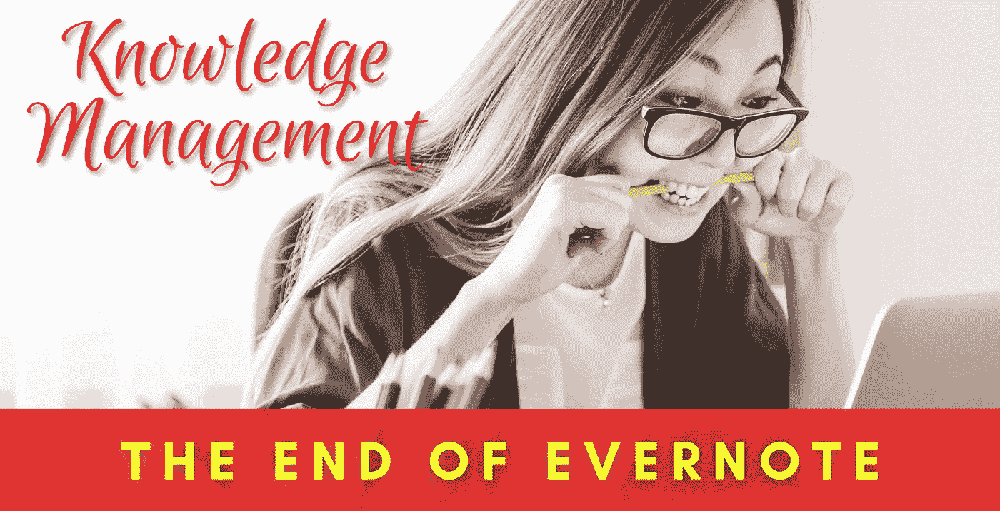

# 再见 Evernote

> 原文：<https://medium.com/codex/goodbye-evernote-1556ce7e5e33?source=collection_archive---------0----------------------->

## 2022 年 3 月 23 日星期三

我从 2008 年 3 月 27 日开始使用 Evernote。差不多 14 年了。我们终于分道扬镳了。Evernote 就是不行了，我再也等不及它长大了。

## **哪里出了问题？**

1.  Evernote 几乎和 14 年前一模一样。没什么变化。
2.  [Evernote 确实在 2020 年初重写了他们的应用](https://evernote.com/blog/2020-update-progress-road-ahead/)。正如大多数重写一样，这是一个彻底的失败。Evernote 现在是一个又大又重的 blob，许多人在网上抱怨它。

## 有哪些选择？

有很多选择，我花了几个星期尝试了几乎每一个。但它们都有这样或那样的不足。Evernote 确实在某些方面宠坏了你，这可能会让你很难与它分手。但也不是不可能。

观念是唯一一个非常接近成为我新欢的选择——但是它没有成功。观念没有让我满意，就像 Evernote 曾经那样。

## 那么最后的选择是什么？

[黑曜石](https://obsidian.md/)。刚开始用黑曜石的时候，看起来有点力不从心。我建议你坚持下去，等几天。一切都很快到位。一旦你掌握了窍门，就没有回头路了。我认为这是不可能的，不承诺黑曜石——直到死亡将我们分开。

## 使用黑曜石的主要优点是什么？

1-它是免费的。是的。黑曜石 100%免费使用。[有付费的附加软件，比如 sync 和 publish](https://obsidian.md/pricing) 。

2-你的数据是你的。它位于你的电脑上，或者你使用的任何云存储设备上，比如 Dropbox、Google Drive、pCloud、iCloud 等等。

3-你所有的笔记都是纯文本(格式上的降价)文件。你可以用任何普通的文本编辑器打开它们。或 markdown 编辑器/查看器来保持格式。

4-你可以用任何你喜欢的应用程序编辑你的笔记，黑曜石将继续与他们合作。只要它们是纯文本/降价。

5-黑曜石功能的无限可扩展性。黑曜石可以用社区插件扩展，也可以用你自己的插件。在撰写本文时，[有 522 个社区插件可用。](https://obsidian.md/plugins)即使具备非常基本的编程知识，操作数据的范围也是无穷无尽的。Evernote 几乎不可能做到的事情。除非你想用[他们的 API](https://dev.evernote.com/doc/) 。

6-有两个插件可以将黑曜石转换成魔杖。[模板](https://silentvoid13.github.io/Templater/)和[数据视图](https://blacksmithgu.github.io/obsidian-dataview/)。[模板](https://silentvoid13.github.io/Templater/)可以用无穷无尽的信息自动填充你的笔记。Dataview 可以将你的笔记记录系统变成一个数据库，可以通过多种方式进行查询和查看。

## 黑曜石缺少哪些 Evernote 功能？

我只从我个人的使用习惯来说。黑曜石目前缺少以下特性，但我已经找到了解决方法。

1-电子邮件通知。使用 Evernote，你可以向一个唯一的电子邮件地址发送电子邮件，它会创建一个带有适当标签、文件夹等的便笺。我已经免费解决了这个问题，用的是 Zapier zap。因为我不用这么多，所以我用免费层来管理。

2-在图像和 pdf 中搜索文本。Evernote 可以搜索所有类型的媒体。没有这个我也能应付，因为 Dropbox 和 Google Drive 都可以搜索媒体。不是理想的解决方案。但这对我很有效。

3-有些人说他们怀念 Evernote 的文档扫描仪。我认为这是最糟糕的文件扫描仪之一。反正没用过。如今，大多数手机相机应用程序都内置了文档扫描仪。Google Drive 和 Dropbox 也有非常好的文档扫描功能。

4- Evernote 有一个杀手级的网页裁剪器。虽然这个功能听起来不错，但我几乎没有用过。当我使用它的时候，我想我创造了混乱，而不是知识。你可以想象我的 evernote 中有成千上万的网络剪辑笔记，它们在 14 年后才变得相当过时。此外，实际上，在查看我的 evernote 之前，我会搜索信息。如果你必须剪辑网站，你可以在你的浏览器上安装一个 [markdown web-clipper 扩展，](https://chrome.google.com/webstore/detail/markdownload-markdown-web/pcmpcfapbekmbjjkdalcgopdkipoggdi)这就能很好地解决问题。

## 离婚是终局的吗？

是的。差不多了。

我已经取消了我的 Evernote 更新。我的笔记不会去任何地方，因为 Evernote 可以在没有每月 9.99 美元(额外配额等)的情况下使用。我将继续在 Evernote 上保存我的重要信息的第二份副本。我不信任任何一个云服务来保存我的数据。他们有能力切断你，这可能是灾难性的。所以，我在很多地方并行存储我的数据。**在另一篇文章中有更多关于这方面的内容。**

我希望每年能节省 120 美元。我已经在技术订阅上花了太多钱。