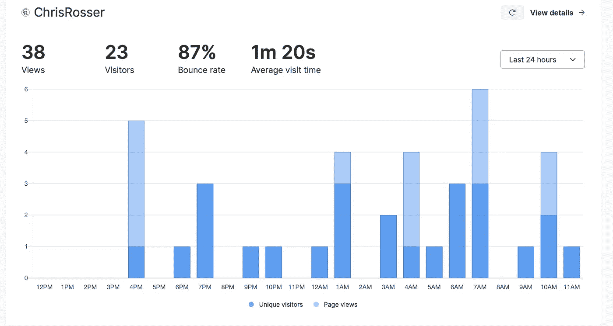

# 再见谷歌分析，你好鲜味

> 原文：<https://medium.com/codex/goodbye-google-analytics-hello-umami-d5c7becf23b9?source=collection_archive---------17----------------------->

当我概述我离开 Google Adsense 的原因时，我的抱怨清单上的第四条是它的跟踪 cookies 的侵犯性和随着广告在网络上跟随读者而引发的隐私担忧。然而，我不能一边使用谷歌分析一边吹嘘我的读者的隐私。

# 什么是分析，我为什么要使用它们？

在网站环境中，分析是帮助网站所有者了解访问者如何在网站上花费时间的软件。基本上，每当有人到达一个网站，该软件会记录他们的访问数据，通常会将这些数据汇总成一份报告。

在理想世界中，我不会使用*的任何*分析，但事实上，它们帮助我对我的网站做出决定，包括我写什么，我如何构建我的网站，以及我如何赚钱。例如，我知道我的路过流量带来的读者对我的技术文章比对我的书和世界建设更感兴趣。我知道我最大的读者群来自美国，所以我把 Amazon.com 作为我首选的联盟计划。我知道当我在帖子中包含更多内部链接时，我的跳出率会下降。

所以，总而言之，我收集分析数据来帮助我改进我的网站，让它更贴近我的读者。

# 谷歌分析有什么问题？

嗯，什么都没有，或者什么都有，取决于你的观点。Google Analytics 是一个强大的分析服务，可以收集大量令人垂涎的数据。老实说，我不知道它收集的全部内容，也不知道世界上有多少网站在使用它。我见过的[最佳估计值](https://w3techs.com/technologies/details/ta-googleanalytics)超过了全球所有网站的 56.4%。

他们搜刮的所有数据不仅仅是网站所有者的。相反，它被送入谷歌的服务器，成为科技巨头控制的大数据馅饼中的又一块。而且他们收集的数据是*他们的*数据，不是我们的。当然，他们给了我一系列从这些数据中产生的令人困惑的报告，但是原始记录超出了我的控制范围。

撇开隐私不谈，我不喜欢谷歌分析，因为它使用起来过于复杂，有很多不必要的噪音，吸引垃圾邮件，同时增加了我的网站的性能和带宽开销。

所以，我决定从我的网站上删除谷歌分析，并自己托管一个开源解决方案。

# 输入鲜味

在搜索了一个开源的、自主托管的 Google Analytics 替代品后，我昨天才知道了 Umami。它在我的列表中名列前茅，因为它是免费的，只记录我感兴趣的数据，并且具有非常干净和最小化的界面。重要的是，鲜味*不会*收集任何可识别个人身份的信息，并且会对收集的所有数据进行匿名处理。我通过查看存储在数据库中的代码和会话数据验证了这一点——啊，开源软件的乐趣就在于此。

事实上，它只收集了我所需要的最低限度的信息:推荐、页面浏览量、访问时间、来源国、跳出率、操作系统和浏览器以及设备类型。没有名字，没有 IP 地址，没有广告 id——一个都没有。

报告仪表板非常干净简单，我需要的所有东西都显示在一个页面上。这是在我的网站上运行了大约 18 个小时后的仪表盘截图。

与谷歌分析相比，Umami 是一种使用乐趣，而且同样准确。在关闭 GA 之前，我让这两个软件在我的网站上运行了大约 18 个小时。是的，我可能应该等一个星期，以便得到一个更完整的比较，但事实上，我渴望把谷歌踢到路边。

# 技术细节

我觉得没有必要写一个完整的教程来说明我是如何安装鲜味的，因为[官方指南](https://umami.is/docs/hosting)已经足够好了。然而，如果你决定跟随我的脚步，这里有一些考虑。

Umami 是一个需要 Node12 的节点/Javascript 应用程序。你不能把一个文件夹放入一个典型 PHP 驱动的 web 主机中，然后它就期望它能工作。它还需要支持 MariaDB/MySQL 和 Postgres 的数据库服务器。

我用 ModProxy 在 Apache2 后面的 [DigitalOcean droplet](https://m.do.co/c/bcfec4757439) 上运行 Umami 就像我托管我的网站一样。这对我有用，但是我喜欢危险的生活，而且我比其他人更了解 Apache。《开发人员指南》建议使用 Nginx 而不是 Apache，如果您决定自托管，您可能应该这样做。

在 Vercel 上运行 Umami 有一个[官方指南](https://umami.is/docs/running-on-vercel)，但是我不能让它工作，主要是因为我发现 Vercel 有点笨重。您可能很容易让 UI 在 Netlify 上运行。无论是哪种情况，Vercel 还是 Netlify，您仍然需要一个数据库服务器，并且在这一点上，您还不如像我一样在相同的 VPS 上运行所有的东西。

不过，有一个提示，如果您的数据库密码包含符号(它应该包含)，请确保将这些字符作为 URL 安全字符串进行转义，否则 Umami 将报告一个关于错误数据库端口的无用错误。

# 总结想法

我觉得我终于可以走自己的路了，而不是简单地用一些含糊其词的承诺来谈论它，以尊重我的读者的隐私。我不知道谷歌或其他科技巨头对我们的数据做了什么，但我肯定不希望我的网站成为他们全球搜索网的一部分。

*原载于 2021 年 8 月 8 日*[*【https://chrisrosser.net】*](https://chrisrosser.net/posts/2021/08/08/goodbye-google-analytics-hello-umami/)*。*