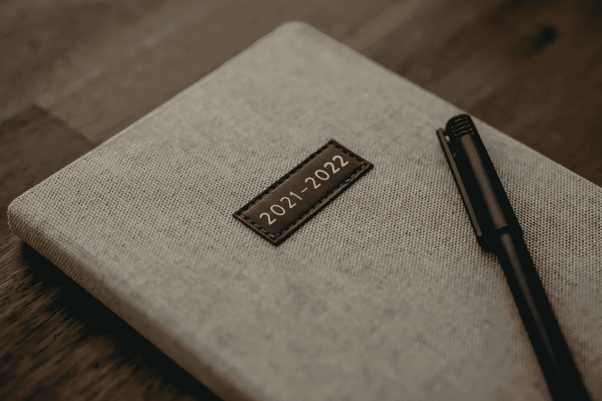

# 作为数据科学平台的谷歌— 2021 年回顾

> 原文：<https://medium.com/codex/google-as-a-data-science-platform-2021-recap-54d0b736add8?source=collection_archive---------5----------------------->

## 2021 年谷歌云平台上发生了什么，以及我对 2022 年的期望

[粘土银行](https://unsplash.com/@claybanks?utm_source=unsplash&utm_medium=referral&utm_content=creditCopyText)在 [Unsplash](https://unsplash.com/s/photos/2022?utm_source=unsplash&utm_medium=referral&utm_content=creditCopyText) 拍摄的照片

2021 年，我继续定期使用谷歌的大数据、数据科学和商业智能服务。在这篇文章中，我想分享我 2021 年的亮点。

## 亮点一:大数据