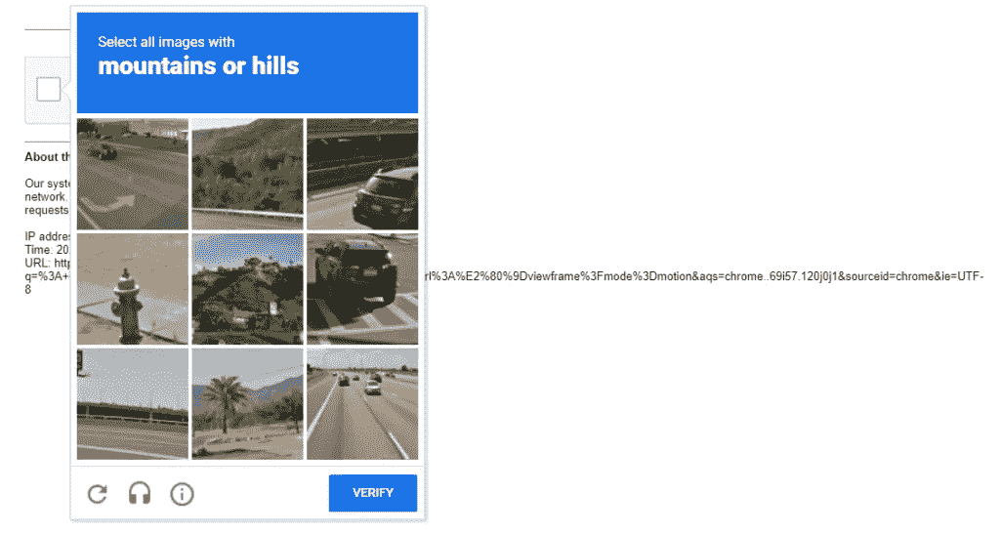
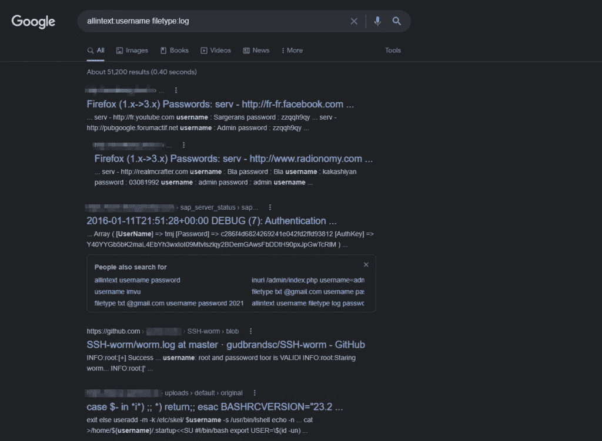
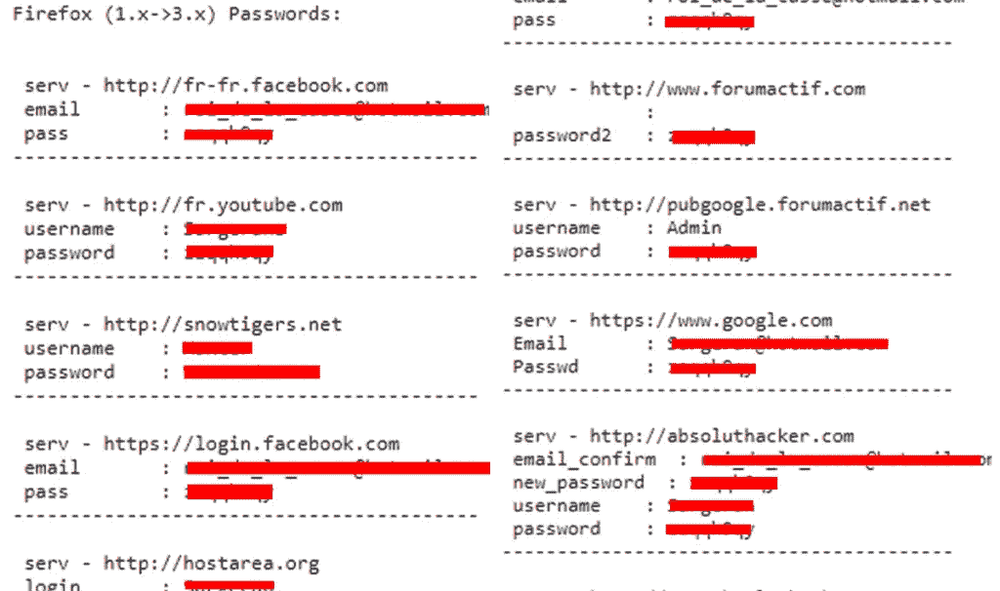
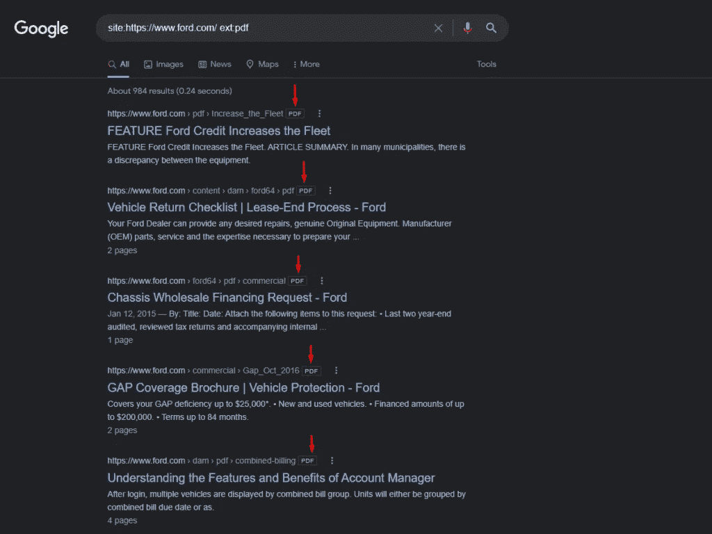
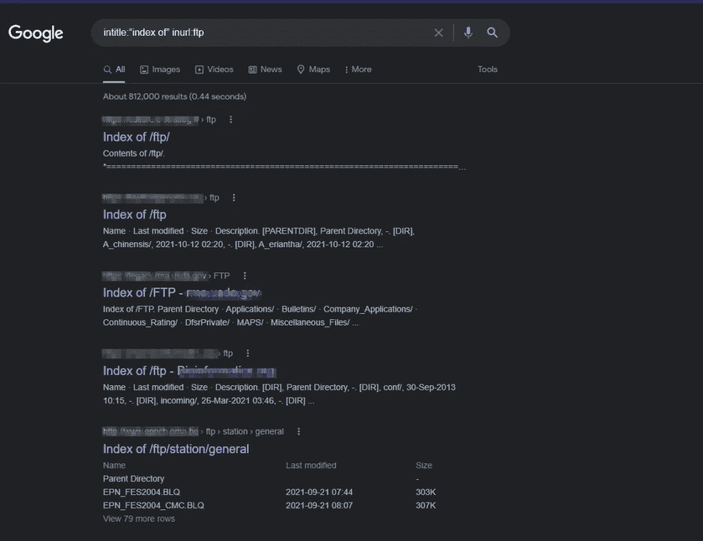
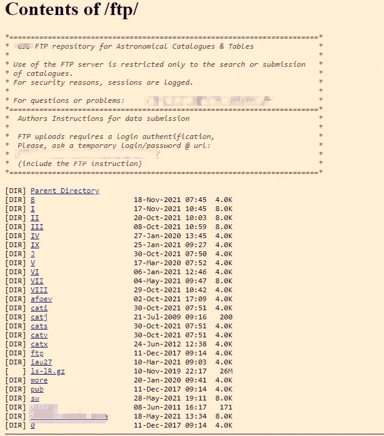
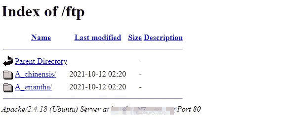
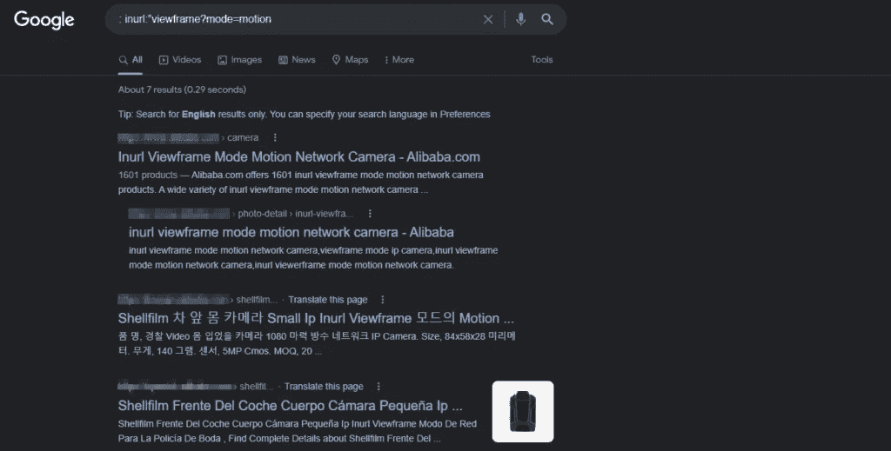
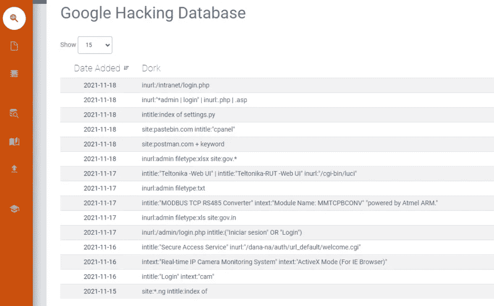

# 谷歌呆子和黑客如何使用它

> 原文：<https://medium.com/codex/google-dorks-and-how-hackers-use-it-758a7c0600cb?source=collection_archive---------3----------------------->

使用谷歌作为黑客工具或平台的想法当然并不新奇，黑客们已经利用这个非常受欢迎的搜索引擎很多年了。谷歌呆子起源于 2002 年，当时一个名叫 Johnny Long 的人开始使用自定义查询来搜索某些网站的元素，他可以利用这些元素进行攻击。从本质上来说，这就是谷歌呆子——一种使用搜索引擎来找出具有某些缺陷、漏洞和敏感信息的网站的方法，这些信息可以被利用。顺便提一下，有些人把谷歌呆子称为谷歌黑客(他们或多或少是同义词)。

Google Dorking 是黑客用来查找意外暴露在互联网上的信息的一种技术。例如，带有用户名和密码或摄像头的日志文件等。这主要是通过使用查询来逐步追踪特定目标来完成的。我们从使用一般查询收集尽可能多的数据开始，然后我们可以使用复杂查询进行具体分析。

信不信由你，谷歌呆子可以发现大量信息，如电子邮件地址和列表、登录凭证、敏感文件、网站漏洞，甚至财务信息(如支付卡数据)。事实上，在我们的 WordPress 黑客教程中，我们列出了一些可以用来发现 SQLi (SQL 注入)漏洞的 Google 呆子。奇妙的是，这是一种令人难以置信的被动攻击形式，不会引起黑客的太多注意。不幸的是，一些人将这些技术用于非法和邪恶的活动，如网络战、数字恐怖主义、身份盗窃和许多其他不受欢迎的活动。

如果你读这篇文章是为了学习如何闯入一个网站并伤害他人，只是为了寻求刺激，也许你应该追求其他的兴趣。让我警告你，闯入网站是一种*非法活动*，它不仅违反法律，也违反道德准则。如果你被抓住了，后果可能是可怕的。首先，你会问，为什么要学这个？嗯，任何白帽黑客首先需要了解黑客是如何运作的。只有这样，他们才能堵住安全漏洞，防止未来的攻击。

# Google Dorking 的基本原理

谷歌多金有七个基本原则。这些只是我们如何用先进的技术使用谷歌。这七个基本原则是构成 google Dorking 基本结构的七种主要查询。我们现在将逐一查看黑客(back/grey/white hat)如何使用这些查询来获取与某个组织甚至个人相关的信息。

# 注意:

谷歌多金不是在黑自己。Google Dorking 是一种在黑客攻击的一个阶段(即信息收集)中派上用场的技术，这是黑客攻击最重要的阶段。黑客攻击有五个阶段，即侦察、扫描、获取访问权限、保持访问权限和清除踪迹。Google Dorking 用于黑客试图获取与任何特定组织或个人相关的所有信息的初始阶段。获得所有信息后，黑客挑选出他们下一阶段需要的信息。

# 使用谷歌傻瓜时的验证码问题

正如我们可以使用谷歌的活动，这可能会泄露他人的信息，而这些信息可能会被用于错误的目的。许多黑帽黑客将机器人放在网上涂写网站，找到页面中的弱点，然后将信息发送回服务器。为了阻止和降低这个问题，谷歌在这个过程中引入了验证码。几乎每次你使用一个傻瓜时，你都需要输入一个验证码。通过这种方式，谷歌阻止机器人将谷歌用于非法目的。

# 了解谷歌呆子运营商

就像简单的数学方程、编程代码和其他类型的算法一样，Google Dorks 有几个操作符，有抱负的白帽黑客需要理解。这方面的内容太多了，本指南无法一一介绍，但我们将介绍一些最常见的内容:

*   ***intitle*** —这使得黑客可以搜索 HTML 标题中包含特定文本的页面。因此，标题:“登录页面”将帮助黑客搜索网页登录页面。
*   ***allintitle*** —类似于前面的操作符，但是只返回满足所有关键字标准*的页面的结果。*
*   ***inurl*** —允许黑客根据 url(即“login.php”)中包含的文本搜索页面。
*   ***allinurl*** —类似于前面的操作符，但是只返回满足所有匹配条件的 url 的匹配。
*   ***文件类型*** —帮助黑客将搜索结果缩小到特定文件，如 PHP、PDF 或 TXT 文件类型。
*   ***ext*** —非常类似于 filetype，但是它根据文件扩展名来查找文件。
*   ***intext*** —该操作符在给定页面的全部内容中搜索黑客提供的关键字。
*   ***allintext*** —类似于前面的操作符，但是需要一个页面来匹配给定关键字的所有*。*
*   ***站点*** —将查询范围限制在单个网站。

# 查询:

# 缓存命令

谷歌不仅列出了网页的当前版本，还在缓存中存储了网站的以前版本，这些页面有时可以给你许多关于开发者所使用的技术的信息。它有时也会泄露最初仅用于测试目的的信息，这些信息在后来的版本中被删除，但在谷歌缓存的版本中仍然可以看到。

## 句法

它的语法是“缓存:网址”。例如，让我们对一个随机的网站使用 cache 命令并查看结果。结果可能会不时变化，因为我们也看到了来自谷歌的更新。

至于结果，我们有多个响应，可以收集与该网站相关的进一步信息。

我们还可以使用这个搜索查询来突出显示搜索结果中的一些关键字。假设我们希望在研究中突出显示“flex”一词，然后我们将按如下方式编写查询:

"缓存:[https://flexstudent.nu.edu.pk/Login](https://flexstudent.nu.edu.pk/Login)flex . "它会在结果中突出显示该关键字。

# intext & allintext 命令

intext 命令用于在网页的搜索结果中查找特定文本。Intext 有两种用法。第一种方法是在结果中获得单个关键字，第二种方法是在搜索中获得多个关键字。要完成第一项任务，该命令的语法是

***英特尔:用户名***

为了完成第二个任务，我们使用 allintext 代替 intext。我们用一个空格来分隔关键词。如果我们使用 allintext，那么 google 会在结果中添加所有这些页面，并在它们的文本中包含查询中提到的所有关键词。如果一个网页有一些丢失的关键字，它将从结果中被丢弃，用户将看不到那个网页。这就是为什么这些命令与适当的关键字一起使用，以便不丢弃必要的信息。

## 句法

假设我们想找出一些包含用户名和密码相关信息的页面，然后我们将编写如下查询:

allintext:"用户名" "密码"

我们得到的结果如下:

正如你所看到的，所有的返回页面都有用户名和密码，这是因为我们的查询，我们已经使用。它给了我们那些同时包含两个关键词的页面。

# 文件类型命令

Filetype 是 google Dorking 的七个著名基础之一，因为它有助于过滤掉大量文件。它可以为你过滤 pdf 文件。它甚至可以为你过滤日志文件。日志文件对于收集与组织相关的信息非常有用，因为这些文件记录了组织中发生的所有事件。如果我们想访问简单的日志文件，我们可以写这个命令:filetype:log，它会给我们所有类型的日志文件，但这不会有太大的帮助，除非我们尝试用一些过滤器来缩小搜索范围。

## 句法

让我们通过指定我们需要那些带有用户名和密码的文件来使它变得更具体。为此，我们将修改查询，如下所示:

allintext:用户名文件类型:日志

它将显示那些结果中提到的用户名和密码。如果这些文件属于任何服务器，人们无法想象它们会造成多大的破坏。

通过应用此查询获得结果后，打开随机文件如下:

正如你所看到的，它对初学者来说可能没有任何意义，但在与一家公司或一台服务器相关的信息收集中，它可能会发挥重要作用。这些信息可能是许多新冒险的关键。

看看互联网上的另一个文件，我们可能最终也有用户名和密码。

您可以使用这种技术将结果缩小到某个特定用户。

首先，您将使用该查询获得日志文件，然后在搜索该文档后，您可以很容易地找到所需的用户名。

# 标题命令

intitle 是一个命令，当我们想要根据 HTML 页面的标题过滤掉文档时会用到它。正如我们所知，HTML 页面的标题中包含了定义整个文档的关键字。它们代表了文档中所描述内容的摘要。我们可以使用这个特性来得到我们想要的东西。假设我们正在寻找包含 IP-Camera 相关信息的文档，那么我们将编写一个查询来告诉 google 根据提供的参数过滤掉所有页面。

## 句法

使用该命令的基本语法如下:

***标题:【ip 摄像机】***

我们还可以选择使用多个关键字来获得更精确的结果。为了使用多个关键字，我们用逗号分隔它们。谷歌首先获取所有页面，然后对结果进行过滤。那些在网站标题中没有提供关键字的网页被丢弃。使用此命令的语法如下:

***allin title:“IP 摄像机”“DVR”***

下面是这个查询的结果。你可以看到它向我们展示了标题中包含这两个关键词的所有页面。我们可以使用这种技术非常有效地过滤我们的结果。

# inurl 命令

Inurl 命令的工作方式与 intitle 相同。不同之处在于，当我们想要根据 url 的文本过滤掉文档时，使用的是 Inurl 命令，因为我们知道 HTML 页面在 URL 中有那些定义整个文档的关键字。它们代表了文档中所描述内容的摘要。我们可以使用这个特性来得到我们想要的东西。同样，假设我们正在寻找包含与 IP-Camera 相关的信息的文档。我们将编写一个查询，告诉 google 根据提供的参数过滤掉所有页面。我们还可以选择使用多个关键字来获得更精确的结果。

## 句法

使用该命令的基本语法如下:

特斯拉·兰博

# 现场指挥

当我们想要搜索特定的实体时，我们有另一个非常有用的命令。首先，我们扩大搜索标准，收集可能与我们的需求相关或不相关的信息。在获得足够的起点后，我们开始使用其他命令缩小搜索范围。例如，假设我们想买一辆汽车，我们正在搜索 2020 年晚些时候推出的汽车。从结果中得到一个列表后，我们研究了页面，发现本田和福特是可靠的。现在，我们的下一步将是从可信的网站上收集这些汽车的信息。所以这里使用了站点命令。现在，我们将把搜索范围缩小到一些特定的网站。

## 句法

地点:[https://global.honda/](https://global.honda/)

它会给我们所有相关的这个网站只。同样，如果我们现在想搜索福特，我们可能只会改变网站地址，并获得我们的结果。

# 外部命令

有时，我们希望搜索特定类型的文档。例如，我们想写一篇关于“网络钓鱼检测”的文章我们不能只是开始写它，除非我们先做研究。研究文章大多以 pdf 格式发表。现在，如果我们想阅读以前关于这个主题的研究，我们将在命令中添加另一个呆子，称为 ext。Ext 是用于指定文件扩展名的命令。它的工作方式类似于 filetype 命令。如果我们修改先前的搜索(我们对福特汽车进行了搜索)，我们现在可能只想查找 pdf 文件，然后我们将编写如下查询:

## 句法

网址:https://www.ford.com/ ext:pdf

从下面的结果，你可以看到我们现在只有 pdf 文件作为我们的结果。

# 更多示例

假设我们想访问一个 FTP 服务器。该命令将混合查询，然后实现我们想要的。

## 查找 FTP 服务器

语法是:intitle:"index of" inurl:ftp

它将找到所有与 FTP 服务器相关的索引页面并显示目录。

得到结果后，我们可以检查不同的 URL 来获取信息。

我们甚至有时可以看到源代码，这应该不是公开的。下面所附的图片不能视为机密，但此活动的程序是相同的。说明我们建议不要从不安全的服务器上下载文件，因为它们可能已经遭到破坏。

# 访问在线摄像头

现在，由于我们已经读了很多关于这些呆子的东西，我们可能会遇到一些不应该访问的东西，因为它可能会伤害到某人的隐私。这项活动的目的是宣传我们需要认真对待我们的隐私。现在人们把闭路电视摄像头放在适当的位置以确保它们的安全，但他们并没有让这些摄像头变得安全。他们甚至做得更糟，把它们公之于众。下面是一些公开的相机截图，任何人都可以看到那里发生了什么。

## 句法

Intitle:"webcamXP 5 " '

你可以看到这些人现在更容易受到攻击，因为人们可以很容易地跟踪他们的活动。

更多示例:

即使我不能发布更多。人们甚至暴露了他们的家，这是不道德的，即使我们访问它。

# 如何不变傻！

针对普通个人的谷歌呆子或谷歌黑客只是触及了表面。索引可以发现图片、视频、ISO 或其他文件类型，甚至是网站的缓存版本。易受攻击的数据很容易暴露给 Google Dorking，这很容易导致黑客攻击或渗透网站本身。为了防止这种攻击对易受攻击的应用程序进行指纹识别，我们需要了解它们在野外是如何工作的。

虽然使用谷歌呆子很容易暴露一些数据，但预防也并不困难。我们可以做几件事来保护自己免受谷歌黑客攻击。

**基于 IP 的限制:**应优先考虑基于 IP 的限制。只要有可能，使用双因素认证、加密、IP 限制和安全密码来避免 Google Dorking。

**漏洞扫描:**漏洞扫描可以成为网站所有者最好的朋友。有太多的漏洞需要弥补，它们很容易被忽视。漏洞扫描有特定的查询，以防止谷歌呆子，这是非常有益的。

**谷歌搜索控制台:**谷歌搜索控制台可以帮助删除敏感内容，如支付页面、用户信息和内幕数据。如果这些是运行平台所必需的，它们可以被索引，因此，可能容易受到这种攻击。谷歌搜索控制台帮助将它们从搜索查询数据库中删除。

**成为黑客，让他们远离:**找到任何暴露部分的一个好方法是自己运行呆子查询。这是最好的方法之一，甚至网站所有者也付钱给其他人在他们的网站上运行傻瓜查询。因为它会很快变得非常复杂，所以你自己在整个平台上运行查询，然后特定的敏感部分会暴露出它是否安全。事后可以采取措施。

**Dorking 类型:**Google Dorking 常用的方法有网站 URL Dorking 和基于序列的 Dorking。

**robots.txt:** 另一个隐藏敏感信息的好方法是利用 robots.txt 文档。Robots.txt 拒绝注册，隐藏隐私信息。然而，这也表明，敏感数据在该文件中，因此它可能是一把双刃剑。

要设置 robots.txt 并自由索引内部内容:

用户代理:*

不允许:/

文件访问限制:

用户代理:*

不允许:/admin/

&

用户代理:*

disallow:/private area/file . html

用“？”限制对动态 URL 的访问符号:

用户代理:*

不允许:/*？

**测试常用关键词:**最简单常用的 Google dork 关键词之一就是 site。我们可以用它来缩小特定网站的搜索范围。在我们的例子中，我们在网站上输入关键字，以查看谷歌缓存的来自 hackingloops.com 的页面。这都是有趣的游戏，但为了进一步了解细节并阻止 Dorking 的结果，我们可以使用 Gooscan、Wikto 或 Sitedigger 等工具。不过，我们只建议尝试专门为测试或你自己的网站。

**安全摄像头防呆:**我们已经讨论过 Google Dorking 如何访问易受攻击的安全摄像头(CCTV 直播镜头)，此外，我们还可以控制摄像头修改器，如移动、放大缩小、改变分辨率、刷新率等。虽然匿名观察这种东西很有趣，但它很可能会泄露你的隐私和安全信息。

要查看打开的闭路电视，请键入

inurl:top.htm inurl:当前时间

intittle:“网络摄像头 XP 6”

inurl: "lvappl.htm "

inurl:“view frame？模式=运动

该命令将根据路由结果列出可用的闭路电视摄像机。为了获得最佳结果，我们可以打开所有可能的结果并查看 GUI。建议的想法是保护这些 GUI 页面不受索引的影响。此外，一些用户保持默认的网络监控密码模式；危险在于，不同制造商的密码都是一样的，很容易被窃取。因此，如果网络摄像头是您的首选，请将默认密码更改为更强的密码。此外，禁止远程登录安全系统，因为这也是默认启用的。

**XSS 预防:** XSS 仍然是在为公众部署网页之前必须保护的核心基础之一。更严格的卫生条件并不是一个很难解决的问题，但是仍然掌握在过滤器阻塞功能的手中。虽然很难编写一个过滤器来阻止 XSS 攻击，但是富文本格式、使用更简单的大小写、数据净化、利用标签如< b >或< i >可以解决这个问题。

**个人数据:**把个人数据丢失给你不认识或可能造成伤害的人，没什么大不了的。这就像使用一个简单的命令一样简单，比如

filetype:PHP inurl:list/admin/int ittle:“支付方式”或

int ittle:finance . xls 的索引

这些简单的查询可以列出个人甚至银行信息。以避免他们加密和密码保护数据。即使不是你的数据，也有责任保护客户信息。目录级配置，如。htaccess 可以保护你的目录免受谷歌爬虫的攻击。

谷歌搜索:由于爬虫对谷歌搜索引擎索引数据很重要，它会一直寻找新的信息。所以，除非你小心，否则数据很容易被篡改。Exploit-db.com 更新了多克命令，这有助于熟悉。

即使你正试图远离黑客，检查他们会给你一个最新策略的粗略概念，所以你知道如何预先处理这种情况。虽然有更多的防范技术，适应这些将大致提供一个坚实的保护，防止谷歌呆子气。为了进一步预防，扩展整篇文章中提到的想法，这将使事情变得相当容易。

# 谷歌呆子自动化工具

正如我们提到的，Google Dorking 需要大量的关键字和耐心来找到特定的漏洞。虽然不建议搜索其他平台的漏洞，但 bug-bounty 程序就是专门针对这一点的。参加他们！但是为了测试我们的技能，野外练习是必须的。向谷歌发送愚蠢的请求可以得到有趣的结果。

但如果你曾经认为整天操纵很容易，那你就错了。谷歌阻止呆瓜的机制相当准确。在极少数情况下，发送多个多金请求可能会阻止 IP，但用户在各种搜索的常见情况下会获得验证码。攻击者和黑客都使用谷歌呆子，但为了使事情变得简单，他们使用自动化工具。自动化工具有很多，比如 Zeus、xgdork、Dorkme、Bingoo、GoogD0rker、gD0rk、M-dork、Gooscan 等等。这些工具只需点击几下鼠标，就能帮助谷歌实现自动化。

黑帽、白帽、红帽每个人都在自己的武器库中保存了一些工具，用于快速、轻松地找到漏洞。由于谷歌对每个 IP 地址发送的查询有严格的限制，代理是强制性的。Python 是自动化领域最流行的脚本语言。简单运行基于 Selenium 的脚本就可以入侵网站或收集数据。类似地，Python 自动化脚本与代理和 Google Dorking 工具混合在一起是一种危险的组合。

# 重要说明

使用谷歌多金的目的应该是利用这些伎俩让人们和你自己安全。如果你正在阅读这篇文章，这意味着你在某种程度上已经掌握了网络安全。每一个人都有责任将信息用于福祉，这应该是最终目标。

想了解更多复杂命令的知识，可以参考 Github。人们通过组合两个或更多的傻瓜来编写复杂的命令，以获得准确的结果。归根结底，这都是实践的问题。

# 定制的谷歌呆子查询

既然我们已经对一些操作符和 Google 呆子如何搜索 web 有了基本的了解，那么是时候看看查询语法了。以下是针对特定领域的 Google Dorks 的高层结构:

" inurl: domain/" "其他呆子"

黑客会插入如下所需的参数:

*   inurl =您想要查询的网站的 url
*   域=站点的域
*   dorks =黑客想要扫描的子字段和参数

如果黑客希望通过除 URL 之外的字段进行搜索，可以有效地替换为以下字段:

*   标题:
*   inurl:
*   正文:
*   定义:
*   网站:
*   电话簿:
*   地图:
*   图书:
*   信息:
*   电影:
*   天气:
*   相关:
*   链接:

这些选项将帮助黑客发现网站的大量信息，这些信息在没有谷歌呆子的情况下是不容易发现的。这些选项还提供了扫描网络以定位难以找到的内容的方法。以下是一个谷歌呆子的例子:

[inurl:log in . JSP intitle:log in](http://www.google-dorking.com/2016/04/inurlbackoffice-intitlelogin.html)

# 有效利用运算符

乍一看可能有点晦涩，所以让我举几个例子来说明不同的运营商如何定位内容和网站数据。用户可以有效地利用 **intitle** 操作符在网站上查找任何内容。也许他们正在搜集电子邮件地址，并想在网站上搜索“@”符号，或者他们正在寻找其他文件的索引。

此外, **intext** 操作符可以用来扫描个人页面中你想要的任何文本，比如目标的电子邮件地址、姓名、网页名称(比如登录屏幕)或其他个人信息，以收集关于他们的数据。

你练习得越多，你就能更好地定位不同类型的网站、页面和漏洞。我需要再次提醒你不要使用这些查询来攻击另一个网站，因为这是非法的，会给你带来很多麻烦。尽管如此，谷歌呆子是在网上定位隐藏信息的一个很好的方式，这就是为什么黑客喜欢用他们来寻找网站的安全漏洞。

如果你想挖掘更多的问题，网上有一些很棒的谷歌百科资源。

欢迎任何类型的评论。谢谢您的时间:)。

# 黑客快乐！！！

如果您喜欢阅读这篇文章，请鼓掌并跟随:

***碎碎念:***[https://twitter.com/i_amsphinx](https://twitter.com/i_amsphinx)

***领英:***[https://www.linkedin.com/in/pathakabhi24/](https://www.linkedin.com/in/pathakabhi24/)

***GitHub:***https://github.com/pathakabhi24