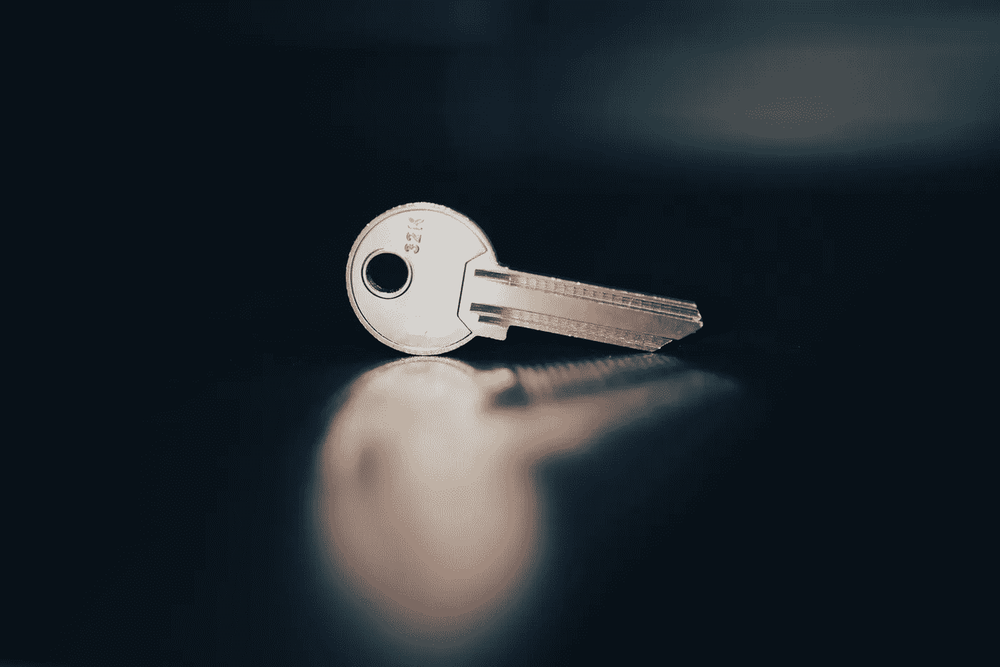

# 谷歌提高其数据仓库 BigQuery 的数据安全性

> 原文：<https://medium.com/codex/google-improves-data-security-in-its-data-warehouse-bigquery-817191ddc636?source=collection_archive---------4----------------------->

## 通过云 KMS 密钥使用列级 SQL 加密

在 [Unsplash](https://unsplash.com/s/photos/security?utm_source=unsplash&utm_medium=referral&utm_content=creditCopyText) 上由 [olieman.eth](https://unsplash.com/@moneyphotos?utm_source=unsplash&utm_medium=referral&utm_content=creditCopyText) 拍摄的照片

无论是为了满足国家或国际准则(例如欧洲的[DSGVO](/p/e65a396d0bed))还是为了保护公司内部的数据，对数据进行相应的加密都会有所帮助。这正是谷歌推出“数据仓库 BigQuery 新特性”的原因。