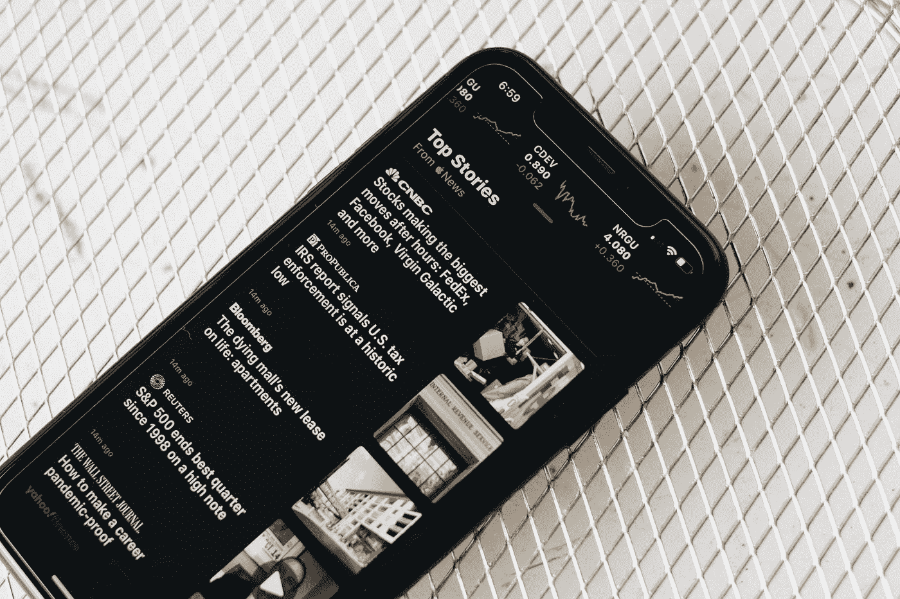

# 谷歌在 2013 年扼杀了 Web 3

> 原文：<https://medium.com/codex/google-killed-web-3-in-2013-892f6c41b02b?source=collection_archive---------2----------------------->

卢卡斯·黄在 [Unsplash](https://unsplash.com?utm_source=medium&utm_medium=referral) 上的照片

2013 年，谷歌扼杀了一款名为谷歌阅读器的小产品。我还是很生气。

你知道，我正在考虑写一篇关于谷歌并没有真的杀死那么多产品的文章，如果你考虑他们有多少产品的话。没错，他们有上百万种产品。就像，我正在看着[被谷歌](https://killedbygoogle.com/)杀死，显然他们杀死了他们的……瑜伽服务？显然，它被称为健身瑜伽。有人知道…