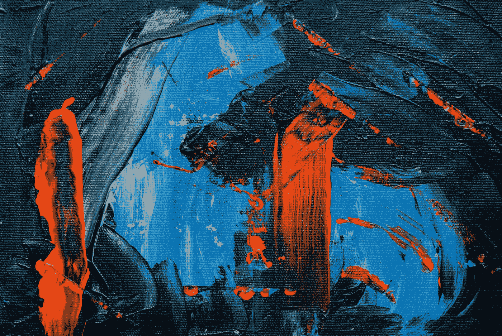

# 谷歌推出新视频 KI-Imagen 视频

> 原文：<https://medium.com/codex/google-launches-new-video-ki-image-video-72dda3e296df?source=collection_archive---------7----------------------->

## 谷歌如何想赶上脸书

[斯蒂夫·约翰森](https://unsplash.com/@steve_j?utm_source=unsplash&utm_medium=referral&utm_content=creditCopyText)在 [Unsplash](https://unsplash.com/s/photos/art?utm_source=unsplash&utm_medium=referral&utm_content=creditCopyText) 上拍照

谷歌刚刚宣布了 Imagen Video，它可以通过文本创建用户指定的不同风格的内容。

就在最近，Meta 宣布制作一个视频。原则上，它的工作方式类似于文本到图像生成器。不同的是，这里生成的是一个视频。现在谷歌是…