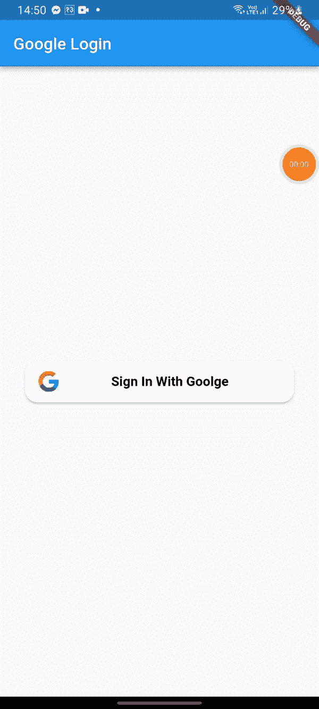
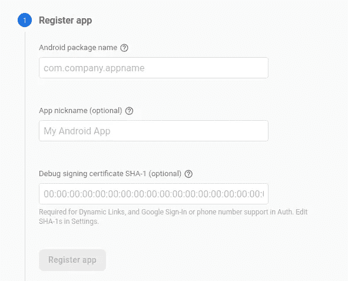
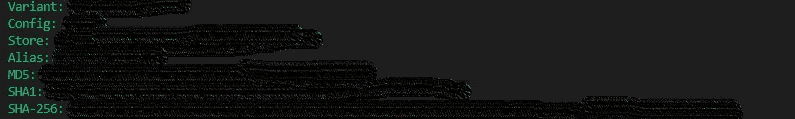
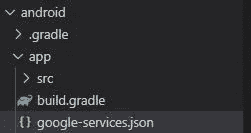
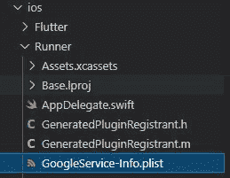
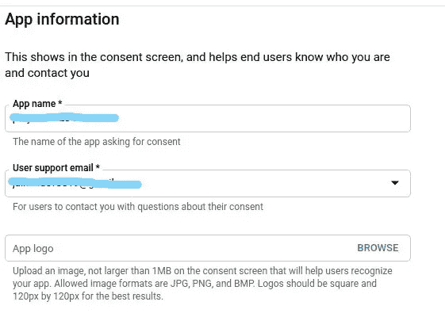
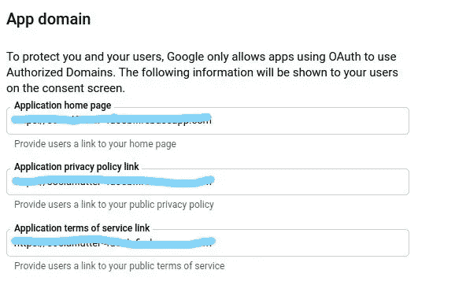
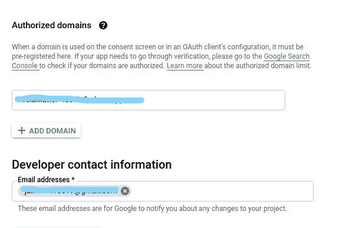
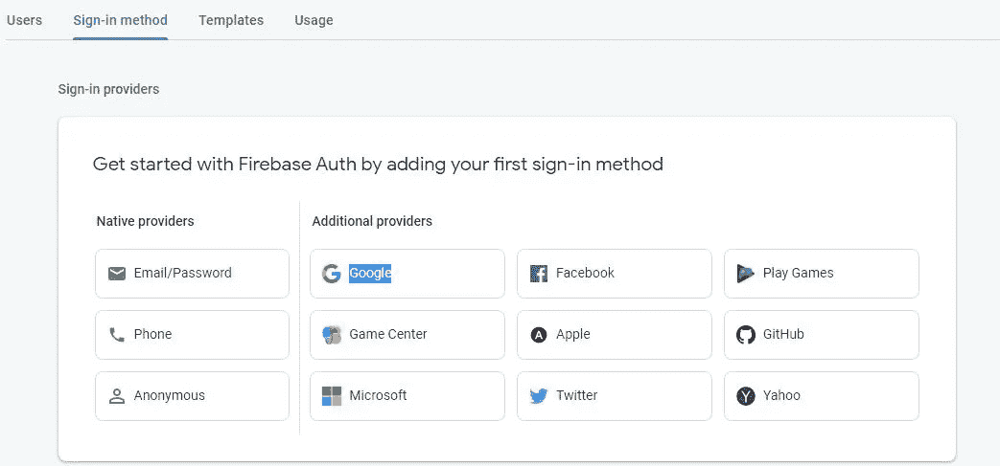
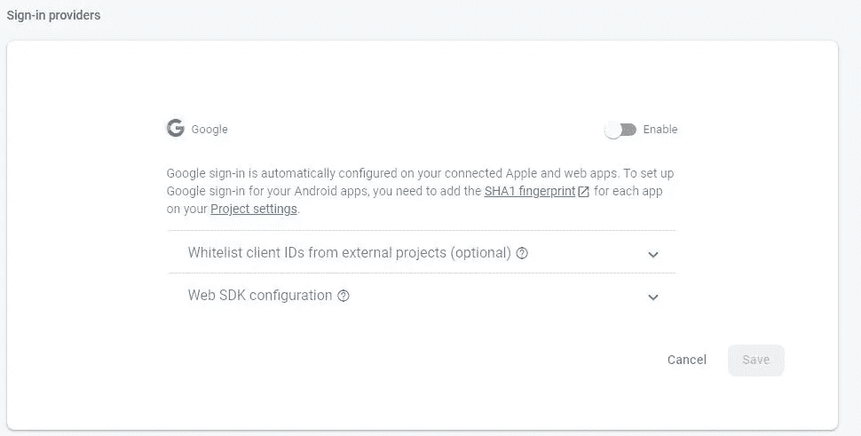

# 谷歌在 Flutter 的登录

> 原文：<https://medium.com/codex/google-login-in-flutter-e420cca06635?source=collection_archive---------6----------------------->

Google 登录是让用户进入应用程序的方法之一。在本文中，我们将讨论如何通过创建一个如下工作的示例应用程序在 flutter 应用程序中登录 google:



在编码之前，我们需要在 [Firebase 控制台](https://console.firebase.google.com/)中创建一个应用程序。

## **1。注册安卓应用**



输入您的包名。

要获取 **SHA1** 密钥，从终端进入 **android** 文件夹，如下所示:

```
cd android
```

然后运行下面的代码。

```
gradlew signingReport
```

如果这不起作用

```
./gradlew signingReport
```

**等待编译完成，您的 SHA 密钥将会打印出来。**



找到 **SHA1** 并将其粘贴到您的 **Firebase 申请表中。**

然后你在你的 **android/build.gradle** 文件中添加依赖项。

```
dependencies {
classpath 'com.google.gms:google-services:4.3.12'
}
```

再次在你的**Android/app/build . gradle**文件中。添加下列依赖项。

```
implementation platform('com.google.firebase:firebase-bom:30.2.0')
implementation 'com.google.firebase:firebase-analytics'
```

然后下载 **google-services.json** 文件。放在**安卓/app** 文件夹里面。



## 2.适用于 IOS 应用程序

请转到 Firebase 控制台应用程序仪表板，点击添加 iOS 图标来设置 iOS 应用程序，并填写与 Android 步骤几乎相似的配置。

下载`GoogleService-Info.plist`文件，放入`Runner`文件夹。



在 **Info.plist** 中添加以下代码。

```
<key>CFBundleURLTypes</key><array><dict><key>CFBundleTypeRole</key><string>Editor</string><key>CFBundleURLSchemes</key><array><string>{YOUR REVERSE CLIENT ID}</string></array></dict></array>
```

您的反向客户 ID *:* `REVERSED_CLIENT_ID from GoogleService-Info.plist`

下一步，您需要填写 [OAuth 同意书](https://console.cloud.google.com/apis/credentials/consent)。



**应用名称:{您的应用名称}**

**用户支持电子邮件:{您与此控制台关联的电子邮件地址}**



***申请首页:*** `*https://<Your Authorized domains>*`

***应用隐私政策链接:*** `https://<Your Authorized domains>`

***应用服务条款链接:*** `https://<Your Authorized domains>`



此外，你需要从你的控制台激活**谷歌登录认证**。

为此，您需要从项目仪表板内的菜单中点击**认证**。

选择**签到方式**选项卡。



然后选择**谷歌。**



**启用**然后点击**保存。**


照片由 [Unsplash](https://unsplash.com?utm_source=medium&utm_medium=referral) 上的 [krakenimages](https://unsplash.com/@krakenimages?utm_source=medium&utm_medium=referral) 拍摄

完成所有配置后，让我们来看代码。

首先，我们需要在 **pubsec.yaml** 文件中添加包。

```
google_sign_in: ^5.3.3
fluttertoast: ^8.0.9
```

现在我们实现 google 登录方法。

```
Future<GoogleSignInModel> googleSignInProcess(BuildContext context) async {GoogleSignIn googleSignIn = GoogleSignIn();GoogleSignInAccount? googleUser = await googleSignIn.signIn();GoogleSignInAuthentication? googleAuth = await googleUser?.authentication;String? token = googleAuth?.idToken;GoogleSignInModel socialGoogleUser = GoogleSignInModel(displayName: googleUser?.displayName,email: googleUser?.email,photoUrl: googleUser?.photoUrl,id: googleUser?.id,token: token);Fluttertoast.showToast(msg: "Welcome",backgroundColor: Colors.green,textColor: Colors.white);return socialGoogleUser;}
```

这个方法负责登录 google，它返回未来。

该方法从**登录屏幕**调用，如下所示:

```
onPressed: () {googleSignInProcess(context);}
```

# 让我们连接起来

我们可以成为朋友。在[脸书](https://www.facebook.com/nabin.dhakal.714/)、 [Linkedin](https://www.linkedin.com/in/nabindhakal/) 、 [Github](https://github.com/nbnD) 、 [Youtube](https://www.youtube.com/channel/UCW6oYt_3QSl7J2HSHNqwXWw) 、 [BuyMeACoffee](https://www.buymeacoffee.com/nabindhakal) 和 [Instagram](https://www.instagram.com/nbn_d_/) 上查找。

访:[颤振结](https://flutterjunction.com/)

**投稿:** [BuyMeACoffee](https://www.buymeacoffee.com/nabindhakal)

# 结论

希望这篇文章对你有所帮助，让你学到新的东西。我在这篇文章中使用了一些对你们中的一些人来说可能是新的东西。

如果你学到了新的东西或者想提出一些建议，请在评论中告诉我。

如果你喜欢这篇文章，请点击👏图标，它为您提供了传递所有新事物的动力。

此外，关注令人兴奋的文章和项目的更新。

通过分享学习对学习过程产生了巨大的影响，并使社区越来越大。

分享是吸引其他爱好者的磁石。

因此，让我们朝着扩大我们的学习社区迈出一小步。

与你的朋友分享这篇文章，或者如果你喜欢这篇文章，就在推特上发表评论。

## 在以下时间吃饱:

[](https://github.com/nbnD/google_login) [## GitHub-nbnD/google _ log in:flutter 中的 Google 登录

### 一个新的颤振项目。这个项目是颤振应用的起点。一些帮助您入门的资源…

github.com](https://github.com/nbnD/google_login)