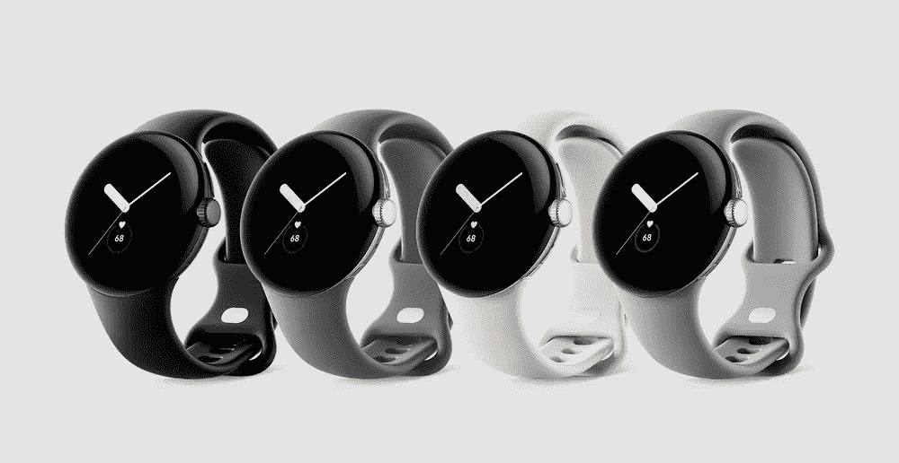

# 谷歌像素手表-2022 年:你需要知道的一切

> 原文：<https://medium.com/codex/google-pixel-watch-2022-everything-you-need-to-know-884b51be249a?source=collection_archive---------5----------------------->

## 谷歌在“谷歌制造”活动上推出了其首款 Pixel 手表

【2022 年 10 月，谷歌发布了首款自主设计和制造的智能手表。它运行在最新版本的 WearOS 上，兼容所有 OS 8.0 及以上版本的安卓手机。这里是你需要知道的关于谷歌新智能手表的一切

鸣谢:谷歌

## 佩戴 OS 3.5

谷歌 Pixel Watch 由谷歌的 Wear OS(Wear OS 3.5)提供支持，并通过始终显示提供您所需的信息。随着 Wear OS 3.5 的更新，该平台扩展了对使用 Google Pay 的**腕上谷歌 Play 商店**、**非接触式支付**、& NFC、 **Google Assistant 支持**以及“OK，Google”唤醒词的支持，并改进了通知支持

## 与 Fitbit 深度集成

谷歌 Pixel Watch 与 Fitbit 深度整合，提供领先的健康和健身功能。谷歌声称 Pixel 手表具有“Fitbit 迄今为止最精确的心率跟踪功能”。通过设备上的机器学习和深入优化到处理器级别，它可以以每秒一次的速度持续跟踪您的心率，从而为您提供准确的测量结果。

手表附带六个月的 Fitbit Premium 提供品牌特有的功能，如每日就绪得分和活跃区域分钟数。
Fitbit 体验完全针对谷歌 Pixel Watch 重新设计，有 40 种锻炼模式。它还内置了 GPS，有助于全天跟踪活动，并汇总数据以显示最准确的结果

## 出现

手表整体看起来高档，设计时尚。位于显示屏右侧的触感表冠控制着屏幕滚动。它还可以访问快捷方式，并启动应用程序托盘来获取您需要的有用信息。表冠正上方有一个物理按钮，可以打开你最近使用的应用

有四种表面可供选择:带有淡褐色活动带的香槟金表壳、带有黑曜石活动带的哑光黑色表壳、带有粉笔活动带的抛光银表壳和带有木炭活动带的抛光银表壳。

## 规范

*   手表直径为 41 毫米，由弯曲的 3D 大猩猩玻璃 5 保护。
*   它有一个有机发光二极管屏幕，能够达到 1000 尼特的亮度。它还具有高达 5ATM 的防水性和防刮擦性。
*   还有 32GB 的板载存储空间来存储音乐和健身数据。
*   它包括一个相对较小的 294 毫安时电池，电池续航时间长达 24 小时，可确保您全天正常工作。当插入 18W 电源适配器时，随附的 USB-C 磁性圆盘充电器承诺在 30 分钟内为 Pixel 手表的电池充电 50%，在 55 分钟内充电 80%，在 80 分钟内充电 100%。
*   它使用三星相对较旧的 10 纳米 Exynos 9110 SoC，该 SoC 已被三星的 4 纳米处理器取代
*   它有两种版本——仅支持蓝牙/WiFi 的型号和 4G LTE 蜂窝版本

## 定价

Pixel Watch 在同一天接受预购，销售日期为 10 月 13 日，覆盖 9 个国家，包括美国、加拿大、英国、爱尔兰、德国、法国、日本、澳大利亚和台湾。

基本型号的价格为 349.99 美元/ 339 澳元/549 澳元，而蜂窝电话的零售价为 399.99 美元/ 379 澳元/649 澳元。

## 要评估的点

*   Fitbit 的一些传感器功能不可用。温度跟踪和应力跟踪。血氧即将更新
*   该处理器相对较旧，但已被有目的地优化，以跟踪健身数据。因此，只有当我们亲自动手操作腕表时，才能评估其性能
*   目前与 iOS 不兼容，但在未来版本中可能会有所变化

这就是我对 Pixel 手表的第一印象的一部分。如果你喜欢总体评价，请留下一些掌声，并关注我更多这样的深入评价