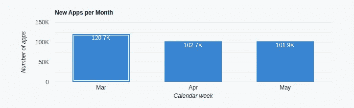

# 创建 Android 应用程序？先查 2022 年的谷歌 Play 商店统计

> 原文：<https://medium.com/codex/google-play-store-statistics-9355abdcf04d?source=collection_archive---------17----------------------->

应用无处不在。简单来说，他们无处不在。随着全球手机普及率超过 90%，因此，随着时间的推移，可以说应用程序用户的比例将大幅上升。

你一定在想，为什么？这是因为这些解决方案的存在让生活更加便利。因此，它要求开发是健壮的，以便不同的任务容易执行，并使生活变得容易。

然而，除了在开发应用程序时坚持最佳实践集之外，关注统计也是一个好主意。这意味着数字对于 android 应用开发者来说至关重要。它有助于开发人员了解用户在与应用程序交互时的行为。接下来是了解用户下载最多的应用类别，等等。

所以当开发者构建一个应用时，两个平台是最受青睐的——Android 和 iOS。在文章中，我们将讨论 Android marketplace。这是因为市场拥有最多的用户。这大约是[**25 亿用户遍布全球 190 个国家**](https://www.businessofapps.com/data/android-statistics/) 。

因此，关注谷歌 Play 商店的统计数据变得至关重要。想知道谷歌 Play 商店是什么吗？以前被称为 Android Market，客户可以从这个地方灵活地安装各种类别的应用程序。

正如我们在上面读到的，Android 是一个受用户欢迎的平台。这是由于成本因素。因此，Android 应用程序的用户数量是最大的。因此，对于 android 应用开发者来说，在他们进入开发 android 应用的阶段之前，他们还需要分析与谷歌 Play 商店相关的统计数据。

想知道为什么吗？继续阅读，了解这其中的意义。

## 谷歌 Play 商店统计对开发者的重要性

*   它有助于了解用户使用该应用程序的行为。
*   评估用户下载最多的应用类别变得天衣无缝。
*   它有助于开发者了解用户对应用程序的满意程度。

知道了关注谷歌 Play 商店统计数据的重要性之后，现在让我们关注一下 2022 年有吸引力的数字。

> ***在创建一个安卓应用*** 之前，先了解 2022 年的谷歌 Play 商店统计数据

## 谷歌 Play 商店上的应用数量

图片来源:statista.com

上图描绘了从 2015 年到 2022 年谷歌 Play 商店上应用数量的增长。这个数字会随着时间的推移而上升。

## 应用发布——每日、每周和每月

《谷歌 Play 商店日报》上发布了大约 2595 个应用程序。每周发布的 app 数量在 6880 左右。最后，每月发布的应用数量在 101，949 左右。

请看下面的统计数据，观察谷歌 Play 商店上应用程序的周发布率和月发布率。

图片来源:42matters.com

图片来源:42matters.com

## 用户评级

图片来源:statista.com

对于 android 应用开发者来说，收视率是非常重要的关注点。这有助于他们了解用户在使用应用程序时的满意度。换句话说，这有助于他们了解用户在使用应用程序时是开心还是不开心，然后开发具有持续高价值的 android 应用程序。

## 下载最多的应用类别

图片来源:statista.com

从上面看，你可以深入了解用户在谷歌 Play 商店游戏上下载最多的类别。游戏是一个拥有 13.83%用户的类别。

除了这些吸引人的统计数字之外，对 android 应用程序开发人员来说，其他重要的数据如下。

> ***2022 年谷歌 Play 商店其他魅力统计***

*   **免费与付费应用用户** — [谷歌 Play 商店上 97%的应用](https://www.statista.com/statistics/266211/distribution-of-free-and-paid-android-apps/)都是免费的，而只有 [3%的应用是用户为](https://www.statista.com/statistics/266211/distribution-of-free-and-paid-android-apps/)付费的。
*   **谷歌 Play 商店领先应用**——insta gram 在热门安卓应用类别中排名第一。Snapchat 占据第二的位置。前者获得了超过[2500 万次下载](https://www.statista.com/statistics/693944/leading-android-apps-worldwide-by-downloads/)，而后者获得了[5350 万次下载](https://truelist.co/blog/snapchat-statistics/)。
*   **使用安卓系统最多的厂商** —三星、小米、华为、Oppo、Vivo、摩托罗拉和 LG 是与安卓系统保持紧密合作关系的厂商。三星是旗手。它在安卓系统中占有 37.10%的市场份额。
*   **使用安卓应用最多的年龄段**——分别在 30 至 49 岁和 18 至 29 岁之间， [95%的用户使用安卓应用](https://earthweb.com/how-many-people-use-android/)。
*   **安卓应用的成本**——尽管谷歌 Play 商店上的大多数应用都是免费的，但分析付费应用的总体成本大约是 [10 美元](https://42matters.com/google-play-statistics-and-trends)。
*   到 2023 年，谷歌 Play 商店的支出将达到[600 亿美元左右。](https://sensortower.com/blog/sensor-tower-app-market-forecast-2023)
*   **应用数量**每天出于安全目的扫描的应用数量约为 60 亿。
*   谷歌 Play 商店的业务遍及全球 190 多个国家。

通过这些数字，很明显——尽管开发者在开发 android 应用时遵循了最佳实践或流程，但数字也很重要。换句话说，除非你不知道描述用户保持率的统计数字，用户搜索最多的类别，等等，否则你不能为你的终端用户创建一个现成的 android 应用。

因此，要实现这一点，请遵循以下步骤。

> ***如何开发承诺最大回报的安卓应用？***

*   一个想法就足够了。因此，当你 [**开发一个 Android 应用**](https://www.xongolab.com/android-app-development/) 时，你关注的是应用将使之成为可能的解决问题的能力。
*   在对你的竞争对手进行分析后，制定一个战略。这将有助于您识别缺失元素的存在。这将证明您为企业开发的最终解决方案卓有成效，并最终帮助 it 部门获得有利的投资回报。
*   构思一个应用蓝图，无缝地制作功能和设计，当你开发 android 应用时，它们的存在将使最终解决方案在视觉上更具吸引力。
*   关注 UI/UX 设计的最新趋势，尽可能多的进行测试，使应用程序在视觉上更加丰富和直观，同时也易于导航。
*   开发 Android 应用程序时，使用最新的技术堆栈。一些值得考虑的是 Kotlin 和 Java。这些将帮助您创建一个开箱即用的 android 应用程序，带来最大的回报。

> ***关键要点***

读完这篇文章后，显而易见的是，数字在帮助开发者实现应用程序的整体用户留存率方面发挥着极其重要的作用。它让位于构思一个计划，使开发变得精简和简单。

在这篇文章中，我们将讨论谷歌 Play 商店的统计数据及其对 Android 应用开发者的影响。因此，关注 Android 应用受欢迎的本质也很重要。

Android 在全球拥有 71.45%的市场份额。因此，对于开发专业人员来说，在 Play Store 上发布应用程序时，关注用户行为至关重要。

谷歌 Play 商店于 2008 年发射升空。随着岁月的流逝，它已经成为 Android 用户可以浏览和下载通过 android SDK(软件开发工具包)开发的移动应用的官方应用商店。你会发现市场上有多种多样的应用程序。这使得最终消费者可以很容易地选择一个符合他们偏好的，然后下载到他们的 Android 设备上。

然而，为了确保最终解决方案能被最终用户下载并放在他们的设备上，不仅开发过程应该是健壮的。对于安卓应用开发者来说，关注谷歌 Play 商店的统计数据同样至关重要。这意味着他们必须研究用户如何与应用程序互动，安装最多的应用程序类别，以及下载特定应用程序类别的性别。换句话说，女性下载生活方式或游戏应用程序，或者男性下载另一个应用程序类别。

最后，检查与应用程序上的用户留存相关的数字也很重要。，不一而足。所有这些，最终将帮助开发者构思和制定一个策略，最终丰富他们整个 [**移动应用开发**](https://www.xongolab.com/mobile-app-development/) 的旅程。

从长远来看，它还将帮助企业获得最大回报，获得巨额收入，并在相当有利的时期内保持客户参与。

## 包扎

阅读这篇文章，我们相信你可能已经了解了谷歌 Play 商店统计数据对于 android 应用开发者的重要性。这将有助于创建一个最终解决方案，为企业带来最大的投资回报率。尽管对专业人士来说，这是一个至关重要的过程，但在移动应用开发过程中遵循一套最佳技术，数字也具有同样重要的价值。他们让位于理解技术来创建一个全功能的应用程序。这个应用程序会让用户保持长时间的参与。随着 android 拥有良好的市场份额，当你开发 Android 应用程序时，也要关注谷歌 Play 商店的统计数据。这将很容易获得巨额收入。

这篇文章最初发表在 https://topdigital.agency/[的](https://topdigital.agency/google-play-store-statistics-2022-to-know-before-android-app-development/)