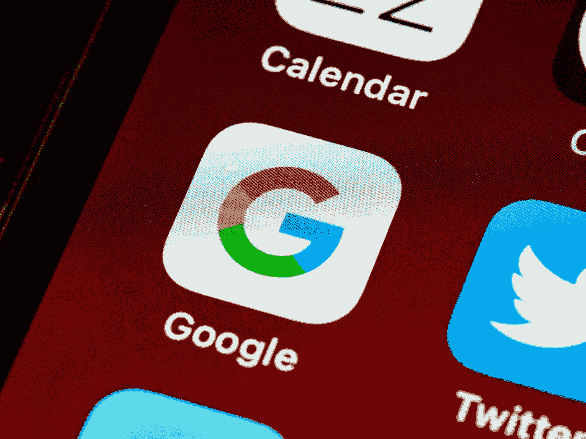

# 谷歌关闭了数百万用户的服务

> 原文：<https://medium.com/codex/google-shuts-down-service-with-millions-of-users-e9877d30d1fc?source=collection_archive---------10----------------------->

## 观点—为什么我们需要(数据)产品负责人

## 为什么谷歌取消了社交网站

布雷特·乔丹在 [Unsplash](https://unsplash.com/s/photos/google?utm_source=unsplash&utm_medium=referral&utm_content=creditCopyText) 上的照片

谷歌也时不时地试图在社交网络领域站稳脚跟。无论是 Google+还是 Google 套件，它也集成了 Google Hangouts。而现在谷歌停止使用的恰恰是谷歌视频聊天工具…